# Google Authentication

{width=280}

[Google Cloud Platform](https://cloud.google.com) is a cloud computing services that runs on the same infrastructure
that Google uses internally.


## GCP Console

Connect to [Console](https://console.cloud.google.com).


### Step 1: Create new project (optional)

::: info
If you already have a `scrapoxy` project, you can skip this step.
:::


1. On the top left, click on the current project
2. And click on `NEW PROJECT`.

---


1. Enter `scrapoxy` as Project name;
2. And click on `CREATE`.

---

Wait for the project to be created. A notification appears when it's done:

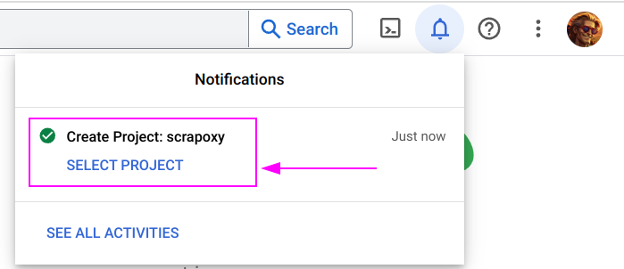

Click on `SELECT PROJECT`.


### Step 2: Configure Consent Screen

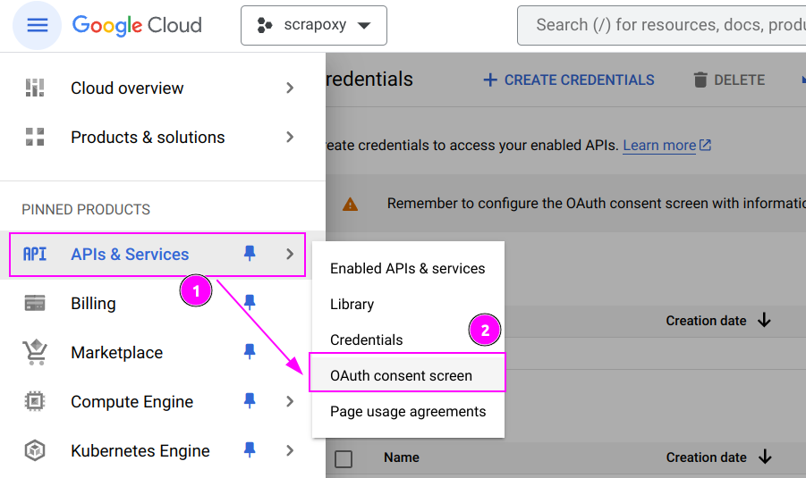

1. On the left menu, click on `APIs & Services`;
2. And click on `OAuth consent screen`.

---

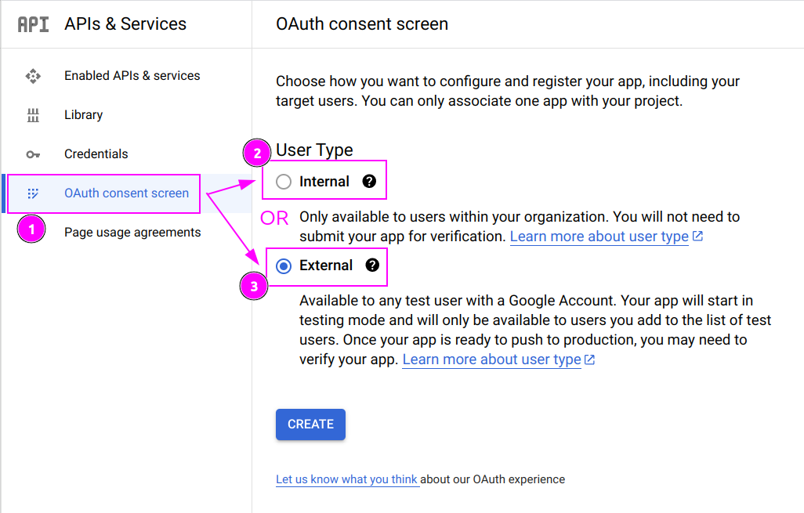

There are two types of consent screen:
- **Internal**: if are a company and own a G Suite account
- **External**: if you are a person (with a `@gmail.com` account for example)

Select the type you want and click on `CREATE`.

---

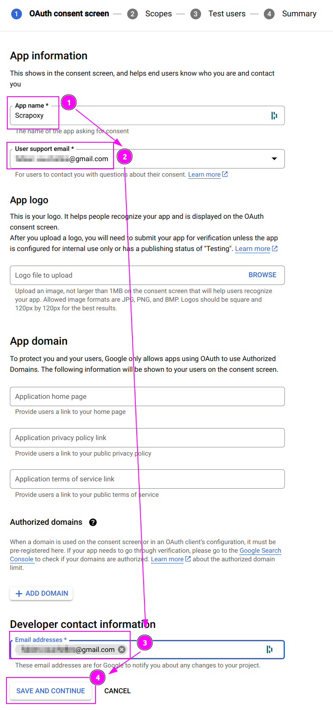

1. Enter `Scrapoxy` as App name;
2. Select your email address as User support email;
3. Enter your email address as Developer contact information;
4. And click on `SAVE AND CONTINUE`.

---

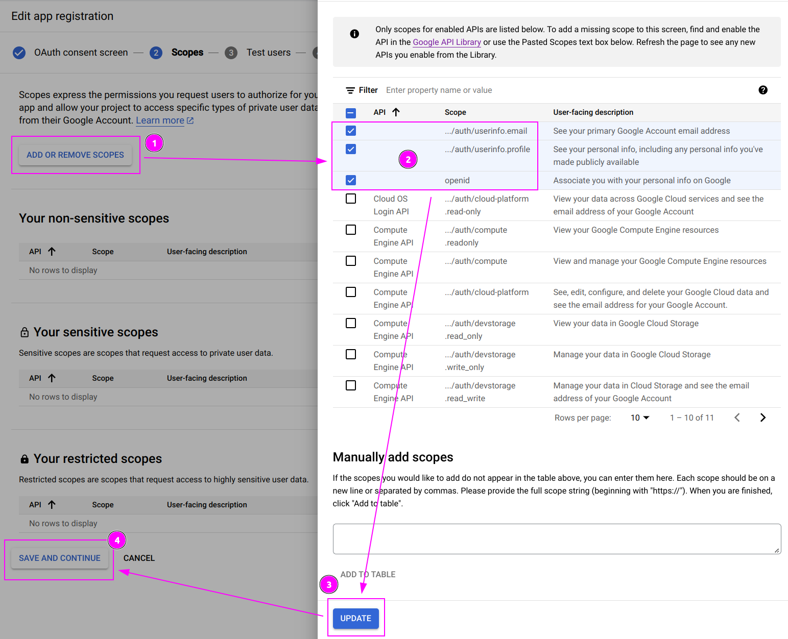

1. Click on `ADD OR REMOVE SCOPES`;
2. Select the following scopes:
- `/auth/usersinfo.email`
- `/auth/userinfo.profile`
- `/openid`
3. Click on `UPDATE`.
4. And click on `SAVE AND CONTINUE`.

---

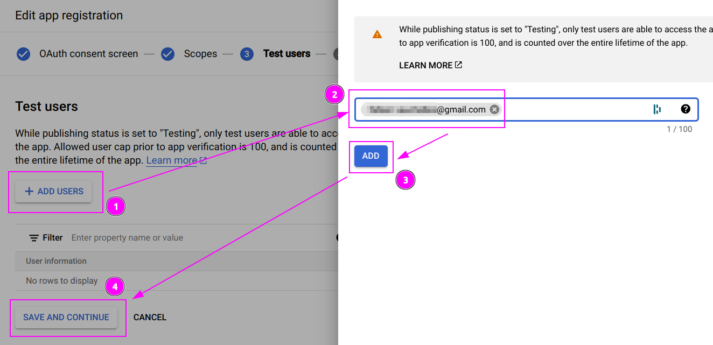

1. Click on `ADD USERS`;
2. If you have an external account, enter the gmail address of the person you want to access to Scrapoxy (including your address);
3. Click on `ADD`.
4. And click on `SAVE AND CONTINUE`.

---

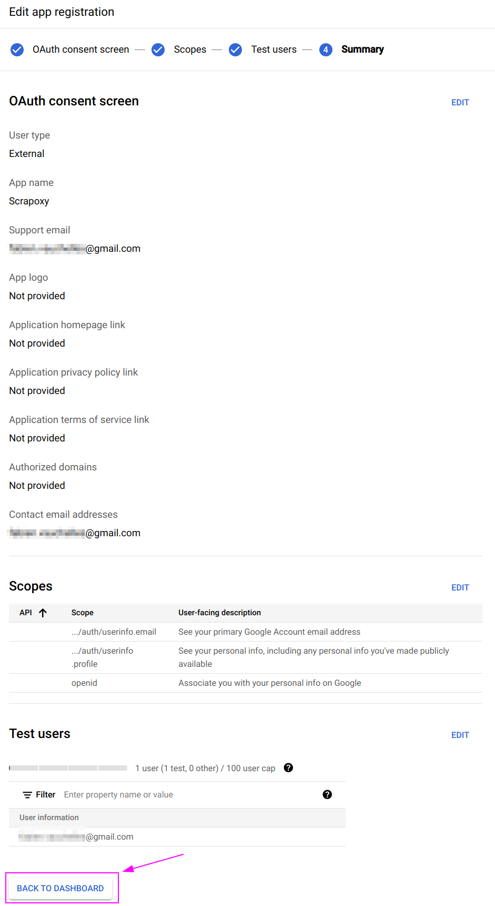

Click on `BACK TO DASHBOARD`.


### Step 3: Add client

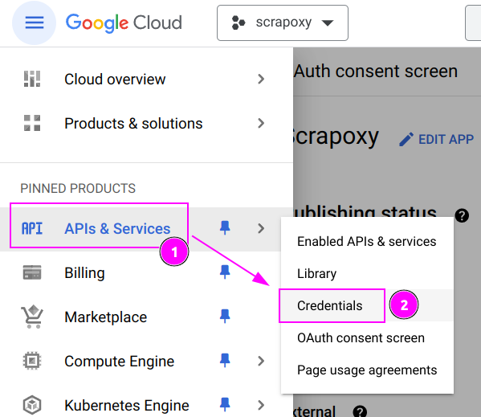

1. On the left menu, click on `APIs & Services`;
2. And click on `Credentials`.

---

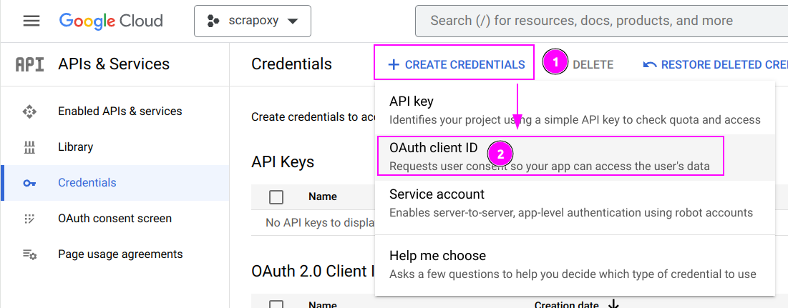

1. Click on `+ CREATE CREDENTIALS`;
2. And click on `OAuth client ID`.

---

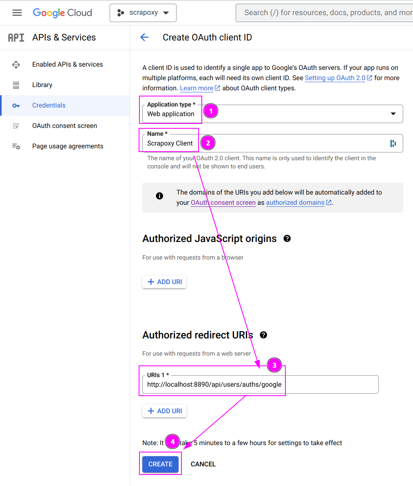

1. Select `Web application` as Application type;
2. Enter `Scrapoxy Client` as Name;
3. Enter `http://localhost:8890/api/users/auths/google` as Authorized redirect URIs (replace `http://localhost:8890` by the **external URL** of your Scrapoxy instance)
4. And click on `CREATE`.

::: info
Google only accepts HTTPS URLS.
:::


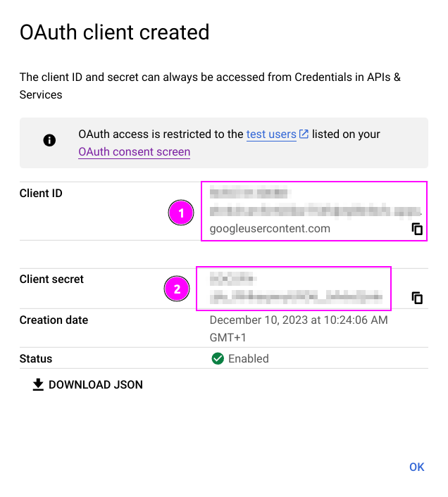

1. Remember the Client ID;
2. Remember the Client secret;


## Scrapoxy

### With Docker

Open the **terminal** and run the following command:

```shell
docker run -d -p 8888:8888 -p 8890:8890 -e FRONTEND_URL=http://localhost:8890 -e AUTH_GOOGLE_CLIENT_ID=my_client_id -e AUTH_GOOGLE_CLIENT_SECRET=my_client_secret -e BACKEND_JWT_SECRET=secret1 -e FRONTEND_JWT_SECRET=secret2 scrapoxy/scrapoxy
```

Replace:
- `my_client_id` and `my_client_secret` with the values you copied earlier;
- `http://localhost:8890` by the external URL of your Scrapoxy instance (HTTPS only).

Scrapoxy will automatically bootstrap the Google authentication:

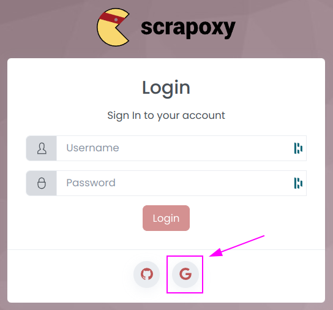


### With NPM

### On Linux

Open the **terminal** and run the following command:

```shell
FRONTEND_URL=http://localhost:8890 AUTH_GOOGLE_CLIENT_ID=my_client_id AUTH_GOOGLE_CLIENT_SECRET=my_client_secret BACKEND_JWT_SECRET=secret1 FRONTEND_JWT_SECRET=secret2 npx --yes scrapoxy
```

Replace:
- `my_client_id` and `my_client_secret` with the values you copied earlier;
- `http://localhost:8890` by the external URL of your Scrapoxy instance (HTTPS only).


### On Windows

Open the **Command Prompt** and run the following command:

```shell
set FRONTEND_URL=http://localhost:8890
set AUTH_GOOGLE_CLIENT_ID=my_client_id
set AUTH_GOOGLE_CLIENT_SECRET=my_client_secret
set BACKEND_JWT_SECRET=secret1
set FRONTEND_JWT_SECRET=secret2
npx --yes scrapoxy
```

Replace:
- `my_client_id` and `my_client_secret` with the values you copied earlier;
- `http://localhost:8890` by the external URL of your Scrapoxy instance (HTTPS only).
