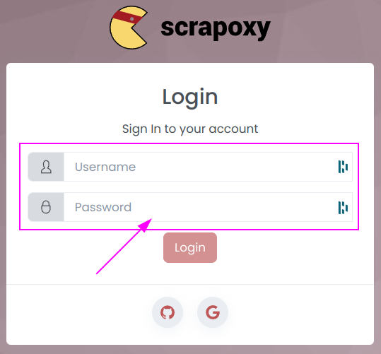

# Standard Authentication

Standard Authentication is the default authentication.

It uses a single login and a password.

::: info
Only one login and password is allowed per installation.
:::


## Scrapoxy

Add 2 environment variables to your Scrapoxy instance:

```shell
export AUTH_LOCAL_USERNAME=admin
export AUTH_LOCAL_PASSWORD=mypassword
```

Replace `admin` and `mypassword` by your own values.

Based on this environment values, Scrapoxy will automatically bootstrap the Standard authentication.

::: info
Adapt the command to your environment (Docker, Kubernetes, etc.).
:::

And restart your Scrapoxy instance with Standard Authentication:


