# Amazon Web Services Connector

{width=150, nozoom}

[Amazon Web Services](https://aws.amazon.com) is a subsidiary of Amazon that provides on-demand cloud computing.

## Prerequisites

An active subscription to Amazon Web Services (AWS) is required.

## AWS Console

Connect to [AWS Console](https://console.aws.amazon.com).

### Create new credential

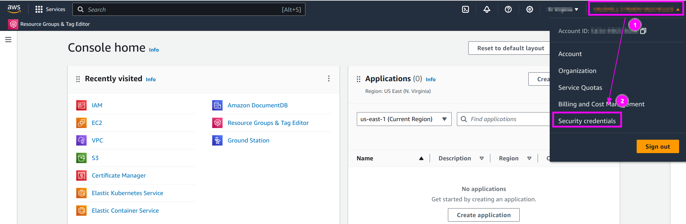

1. On the top right, click on your name to open the menu;
2. And click on `Security credentials`.

---

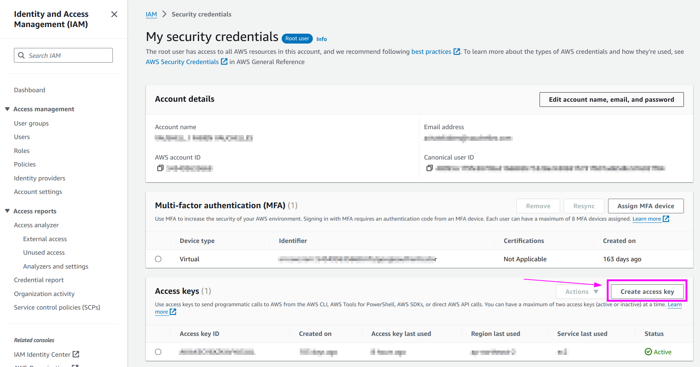

Click on `Create access key`.

---

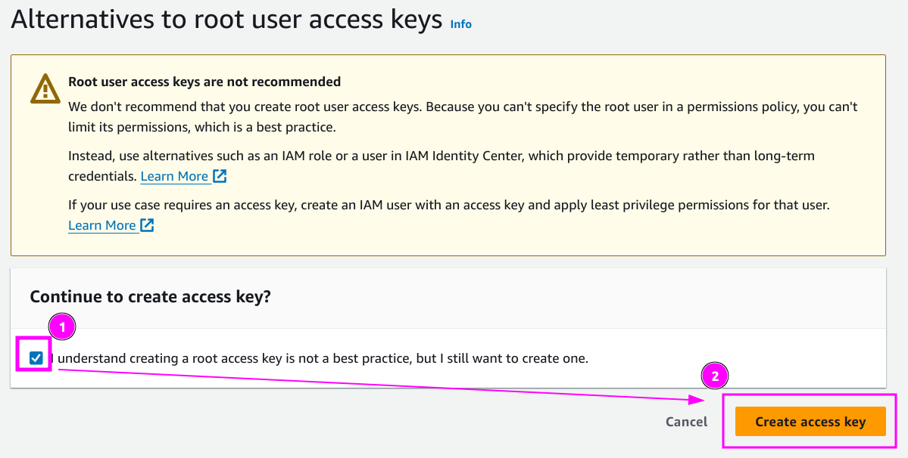

1. Check the box;
2. And click on `Create access key`.

---

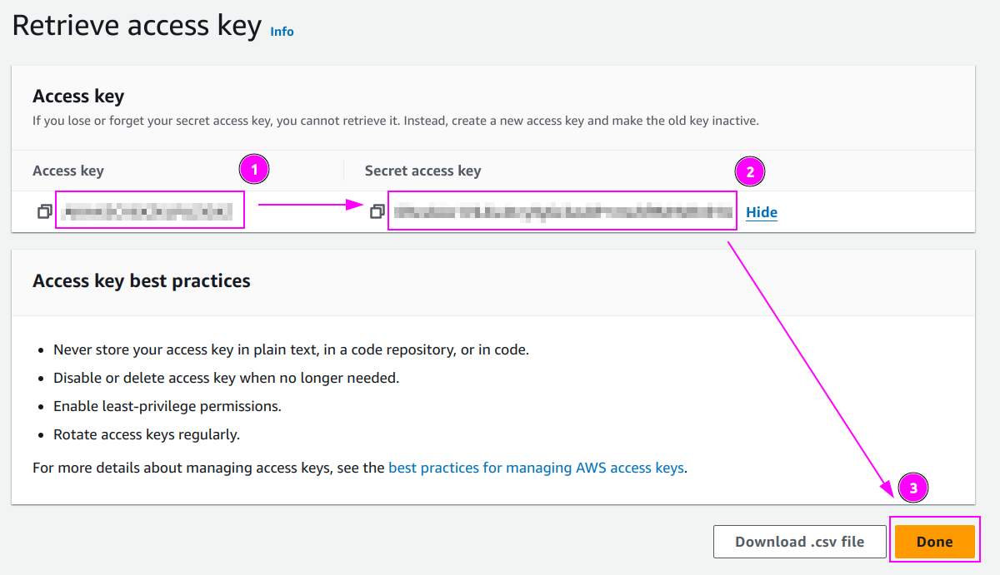

Remember the `Access key ID` and the `Secret access key` values.

## Scrapoxy

Open Scrapoxy User Interface and select `Marketplace`:

### Step 1: Create a new credential

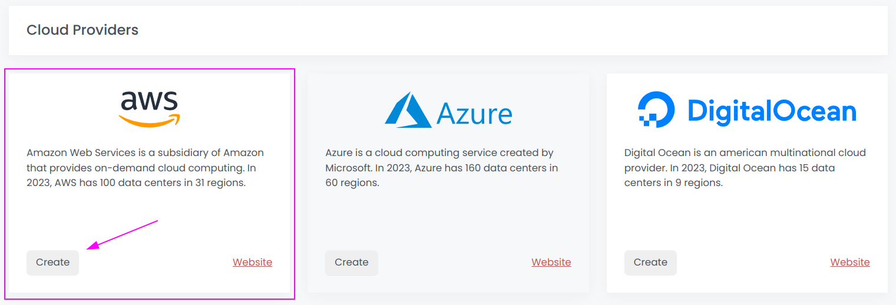

Select `AWS` as provider to create a new credential (use search if necessary).

---

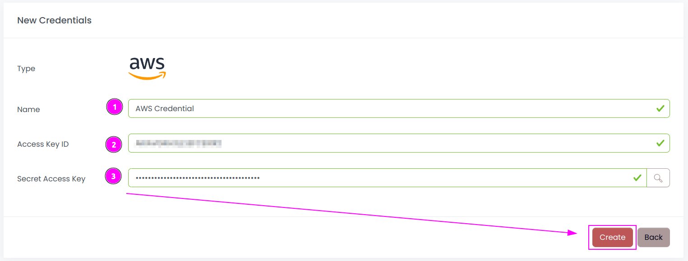

Complete the form by entering the following information:
1. **Name**: Specify the unique name for the credential;
2. **Access key ID**: Provide the Access Key ID associated with the account;
3. **Secret access key**: Enter the Client Secret associated with the account.

And click on `Create`.

### Step 2: Create a new connector

Create a new connector:

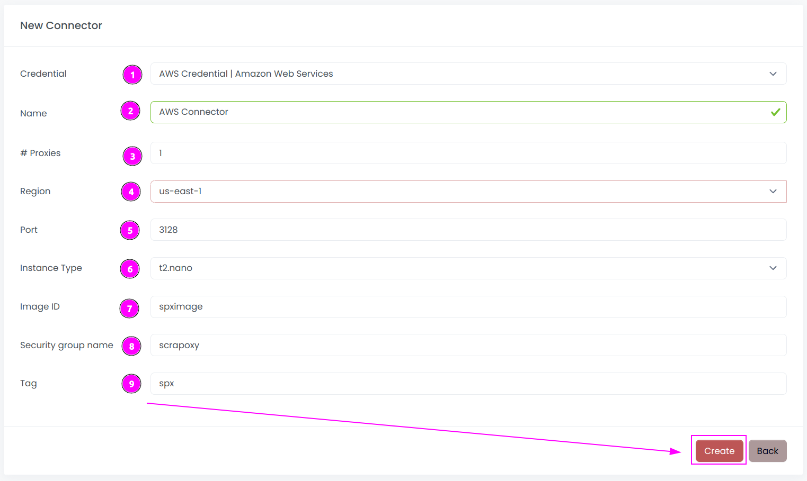

Complete the form with the following information:
1. **Credential**: The previous credential;
2. **Name**: The name of the connector;
3. **# Proxies**: The number of instances to create;
4. **Region**: The region where the instances will be created;
5. **Port**: The port of the proxy (on AWS);
6. **Instance Type**: The type of the instance;
7. **Image ID**: The name of the image in the region;
8. **Security group name**: The name of the security group containing the firewall rules;
9. **Tag**: The default tag for instance.

And click on `Create`.

::: tip
You can retain most of the default values if they are suitable for your use case.
:::

### Step 3: Install the connector

::: warning
AWS requires an image by region. So you must install the connector in each region you want to use.
:::

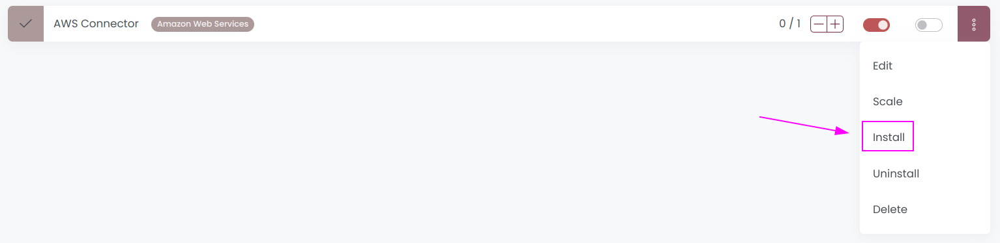

On the connector list, click on `Install`.

---

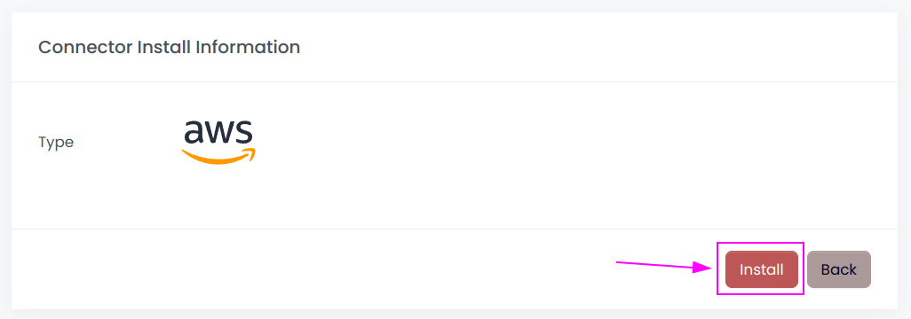

Click on `Install`.

Scrapoxy will start, install and stop the VM to create a custom image.

---

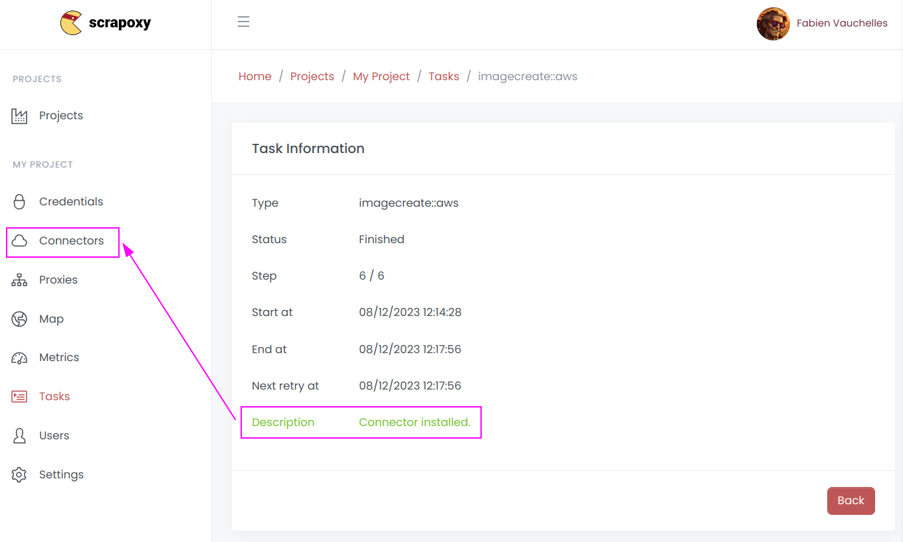

When the installation is finished, click on `Connectors`.

---

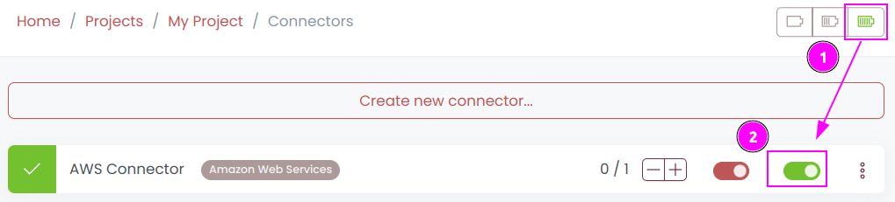

1. Start the project;
2. Start the connector.

### Other: Uninstall the connector

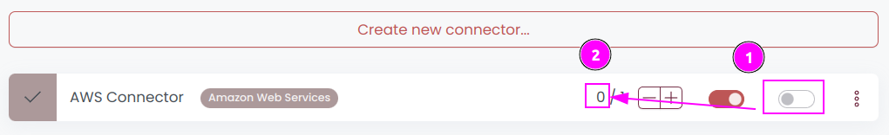

1. Stop the connector;
2. Wait for proxies to be removed.

---

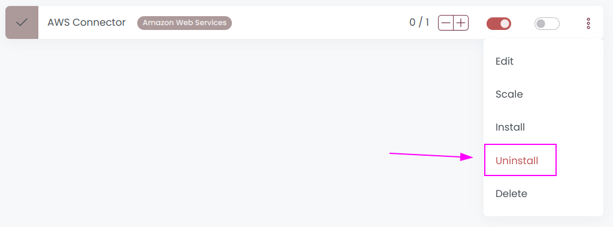

On the connector list, click on `Uninstall`.

---

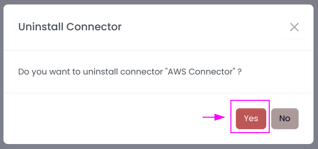

Confirm the uninstallation.

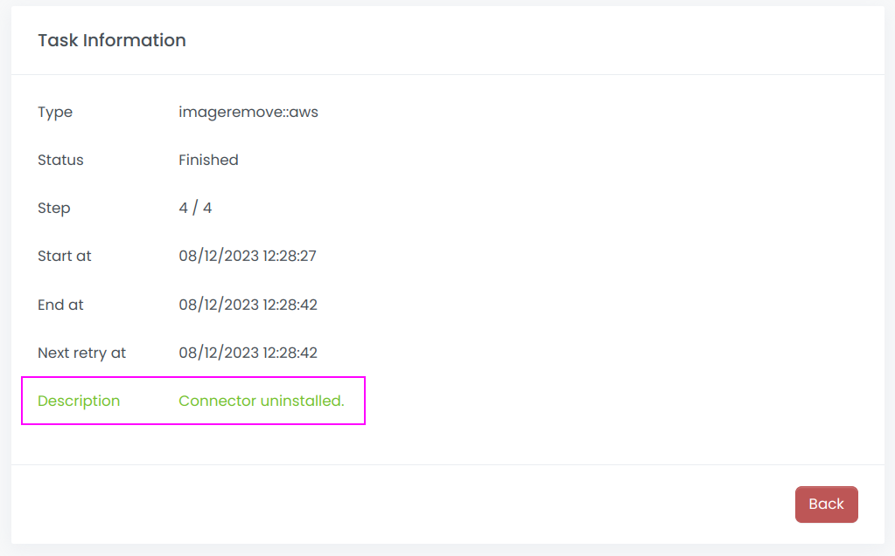

Wait for the uninstallation to finish: Scrapoxy will delete the custom image.
