# Bright Data Connector

{width=280 nozoom}

[Bright Data](https://get.brightdata.com/khkl3keb25ld) provides award-winning proxy networks, AI-powered web scrapers, 
and business-ready datasets for download. Welcome to the internet’s most trusted web data platform.

## Prerequisites

An active Bright Data subscription is required.

## Bright Data Dashboard

Connect to [Dashboard](https://brightdata.com/cp).

### Create a token

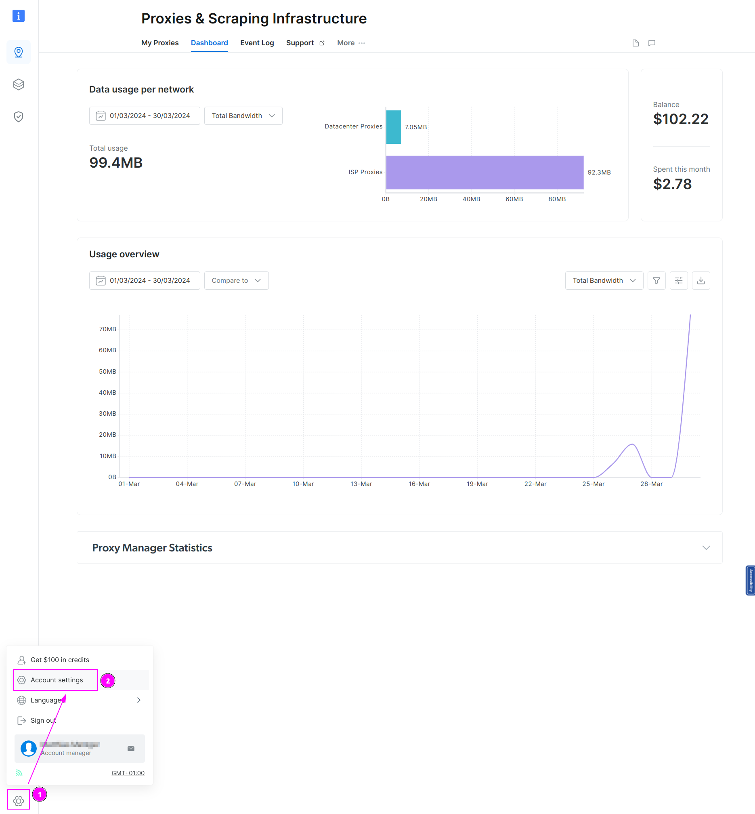

1. On the left menu, select the wheel at the bottom;
2. Click on `Account settings`.

---

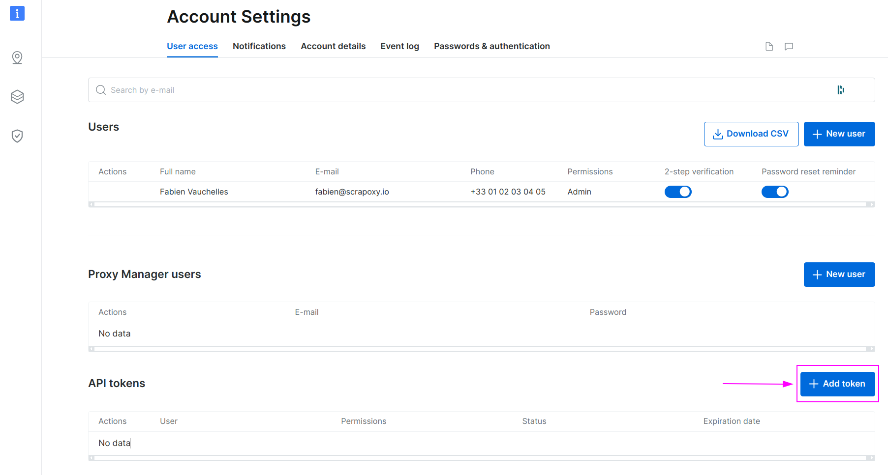

Click on `Add token`.

---

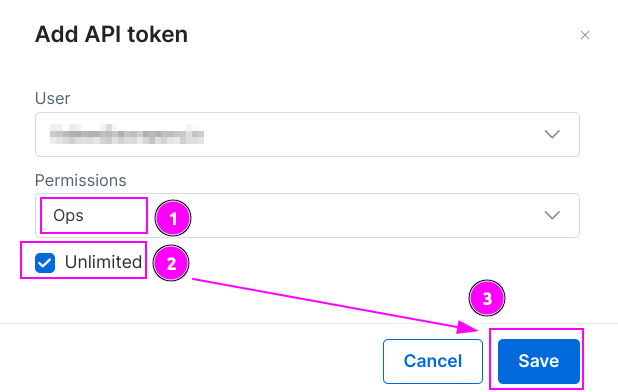

1. Select the `Ops` permissions;
2. Click on `Unlimited` or specify a date for a limited token if wanted;
3. Click on `Save`.

---

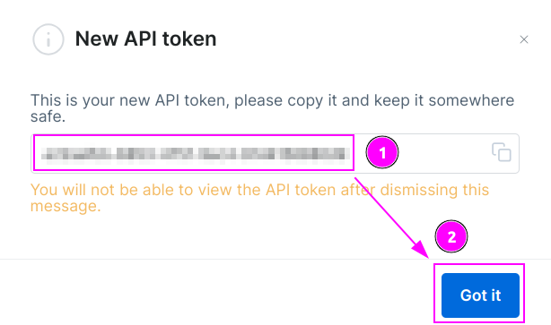

1. Remember the token;
2. and click on `Got it`.

### Add a zone

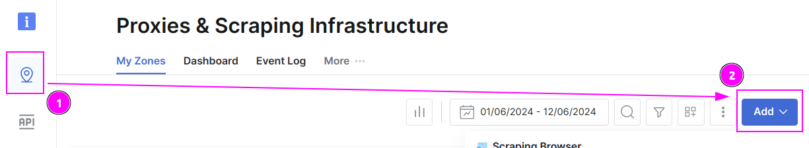

1. On the left menu, click on the zone icon;
2. Click on `Add`.

---

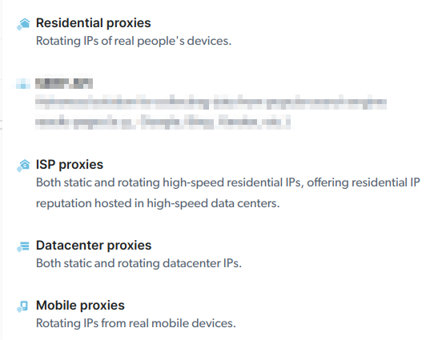

Choose between Residential, ISP, Datacenter or Mobiles proxies.

### Add proxies count and country (for Datacenter or ISP proxies only)

Geolocation for Datacenter or ISP proxies cannot be managed directly in Scrapoxy, as BrightData assigns the country during zone creation.

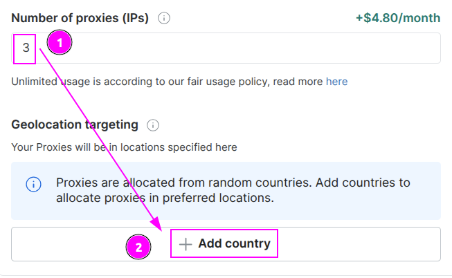

In the `Basic settings`:

1. Specify the required number of proxies;
2. Add a country.

::: info
It is recommended to assign only one country per zone. For multiple countries, create separate zones for each.
:::

## Scrapoxy

Open Scrapoxy User Interface and select `Marketplace`:

### Step 1: Create a new credential

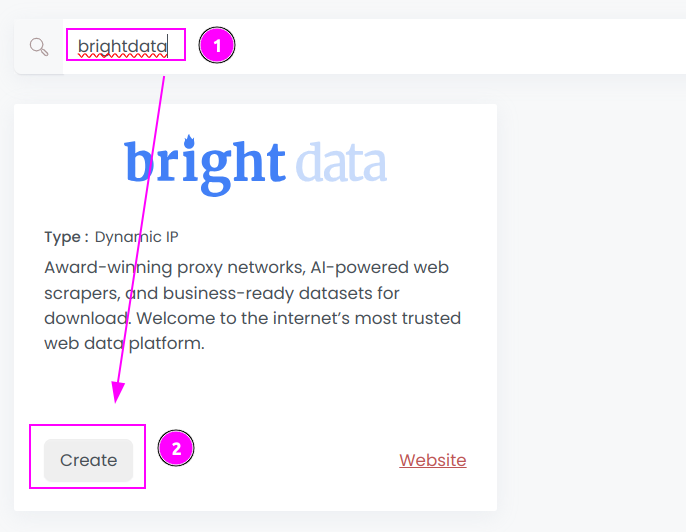

Select `Brightdata` to create a new credential (use search if necessary).

---

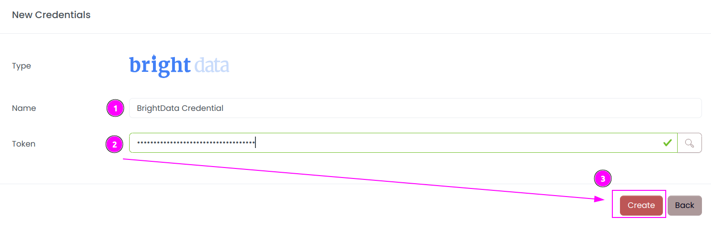

Complete the form with the following information:
1. **Name**: The name of the credential;
2. **Token**: The token.

And click on `Create`.

### Step 2: Create a new connector

Create a new connector and select `BrightData` as provider:

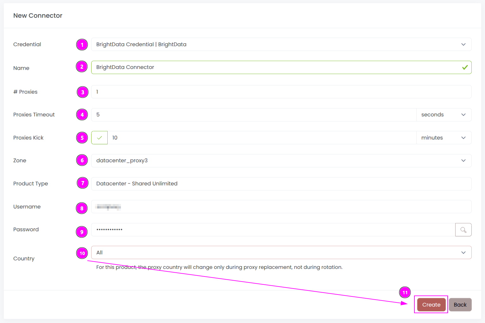

Complete the form with the following information:
1. **Credential**: The previous credential;
2. **Name**: The name of the connector;
3. **# Proxies**: The number of instances to create;
4. **Proxies Timeout**: Maximum duration for connecting to a proxy before considering it as offline;
5. **Proxies Kick**: If enabled, maximum duration for a proxy to be offline before being removed from the pool;
6. **Zone**: The zone to use;
7. **Country**: Select the country to use, or `All` to use all countries (only available for Residential and Mobile proxies).

And click on `Create`.

::: warning
To prevent rate limit issues, please set the `Proxies Timeout` to 30 seconds.
:::

### Step 3: Start the connector

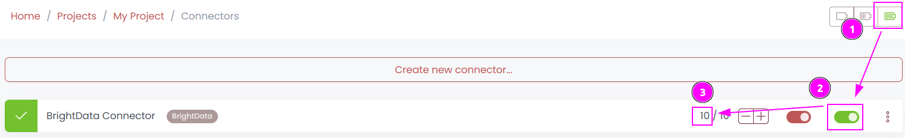

1. Start the project;
2. Start the connector.

### Step 4: Interact with proxies

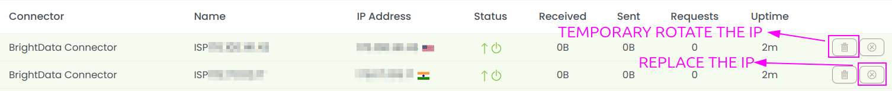

Within this connector, you can perform 2 actions on the proxies:
1. **Trash button**: Initiates a proxy rotation. The session is temporarily removed and will be reused later.
2. **Cross button**: Requests a replacement from BrightData to permanently replace the IP, which comes with associated costs.

::: info
If a country is chosen from the configuration menu,
the trash button will swap the current instance with an instance of the selected country.
:::

### Other: Stop the connector

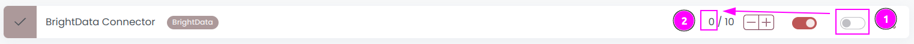

1. Stop the connector;
2. Wait for proxies to be removed.
