# Digital Ocean Connector

{width=280 nozoom}

[Digital Ocean](https://digitalocean.com) is an US multinational cloud provider.

## Prerequisites

An active Digital Ocean subscription is required.

## Digital Ocean Admin

Connect to [Admin](https://cloud.digitalocean.com).

### Create new credential

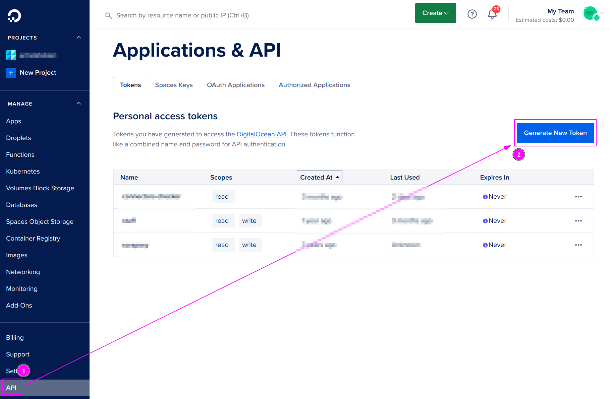

On the left menu, click on `API` and click on `Generate New Token`.

---

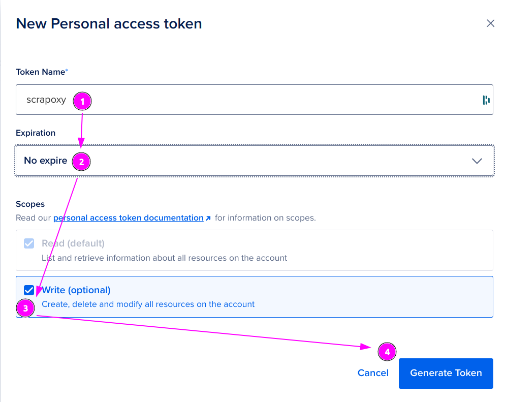

1. Enter `scrapoxy` as Token name;
2. Select `No expire` for Expiration;
3. Check the `Write` box on Scopes
4. And click on `Generate Token`.

---

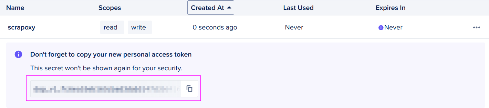

Remember the `Token` value.

## Scrapoxy

Open Scrapoxy User Interface and select `Credentials`:

### Step 1: Create a new credential

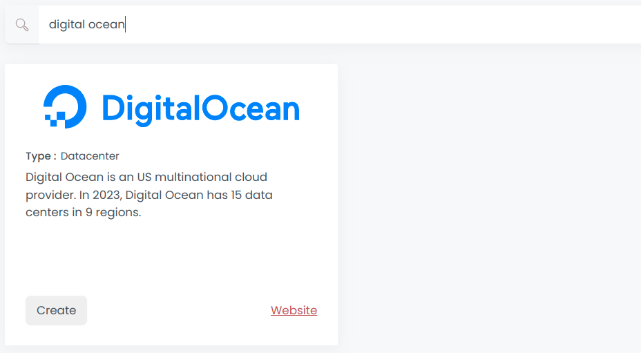

Create a new credential and select `Digital Ocean` as provider.

---

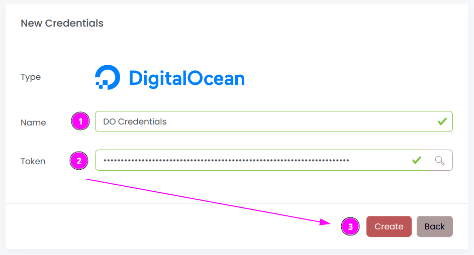

Complete the form with the following information:
1. **Name**: The name of the credential;
2. **Access key ID**: The Access key ID of the account;
3. **Secret access key**: The Client Secret of the account.

And click on `Create`.

### Step 2: Create a new connector

Create a new connector and select `Digital Ocean` as provider:

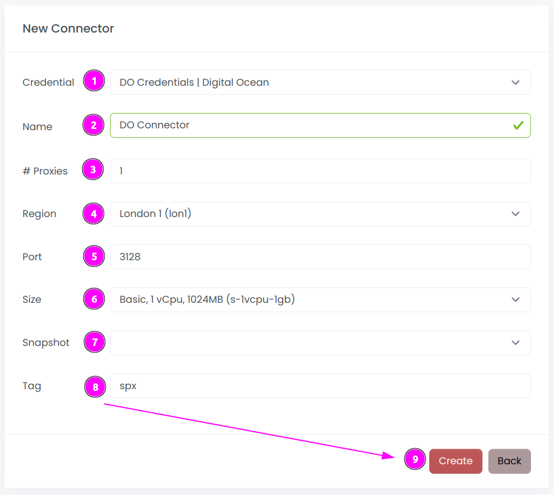

Complete the form with the following information:
1. **Credential**: The previous credential;
2. **Name**: The name of the connector;
3. **# Proxies**: The number of instances to create;
4. **Region**: The region where the instances will be created;
5. **Port**: The port of the proxy (on Digital Ocean);
6. **Size**: The type of the instance;
7. **Snapshot**: The name of the snapshot to use. ⚠️ Don't fill it, it will be created automatically during installation;
8. **Security group name**: The name of the security group containing the firewall rules;
9. **Tag**: The default tag for instance.

And click on `Create`.

::: tip
You can retain most of the default values if they are suitable for your use case.
:::

### Step 3: Install the connector

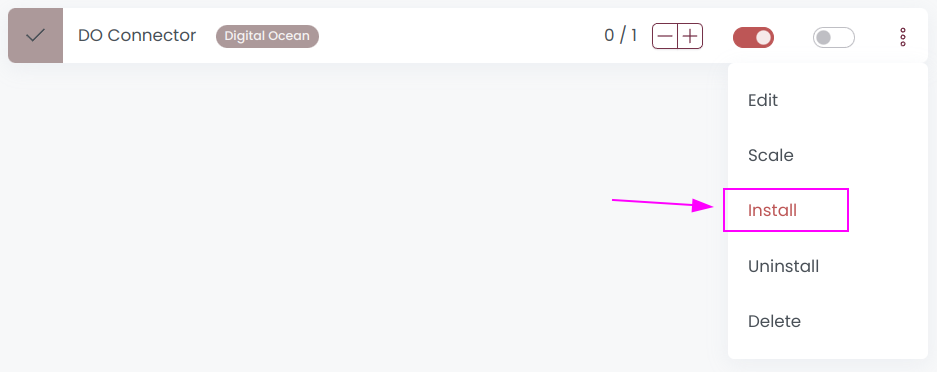

On the connector list, click on `Install`.

---

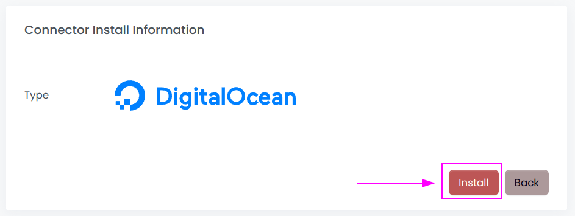

Click on `Install`.

Scrapoxy will start, install and stop the VM to create a custom image.

---

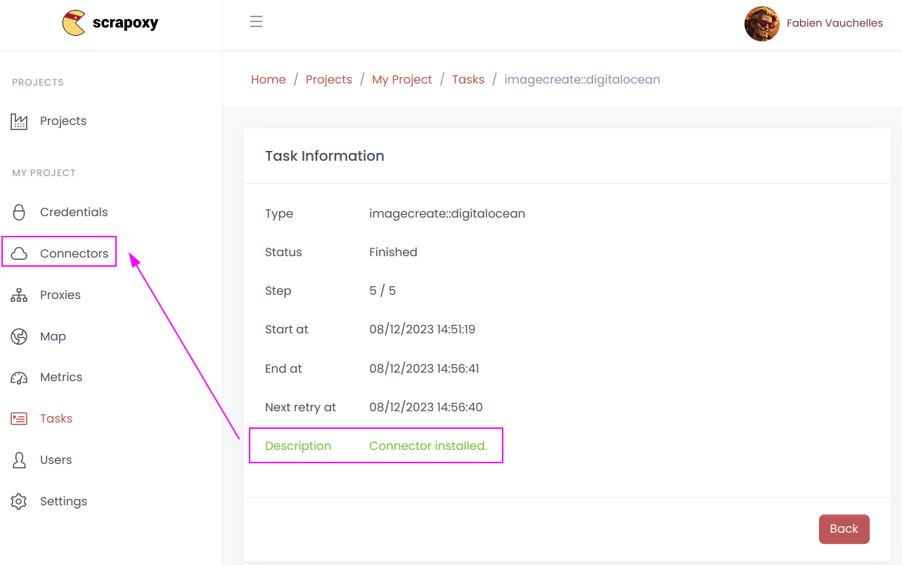

When the installation is finished, click on `Connectors`.

---

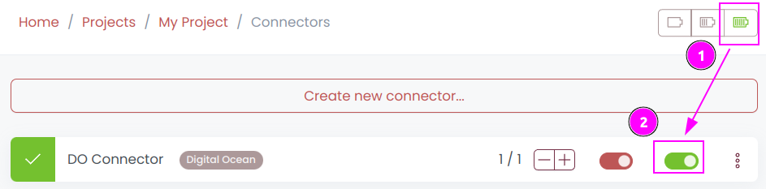

1. Start the project;
2. Start the connector.

### Other: Uninstall the connector

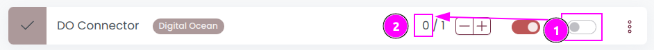

1. Stop the connector;
2. Wait for proxies to be removed.

---

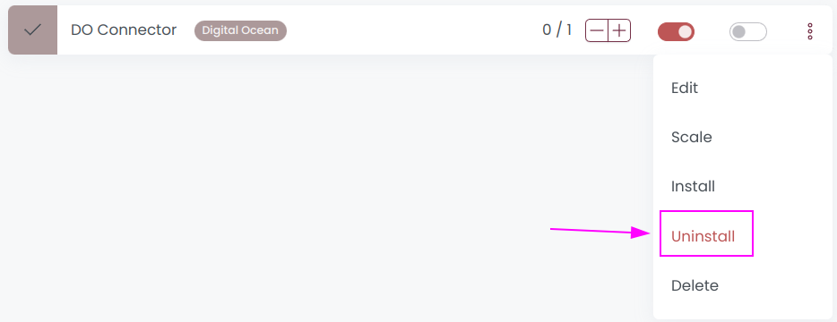

On the connector list, click on `Uninstall`.

---

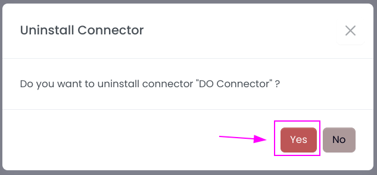

Confirm the uninstallation.

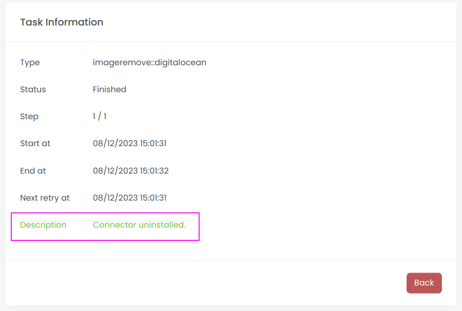

Wait for the uninstallation to finish: Scrapoxy will delete the custom image.
