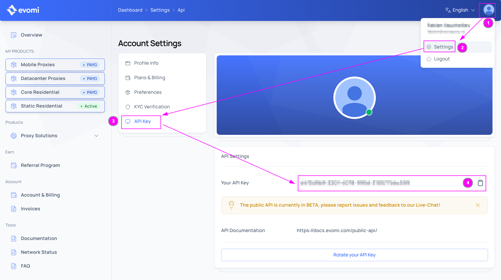
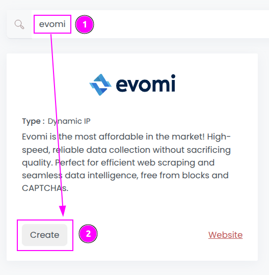
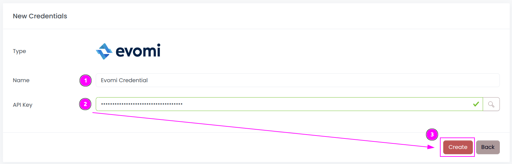
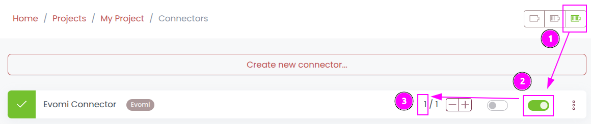
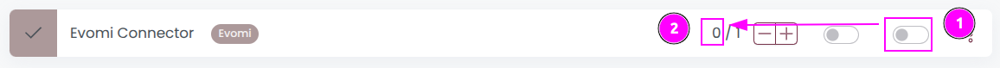

# Evomi Connector

{width=280 nozoom}

[Evomi](/l/evomi) provides the most affordable in the market! 
High-speed, reliable data collection without sacrificing quality. 
Perfect for efficient web scraping and seamless data intelligence, free from blocks and CAPTCHAs.

## Prerequisites

An active Evomi subscription is required.

## Evomi Dashboard

Connect to [Dashboard](/l/evomi-dashboard).

### Get credentials

1. On the top right, click on the user icon to open the menu;
2. Click on `Settings`;
3. Select the tab `API Keys` on the left;
4. Remember the `API Key`.

## Scrapoxy

Open Scrapoxy User Interface and select `Marketplace`:

### Step 1: Create a new credential

Select `Evomi` to create a new credential (use search if necessary).

---

Complete the form with the following information:
1. **Name**: The name of the credential;
2. **API Key**: The API key.

And click on `Create`.

### Step 2: Create a new connector

Create a new connector and select `Evomi` as provider:

Complete the form with the following information:
1. **Credential**: The previous credential;
2. **Name**: The name of the connector;
3. **# Proxies**: The number of instances to create;
4. **Proxies Timeout**: Maximum duration for connecting to a proxy before considering it as offline;
5. **Proxies Kick**: If enabled, maximum duration for a proxy to be offline before being removed from the pool;
6. **Product**: Select the product to use;
7. **Country**: Select the country to use, or `All` to use all countries.

::: info
The hostname, port, username, and password are simply details provided for your reference and don't need to be remembered.
:::

And click on `Create`.

### Step 3: Start the connector

1. Start the project;
2. Start the connector.

### Other: Stop the connector

1. Stop the connector;
2. Wait for proxies to be removed.
