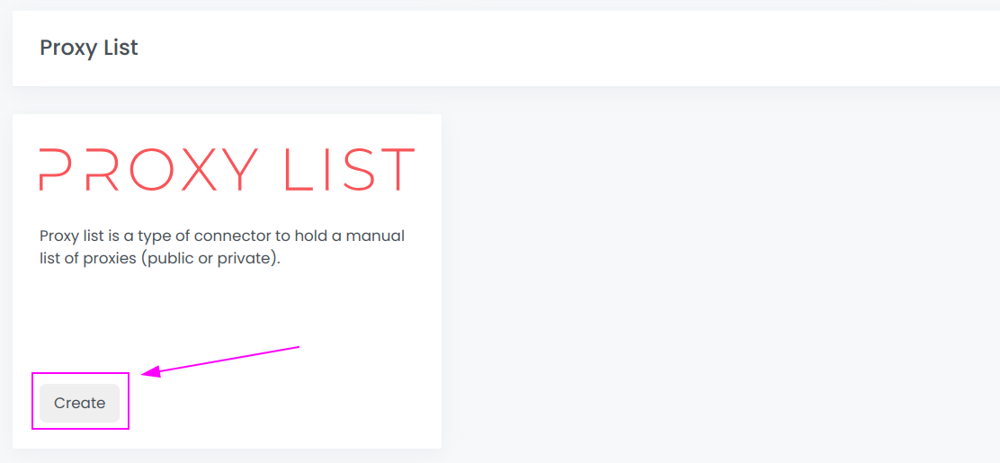
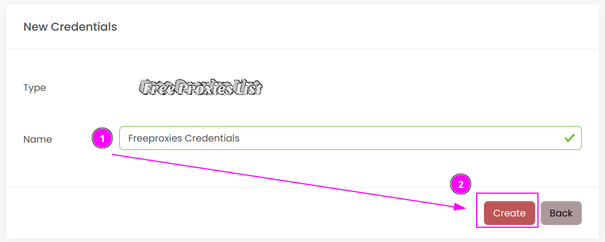
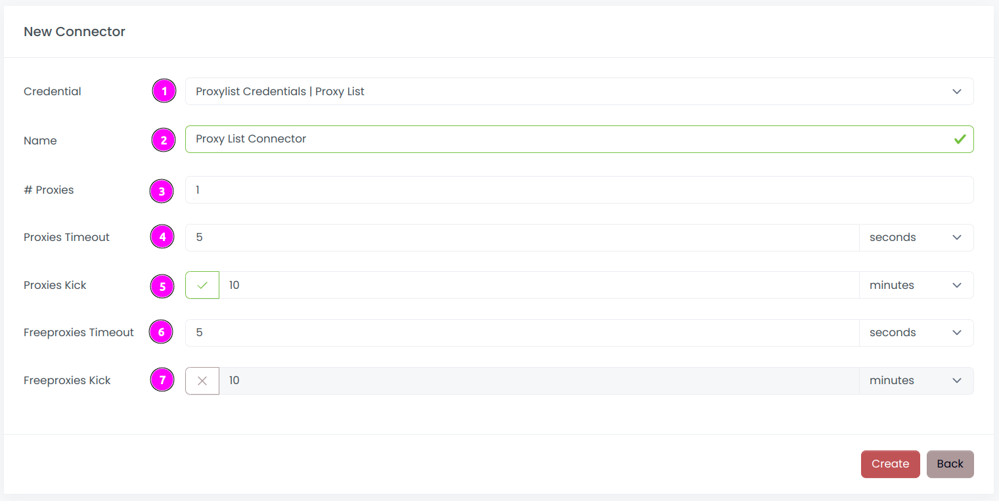
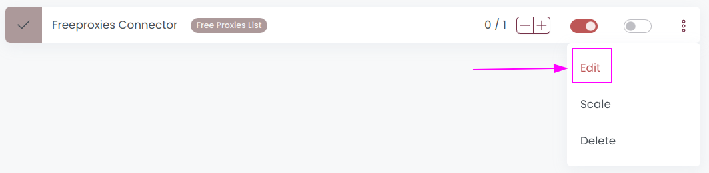
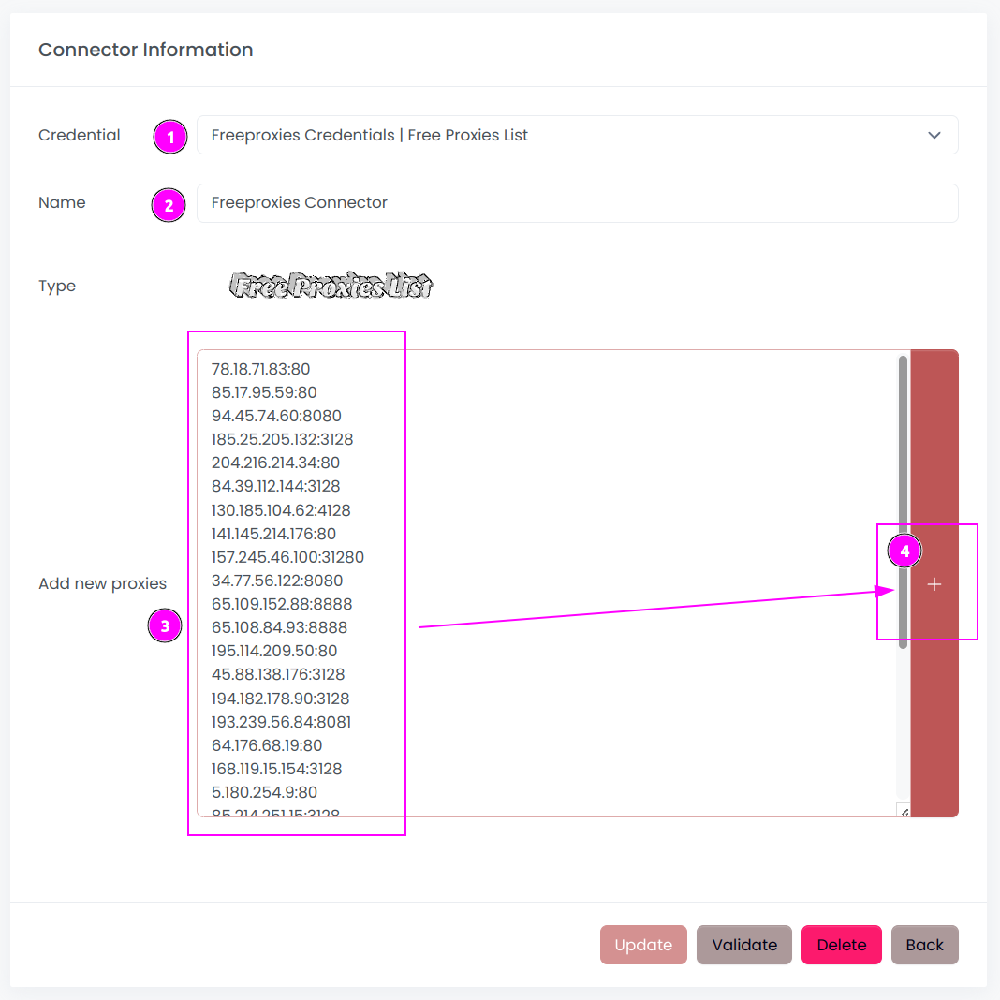
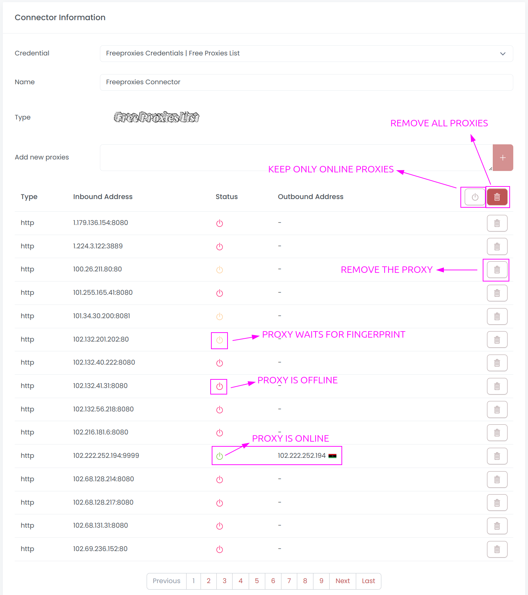
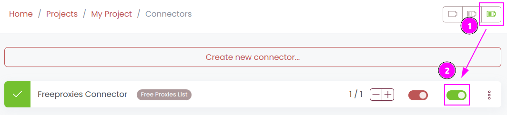
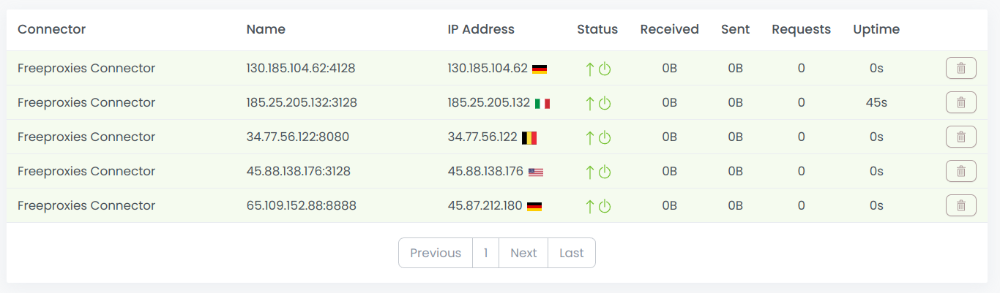

# Free Proxies List Connector

A _Free Proxies List_ is a specific type of connector designed to manage a manual list of proxies. 
Users have the flexibility to either utilize their own private proxies or incorporate a list of free proxies available on the Internet.

For instance, a free proxies list can be obtained from:
- [ProxyScrape](https://proxyscrape.com/free-proxy-list)

## Scrapoxy

Open Scrapoxy User Interface and select `Credentials`:

### Step 1: Create a new credential

Create a new credential and select `Free Proxies List` as provider.

---

Complete the form with the following information:
1. **Name**: The name of the credential

And click on `Create`.

::: info
This credential is a holder for the free proxies connector
because Scrapoxy always needs a credential to create a connector.
:::

### Step 2: Create a new connector

Create a new connector and select `Free Proxies List` as provider:

Complete the form with the following information:
1. **Credential**: The previous credential;
2. **Name**: The name of the connector;
3. **# Proxies**: The number of instances to create.

### Step 3: Add some proxies

On the connector, click on `Update`.

---

Copy / Paste a list of proxies in the textarea.

Scrapoxy supports theses formats:
- `ip:port`
- `ip:port:username:password`
- `http://ip:port`
- `http://ip:port:username:password`
- `https://ip:port`
- `https://ip:port:username:password`

--- 

Scrapoxy will assess the availability of proxies and retain only those
that are currently accessible for the connector.

The provided buttons offer the following functionalities:
- **Delete One Proxy**: Remove a specific proxy from the list;
- **Delete Offline Proxies**: Eliminate proxies that are either offline or in a waiting state for fingerprinting.;
- **Delete All Proxies**: Clear the entire proxy list.

### Step 3: Start the connector

1. Start the project;
2. Start the connector.

---

You can use the proxies on the connector.

### Other: Stop the connector

1. Stop the connector;
2. Wait for proxies to be removed.
