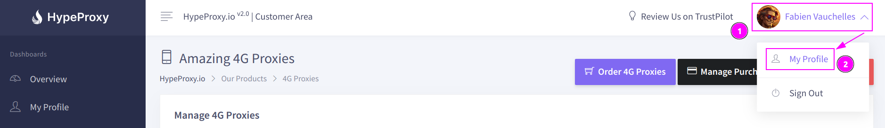
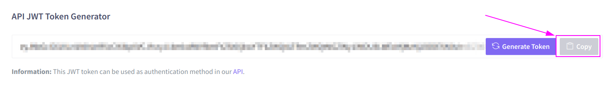
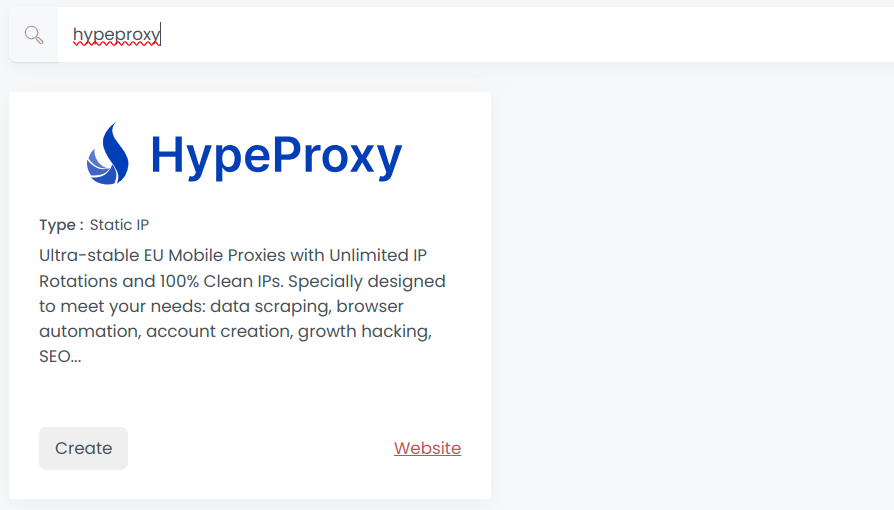
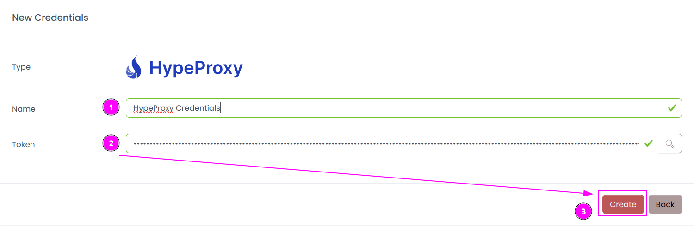
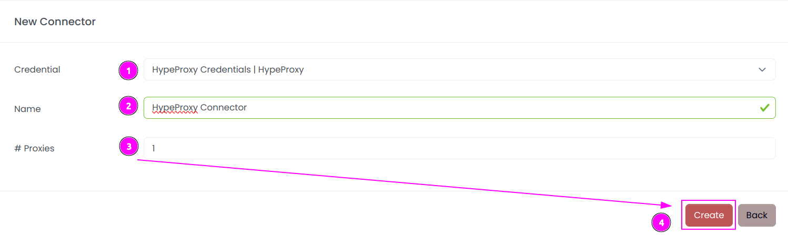
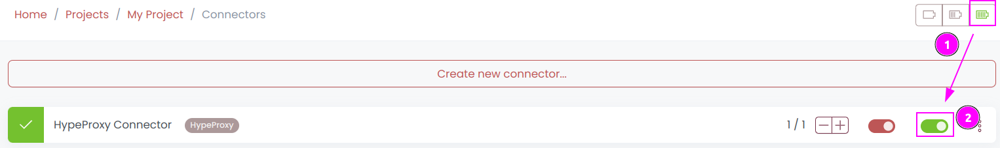
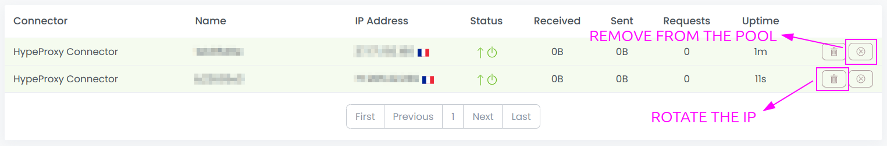
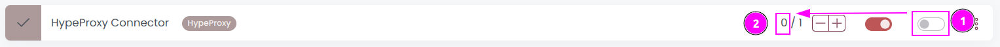

# HypeProxy Connector

{width=250 nozoom}

[HypeProxy](https://hypeproxy.io) provides ultra-stable EU Mobile Proxies with Unlimited IP Rotations and 100% Clean IPs.
Specially designed to meet your needs: data scraping, browser automation, account creation, growth hacking, SEO...

## Prerequisites

An active HypeProxy subscription is required.

## HypeProxy Dashboard

Connect to [Dashboard](https://app.hypeproxy.io).

### Get the credentials

1. On the top right, click on your profile picture;
2. Select `My Profile`.

---

Select `API Access` tab.

---

Click on `Copy` to copy the token into the clipboard. 

## Scrapoxy

Open Scrapoxy User Interface and select `Marketplace`:

### Step 1: Create a new credential

1. On the left menu, click on `Marketplace`;
2. Search for `hypeproxy`;
3. Click on `Create` button.

---

Complete the form with the following information:
1. **Name**: The name of the credential;
2. **Token**: The previously copied token.

And click on `Create`.

### Step 2: Create a new connector

Create a new connector and select `HypeProxy` as provider:

Complete the form with the following information:
1. **Credential**: The previous credential;
2. **Name**: The name of the connector;
3. **# Proxies**: The number of instances to create.

And click on `Create`.

### Step 3: Start the connector

1. Start the project;
2. Start the connector.

### Step 4: Interact with modems

Within this connector, you can perform 2 actions on the proxies:
1. **Trash button**: Remove the proxy from the Scrapoxy pool and replace it with a new one;
2. **Cross button**: Force a change in IP address of the proxy (this process takes 8 seconds).

::: info
Same proxy is re-added if there are insufficient proxies in your pool.
:::

### Other: Stop the connector

1. Stop the connector;
2. Wait for proxies to be removed.
