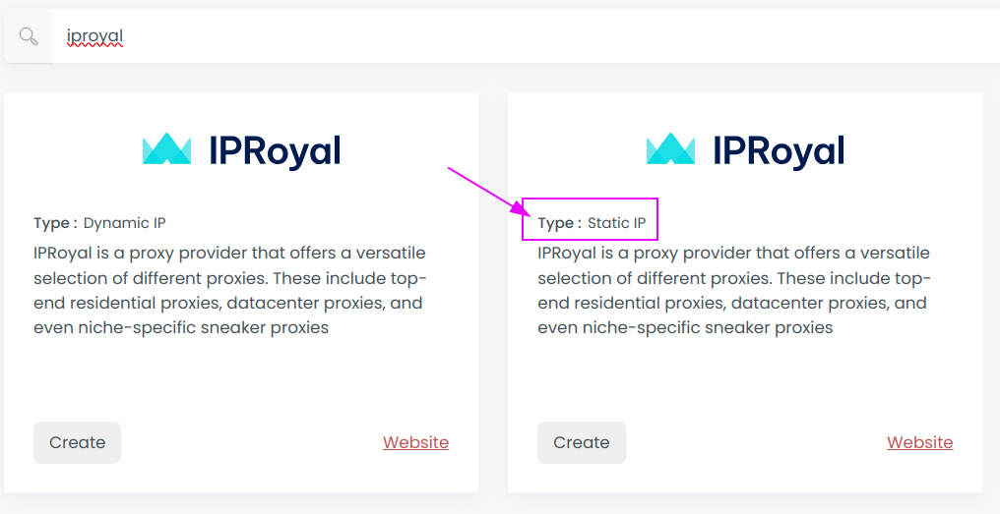
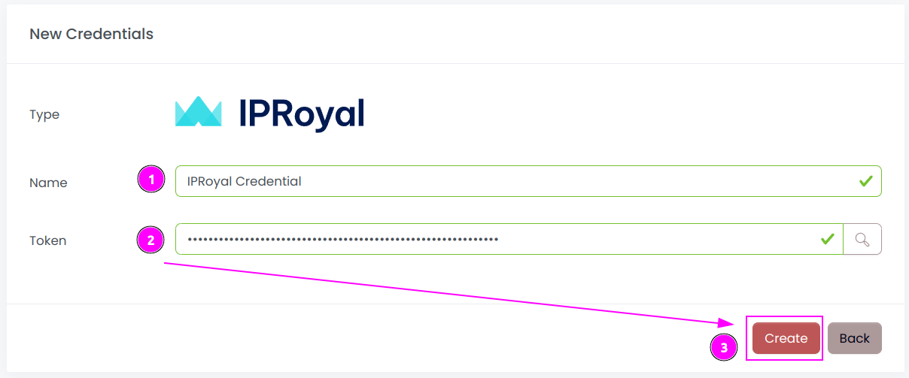
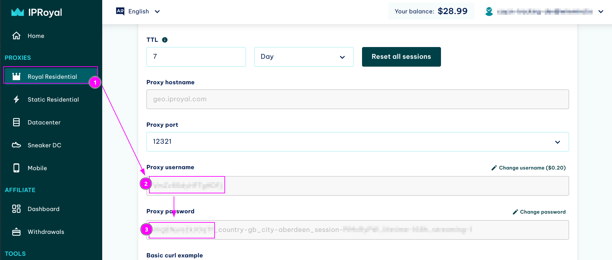
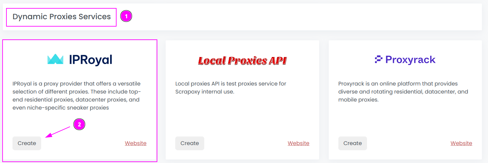
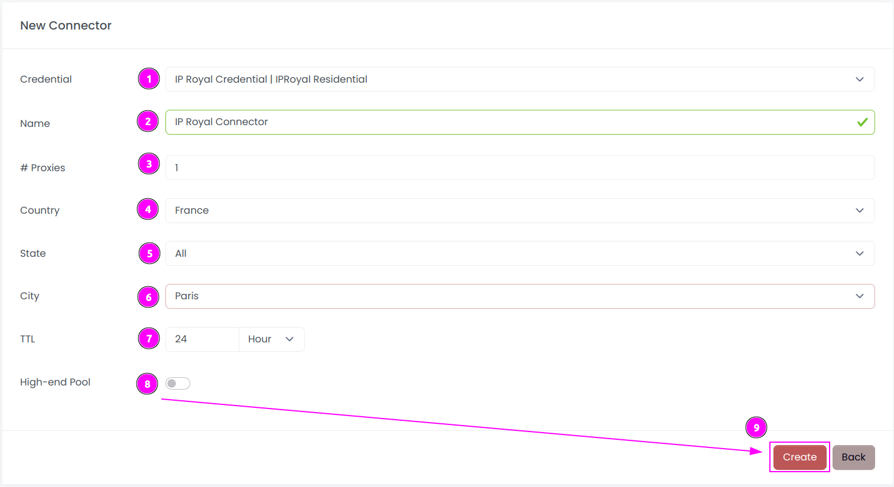

# IPRoyal Connector

{width=230 nozoom}

[IPRoyal](https://iproyal.com) is a proxy provider that offers a versatile selection of different proxies. These include top-end residential proxies, datacenter proxies, and even niche-specific sneaker proxies

Scrapoxy features 2 IPRoyal connectors:

- connector for **server proxies**: encompassing Static Residential Proxies, Sneaker DC Proxies, and Datacenter Proxies.
- connector for **residential proxies**: specifically Royal Residential Proxies.

::: info
For 4G proxies, it is advisable to utilize the [Free Proxies List](../freeproxies/guide),
as IPRoyal does not offer an API for this category.
:::

## Server Proxies

Server Proxies are static endpoints featuring a dedicated IP address. 

### Prerequisites

An active IPRoyal subscription is required on Static Residential Proxies, Sneaker DC Proxies, or Datacenter Proxies.

### IPRoyal Dashboard

Connect to [Dashboard](https://dashboard.iproyal.com).

#### Get the account credentials

1. On the top right menu, click on your username;
2. Click on `Settings`.

---

Remember `API Token`.

### Scrapoxy

Open Scrapoxy User Interface and select `Marketplace`:

#### Step 1: Create a new credential

1. In the `Static IP Providers` section,
2. Select `IPRoyal` as provider to create a new credential (use search if necessary).

---

Complete the form with the following information:
1. **Name**: The name of the credential;
2. **Token**: The token of the API.

And click on `Create`.

#### Step 2: Create a new connector

Create a new connector and select `IPRoyal` as provider:

Complete the form with the following information:
1. **Credential**: The previous credential;
2. **Name**: The name of the connector;
3. **# Proxies**: The number of instances to create;
4. **Product**: Select the product to use, or `All` to use all products;
5. **Country**: Select the country to use, or `All` to use all countries.

And click on `Create`.

#### Step 3: Start the connector

1. Start the project;
2. Start the connector.

#### Other: Stop the connector

1. Stop the connector;
2. Wait for proxies to be removed.

## Residential Proxies

Residential Proxies are accessed via a unique endpoint, and the link is maintained through a sticky session mechanism.

### Prerequisites

An active IPRoyal subscription is required on Royal Residential Proxies.

### IPRoyal Dashboard

Connect to [Dashboard](https://dashboard.iproyal.com).

#### Get the account credentials

1. On the top right menu, click on your username;
2. Click on `Settings`.

---

Remember `API Token`.

### Get the proxy credentials

1. On the left menu, select `Royal Residential`;
2. Remember the `Proxy username`;
3. Remember the `Proxy password`.

::: tip
On the password, only keep the first part before the `_` character.
:::

### Scrapoxy

Open Scrapoxy User Interface and select `Marketplace`:

#### Step 1: Create a new credential

1. In the `Dynamic IP Providers` section,
2. Select `IPRoyal` as provider to create a new credential (use search if necessary).

---

Complete the form with the following information:
1. **Name**: The name of the credential;
2. **Token**: The token of the API.

And click on `Create`.

#### Step 2: Create a new connector

Create a new connector and select `IPRoyal` as provider:

Complete the form with the following information:
1. **Credential**: The previous credential;
2. **Name**: The name of the connector;
3. **# Proxies**: The number of instances to create;
4. **Country**: Select the country to use, or `All` to use all countries;
5. **State**: Choose the state in the selected country, or `All` to use all states;
6. **City**: Choose the city in the selected, or `All` to use all cities;
7. **TTL**: Select the duration of the sticky session;
8. **High-end Pool**: If enabled, choose only fast and stable proxies from the IP Royal pool.

And click on `Create`.

::: info
Please note that State and City are mutually exclusive options and cannot be used together in the form
:::

#### Step 3: Start the connector

1. Start the project;
2. Start the connector.

#### Other: Stop the connector

1. Stop the connector;
2. Wait for proxies to be removed.
