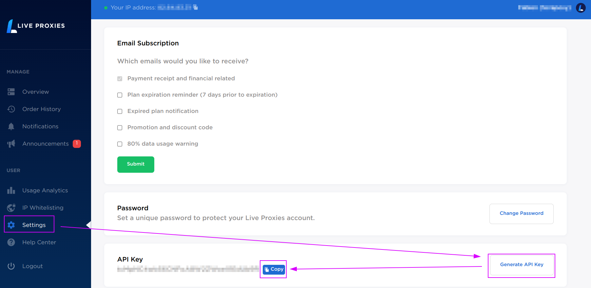
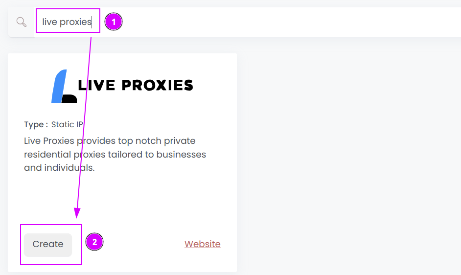
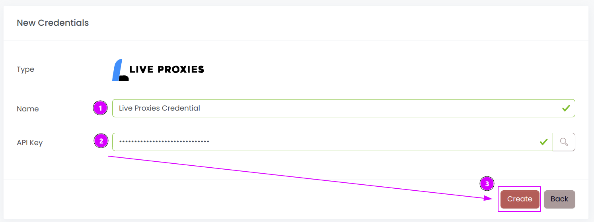
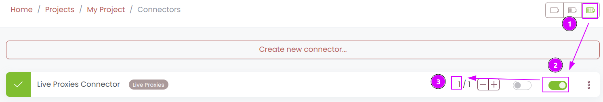
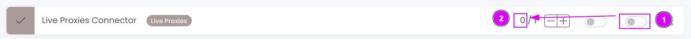

# Live Proxies Connector

{width=230 nozoom}

[Live Proxies](/l/liveproxies) provides top notch private residential proxies tailored to businesses and individuals.

## Prerequisites

An active Live Proxies subscription is required.

## Live Proxies Dashboard

Connect to [Dashboard](/l/liveproxies-dashboard).

### Get the credentials

1. Click on the `Settings` tab
2. Click on `Generate API Key` to create a new key
3. Click on `Copy` to save the key in the clipboard.

## Scrapoxy

Open Scrapoxy User Interface and select `Marketplace`:

### Step 1: Create a new credential

Select `Live Proxies` to create a new credential (use search if necessary).

---

Complete the form with the following information:
1. **Name**: The name of the credential;
2. **API Key**: The key of the API.

And click on `Create`.

### Step 2: Create a new connector

Create a new connector and select `Rayobyte` as provider:

Complete the form with the following information:
1. **Credential**: The previous credential;
2. **Name**: The name of the connector;
3. **# Proxies**: The number of instances to create;
4. **Proxies Timeout**: Maximum duration for connecting to a proxy before considering it as offline;
5. **Proxies Kick**: If enabled, maximum duration for a proxy to be offline before being removed from the pool;
6. **Plan**: Select the plan to use;
7. **Country**: Select the country to use, or `All` to use all countries. This menu only appears for `Enterprise` plan.

And click on `Create`.

### Step 3: Start the connector

1. Start the project;
2. Start the connector.

::: info
If the proxies were just ordered, it may take between 5 and 10 minutes to be available.
:::

### Other: Stop the connector

1. Stop the connector;
2. Wait for proxies to be removed.
