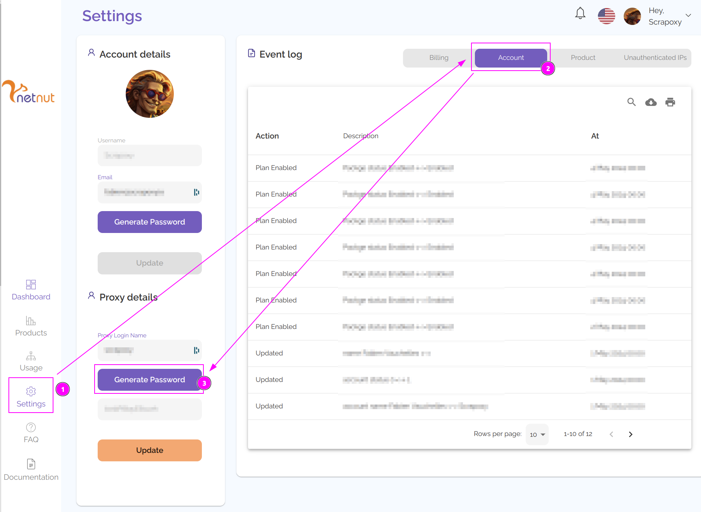
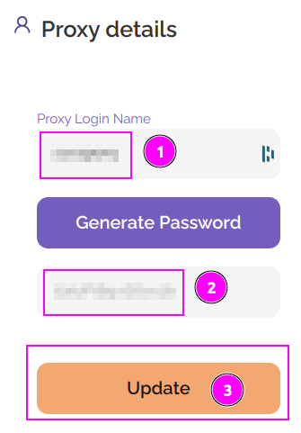
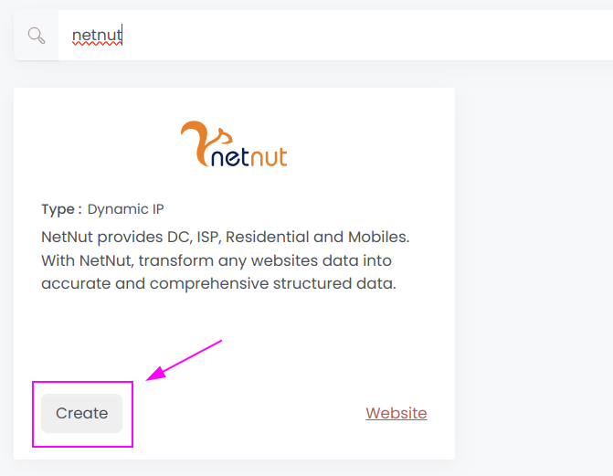
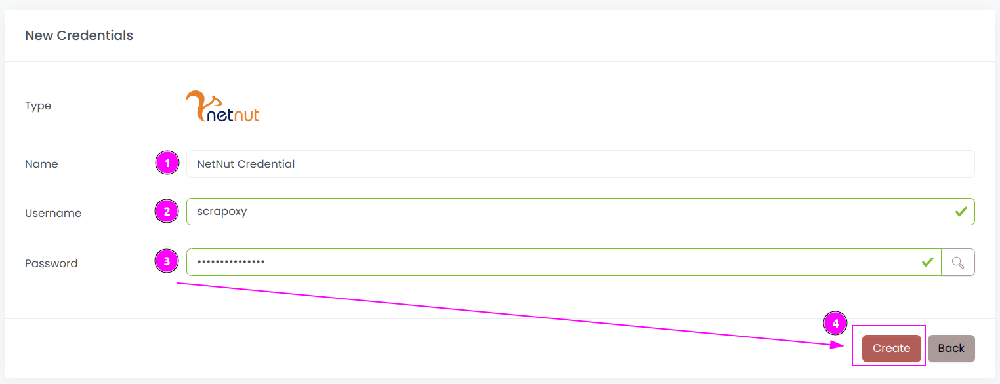
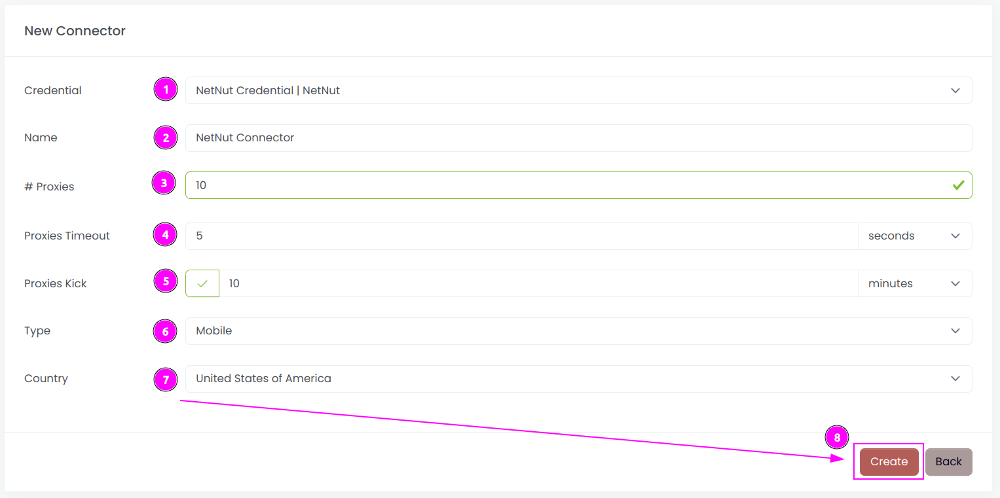
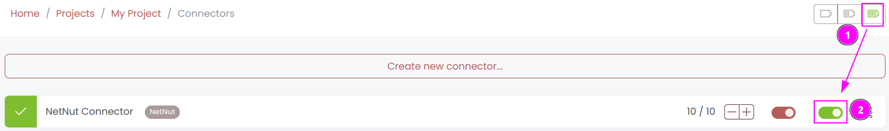
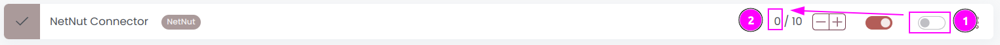

# NetNut Connector

{width=250 nozoom}

[NetNut](/l/netnut) provides DC, ISP, Residential and Mobiles. 
With NetNut, transform any websites data into accurate and comprehensive structured data.

## Prerequisites

An active NetNut subscription is required.

## NetNut Portal

Connect to [Portal](/l/netnut-dashboard).

### Update the credentials

1. On the left, click on `Settings';
2. Click on the `Account` tab;
3. Click on the `Generate Password` button.

---

1. Remember the `Proxy Login Name`;
2. Remember the `Password`;
3. Click on `Update`.

::: warning
The password is only displayed once. If you lose it, you will need to update it again.
:::

## Scrapoxy

Open Scrapoxy User Interface and select `Marketplace`:

### Step 1: Create a new credential

Select `NetNut` to create a new credential (use search if necessary).

---

Complete the form with the following information:
1. **Name**: The name of the credential;
2. **Username**: The previously copied login;
3. **Password**: The previously copied password.

And click on `Create`.

### Step 2: Create a new connector

Create a new connector and select `NetNut` as provider:

Complete the form with the following information:
1. **Credential**: The previous credential;
2. **Name**: The name of the connector;
3. **# Proxies**: The number of instances to create.
4. **Proxies Timeout**: Maximum duration for connecting to a proxy before considering it as offline;
5. **Proxies Kick**: If enabled, maximum duration for a proxy to be offline before being removed from the pool;
6. **Type**: The type of proxies to use between `Residential`, `ISP`, `Mobile` and `Datacenter`;
7. **Country**: The country of the proxies (or `All` for all countries);

And click on `Create`.

### Step 3: Start the connector

1. Start the project;
2. Start the connector.

### Other: Stop the connector

1. Stop the connector;
2. Wait for proxies to be removed.
