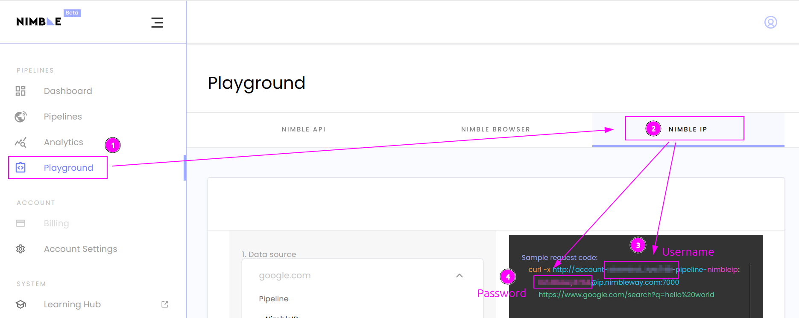
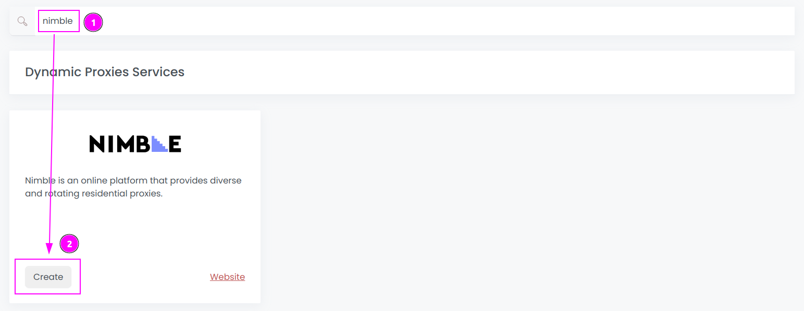
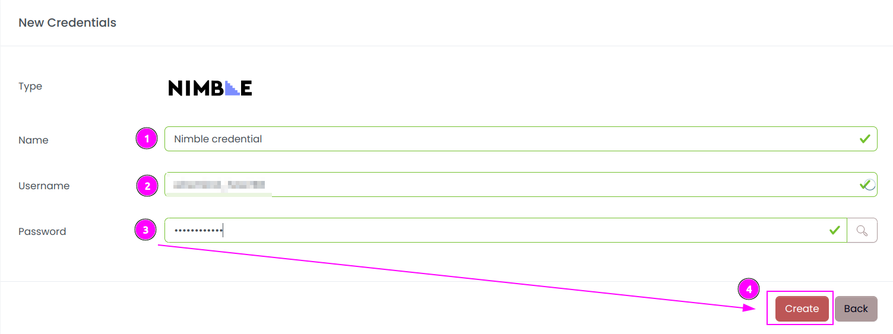
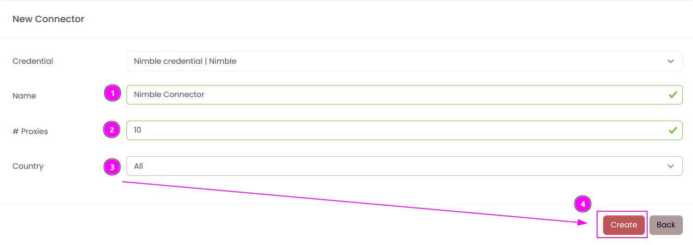
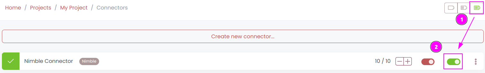
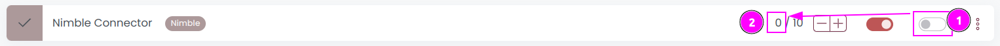

# Nimble Connector

{width=250 nozoom}

[Nimble](https://tracking.nimbleway.com/SH4a) is an experience seamless data-gathering with high-performance residential proxies, optimized for superior quality and granular control.

## Prerequisites

An active Nimble subscription is required.

::: warning
Scrapoxy supports only `Nimble IP`.
:::

## Nimble Dashboard

Connect to [Dashboard](https://app.nimbleway.com/).

### Get the credentials

1. On the left menu, click on `Playground`;
2. Select `NIMBLE IP` tab;
3. In the sample request code, remember `Username` (format is `...account-<username>-pipeline...`);
4. And remember `Password` (just before the `@`).

## Scrapoxy

Open Scrapoxy User Interface and select `Marketplace`:

### Step 1: Create a new credential

Select `Nimble` as provider to create a new credential (use search if necessary).

---

Complete the form with the following information:
1. **Name**: The name of the credential;
3. **Username**: The username previously copied;
4. **Password**: The password previously copied.

And click on `Create`.

### Step 2: Create a new connector

Create a new connector and select `Nimble` as provider:

Complete the form with the following information:
1. **Name**: The name of the connector;
2. **# Proxies**: The number of instances to create;
3. **Country**: Select the country to use, or `All` to use all countries.
4. And click on `Create`.

::: info
You can ask to Nimble to refine proxies by country.
:::

### Step 3: Start the connector

1. Start the project;
2. Start the connector.

### Other: Stop the connector

1. Stop the connector;
2. Wait for proxies to be removed.
