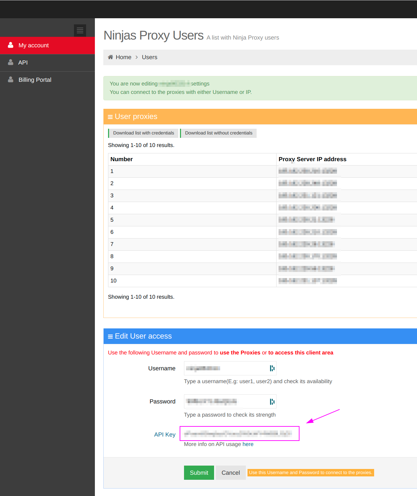
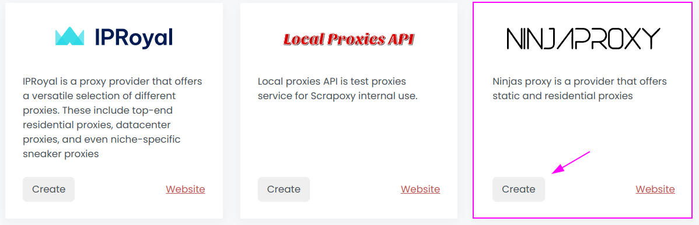
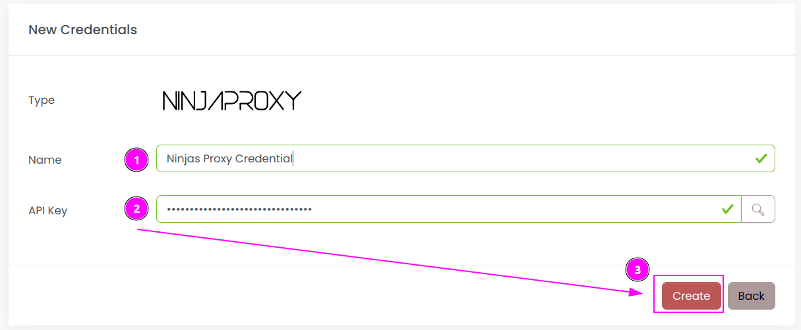
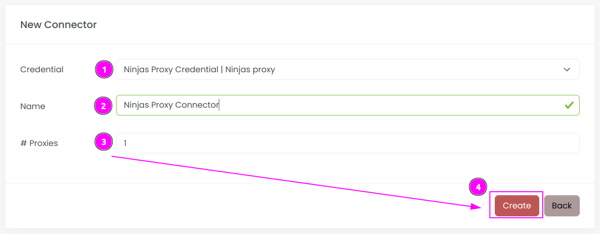
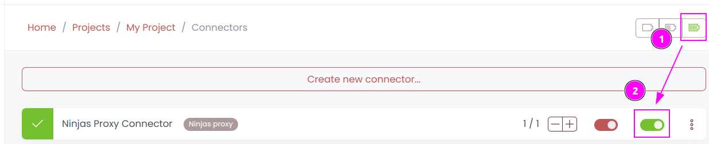

# Ninjas Proxy Connector

{width=280 nozoom}

[Ninjas Proxy](https://ninjasproxy.com) is a provider that offers static and residential proxies.

## Prerequisites

An active Ninjas Proxy subscription is required.

## IPRoyal Dashboard

Connect to [Dashboard](https://hello.ninjasproxy.com).

### Get the credentials

On, the `Edit User access` section, remember `API Key`.

## Scrapoxy

Open Scrapoxy User Interface and select `Marketplace`:

### Step 1: Create a new credential

Select `Ninjas Proxy` as provider to create a new credential (use search if necessary).

---

Complete the form with the following information:
1. **Name**: The name of the credential;
2. **API Key**: The key of the API.

And click on `Create`.

### Step 2: Create a new connector

Create a new connector and select `IPRoyal` as provider:

Complete the form with the following information:
1. **Credential**: The previous credential;
2. **Name**: The name of the connector;
3. **# Proxies**: The number of instances to create.

And click on `Create`.

### Step 3: Start the connector

1. Start the project;
2. Start the connector.

### Other: Stop the connector

1. Stop the connector;
2. Wait for proxies to be removed.
