# OVH Cloud Connector

{width=280 nozoom}

[OVH Cloud](https://www.ovh.com) is a french cloud computing service created by OVH

## Prerequisites

An active OVH subscription is required.

## OVH Manager

Connect to [Manager](https://www.ovh.com/manager).

### Step 1: Create new project

Click on `+ Create a new project`.

---

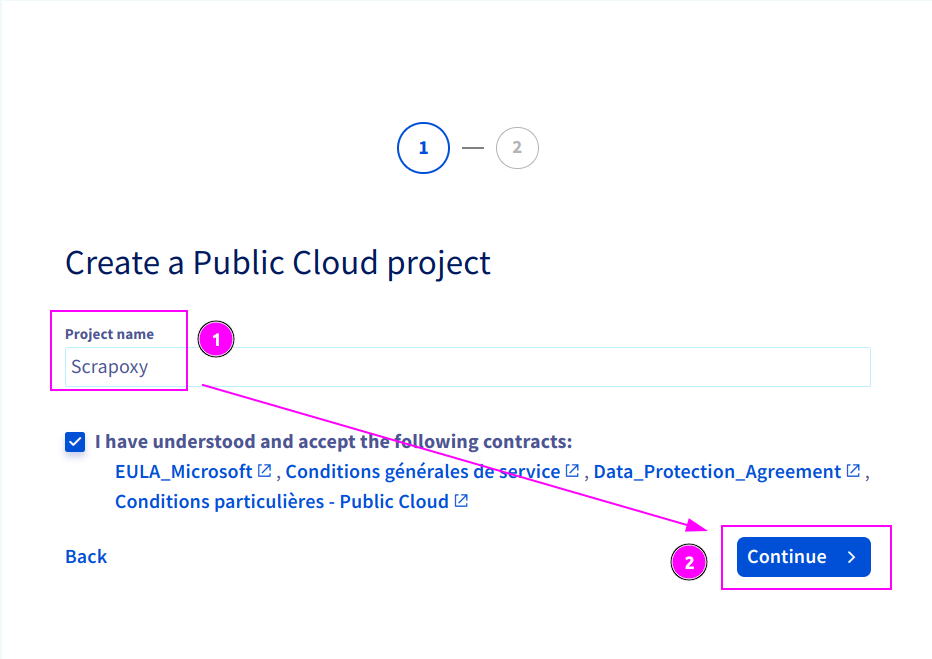

1. Enter `scrapoxy` as Project name;
2. And click on `Continue`.

---

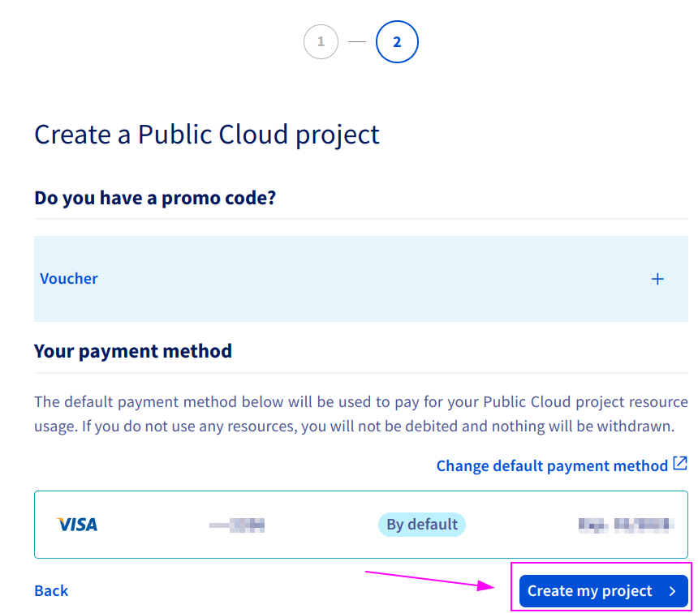

Click on `Create my project` and wait for project creation.

---

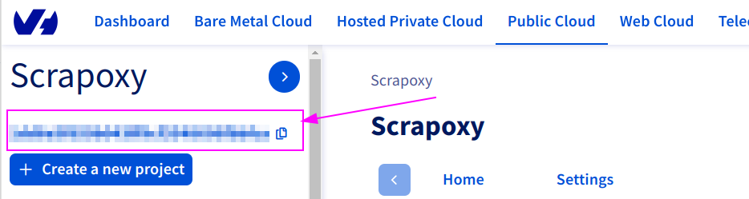

Remember the `Project ID`.

### Step 2: Create new credential

Connect on [https://www.ovh.com/auth/api/createToken](https://www.ovh.com/auth/api/createToken):

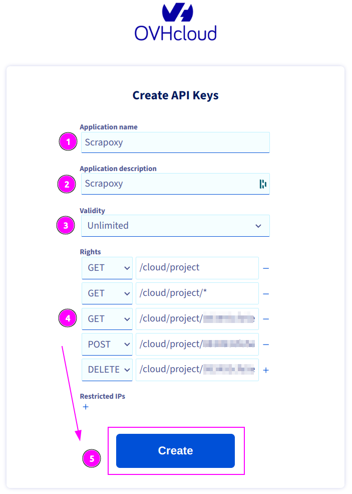

Complete the form with the following information:
1. **Application name**: `Scrapoxy`
2. **Description**: `Scrapoxy`
3. **Validity**: `Unlimited`
4. **Rights**: see table below

| Method | Path                         |
|--------|------------------------------|
| GET    | /cloud/project               |
| GET    | /cloud/project/*             |
| GET    | /cloud/project/{projectId}/* |
| POST   | /cloud/project/{projectId}/* |
| DELETE | /cloud/project/{projectId}/* |

::: info
Replace `{projectId}` by the previously copied project ID.

If the `projectId` is `0123456789abcdefgh`, the path will be `/cloud/project/0123456789abcdefgh/*`.
:::

---

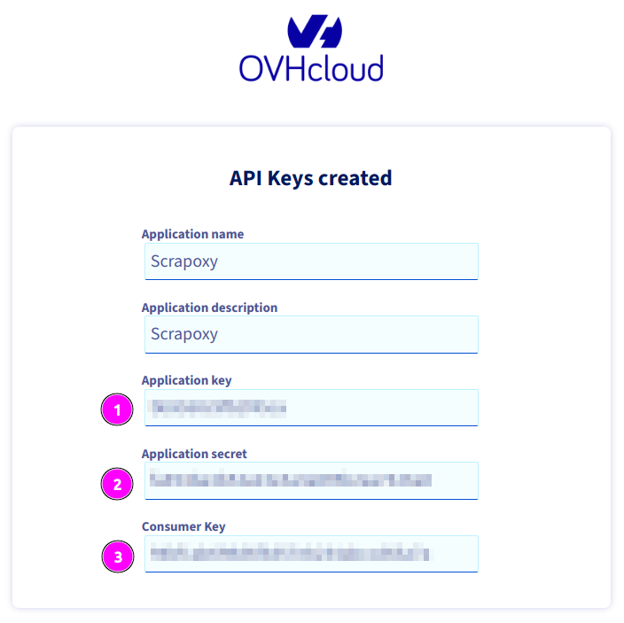

Remember:
1. Application Key;
2. Application Secret;
3. And Consumer Key.

## Scrapoxy

Open Scrapoxy User Interface and select `Marketplace`:

### Step 1: Create a new credential

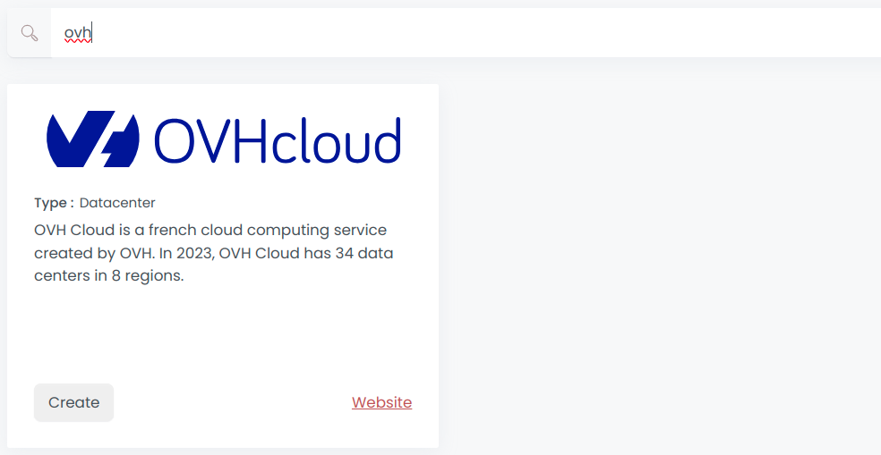

Select `OVH` to create a new credential (use search if necessary).

---

Complete the form with the following information:
1. **Name**: The name of the credential;
2. **Application Key**: The key of the application;
3. **Application Secret**: The secret of the application;
4. **Consumer Key**: The consumer key of the application (this is the installation ID of the application for your account).

And click on `Create`.

### Step 2: Create a new connector

Create a new connector and select `OVH` as provider:

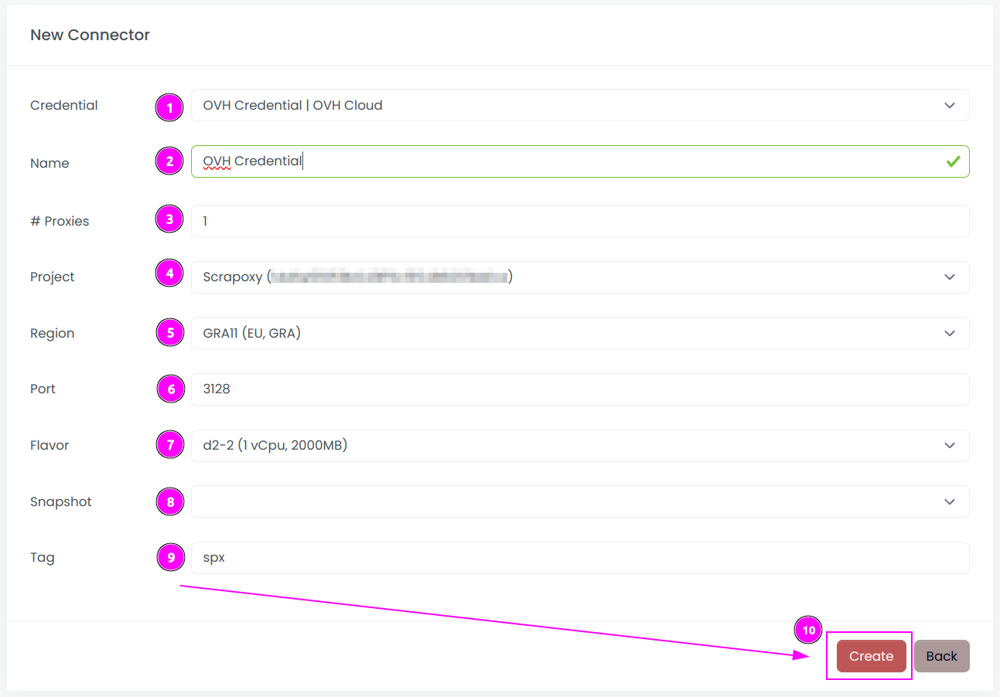

Complete the form with the following information:
1. **Credential**: The previous credential;
2. **Name**: The name of the connector;
3. **# Proxies**: The number of instances to create;
4. **Project**: The project used to create the instances;
5. **Region**: The region where the instances will be created;
6. **Port**: The port of the proxy (on OVH);
7. **Flavor**: The type of the instance;
8. **Snapshot**: The name of the snapshot to use. ⚠️ Don't fill it, it will be created automatically during installation.;
9. **Tag**: The default label to tag instance.

And click on `Create`.

::: tip
You can retain most of the default values if they are suitable for your use case.
:::

### Step 3: Install the connector

::: warning
Do not reuse an installation from a prior setup:
Scrapoxy embeds a unique TLS certificate within the instance image to secure communication and communication with the Master will fail.
:::

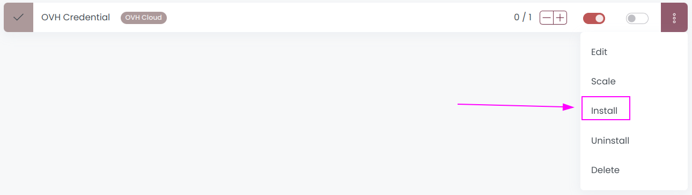

On the connector list, click on `Install`.

---

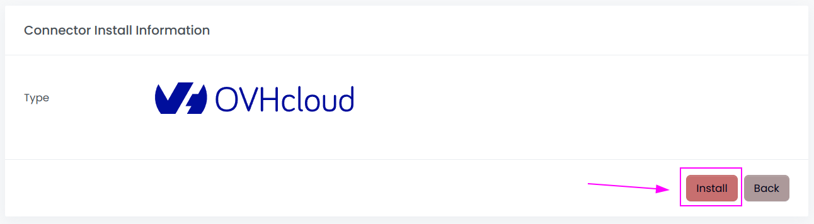

Click on `Install`.

Scrapoxy will start, install and stop the VM to create a custom image.

---

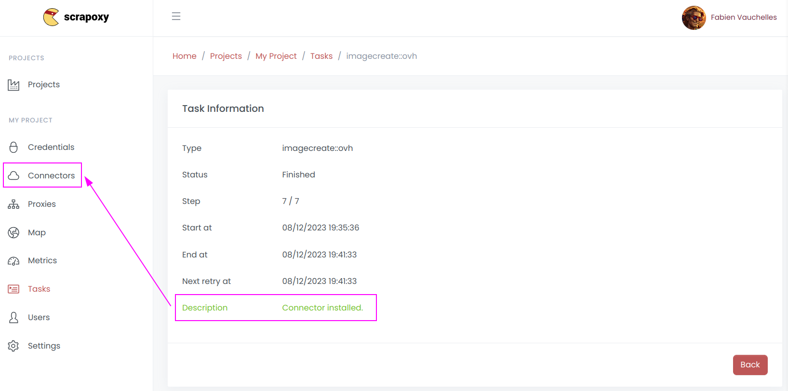

When the installation is finished, click on `Connectors`.

---

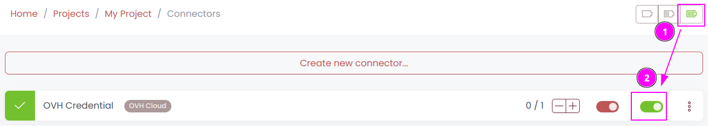

1. Start the project;
2. Start the connector.

::: tip
Installation creates a custom image for **this** region.
If you have multiple regions across multiple connectors, you must perform the installation step for each region.
:::

### Other: Uninstall the connector

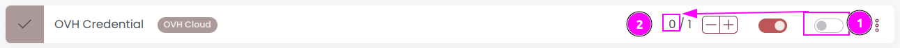

1. Stop the connector;
2. Wait for proxies to be removed.

---

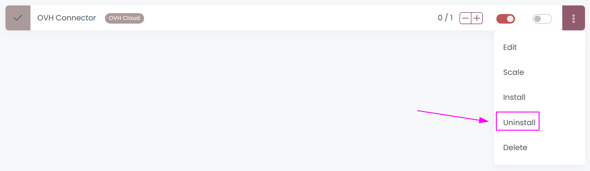

On the connector list, click on `Uninstall`.

---

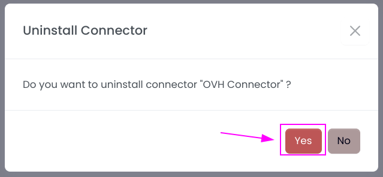

Confirm the uninstallation.

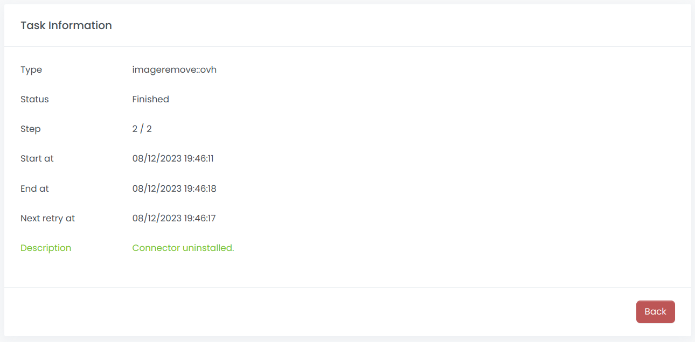

Wait for the uninstallation to finish: Scrapoxy will delete the custom image.
