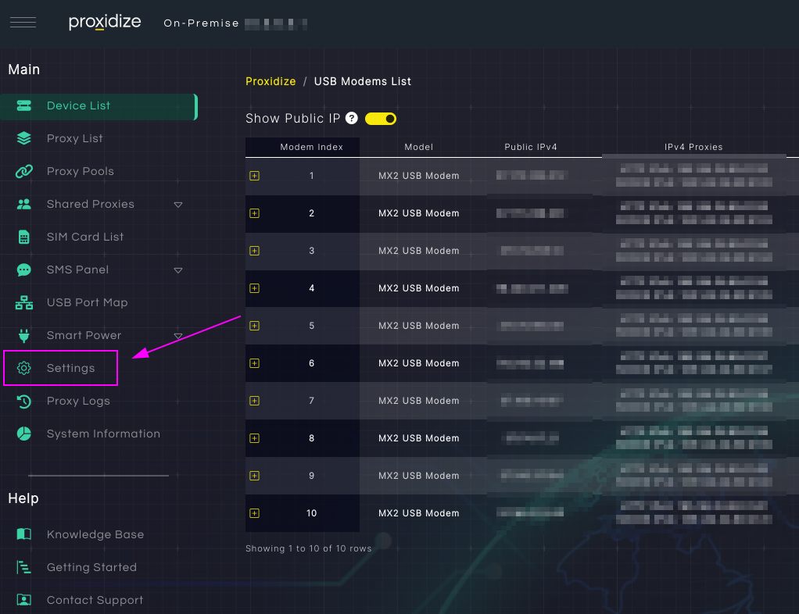
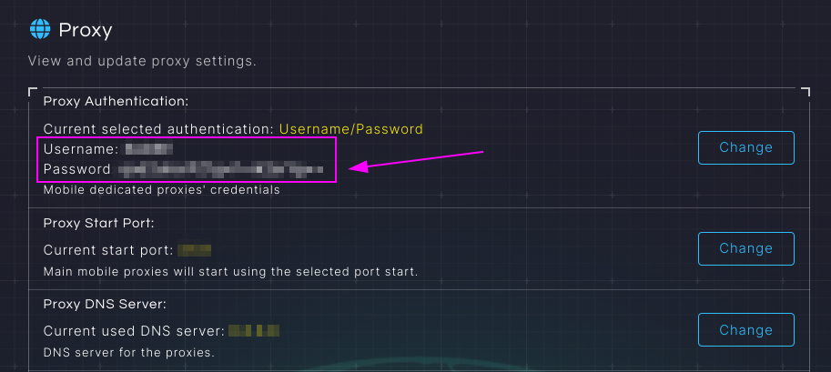
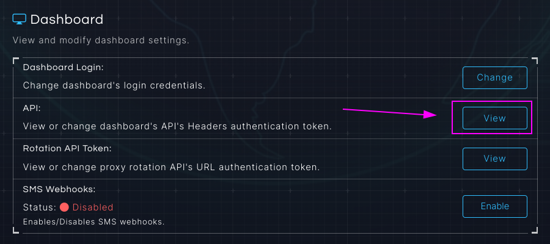
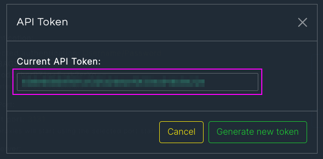
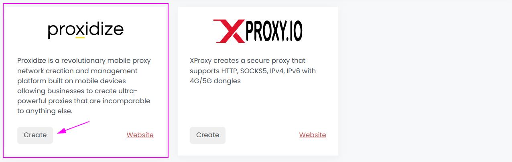
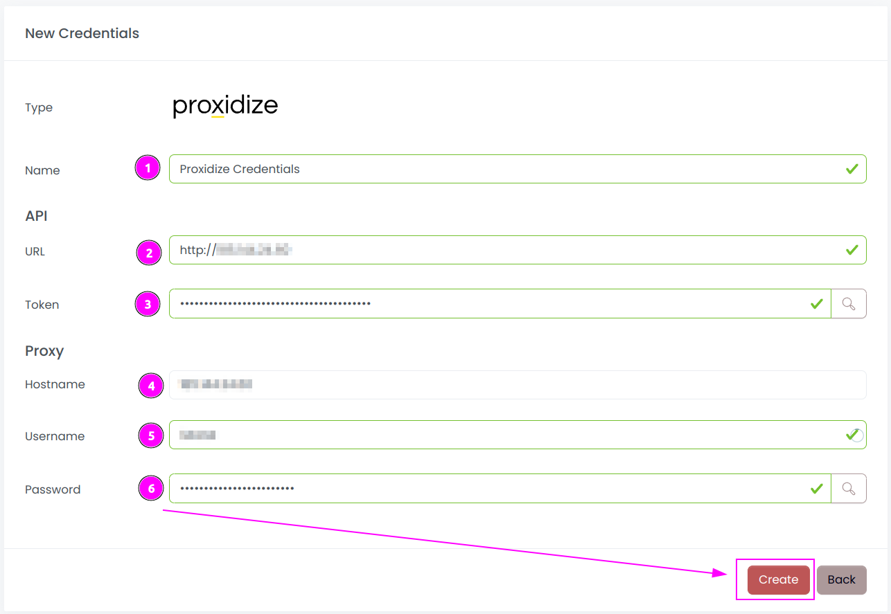
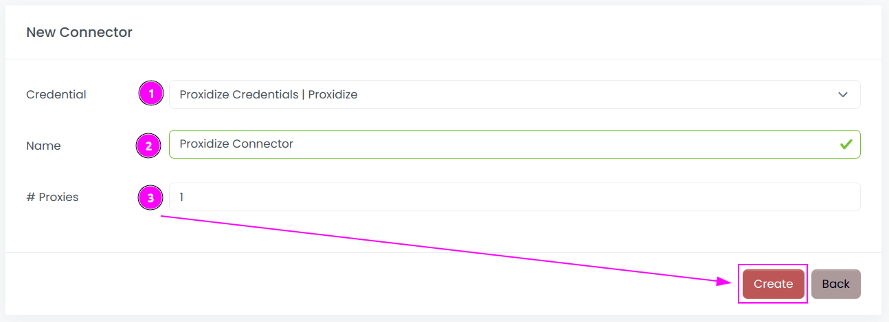
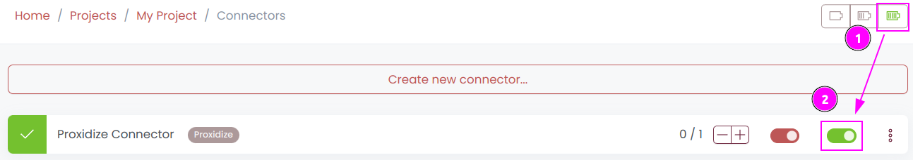
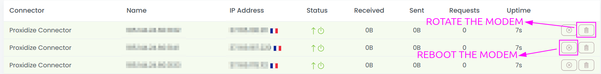
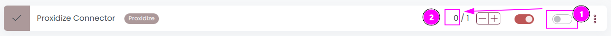

# Proxidize Connector

{width=250 nozoom}

[Proxidize](https://proxidize.com) is a revolutionary mobile proxy network creation and management platform 
built on mobile devices allowing businesses to create ultra-powerful proxies that are incomparable to anything else.

## Prerequisites

1. Proxidize material and subscription are required.
2. Scrapoxy can access to Proxidize admin interface and proxies IP addresses.

## Proxidize Admin

Connect to your Proxidize hardware UI and remember the URL.

### Get the credentials

Click on `Settings`.

---

Remember `Username` and `Password`.

---

Go the the Dashboard > API section and click on `View`.

---

Remember the `API Token`.

## Scrapoxy

Open Scrapoxy User Interface and select `Marketplace`:

### Step 1: Create a new credential

Select `Proxidize` as provider to create a new credential (use search if necessary).

---

Complete the form with the following information:
1. **Name**: The name of the credential;
2. **URL**: URL of the Proxidize Admin (without trailing `/`);
3. **Token**: The token of the API;
4. **Hostname**: The hostname of the proxy (should be the same as the URL);
5. **Password**: The password of the proxy.

And click on `Create`.

### Step 2: Create a new connector

Create a new connector and select `Proxidize` as provider:

Complete the form with the following information:
1. **Credential**: The previous credential;
2. **Name**: The name of the connector;
3. **# Proxies**: The number of instances to create.

And click on `Create`.

### Step 3: Start the connector

1. Start the project;
2. Start the connector.

### Step 4: Interact with modems

Within this connector, you can perform 2 actions on the proxies:
1. **Trash button**: Initiates a fast rotation of the modem;
2. **Cross button**: Triggers a slower process, rebooting the modem.

### Other: Stop the connector

1. Stop the connector;
2. Wait for proxies to be removed.
