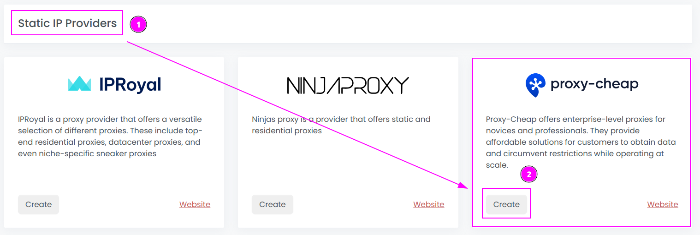
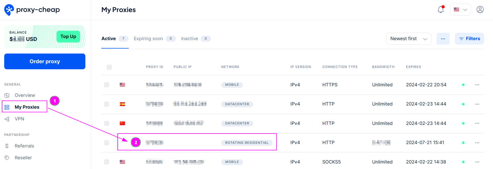
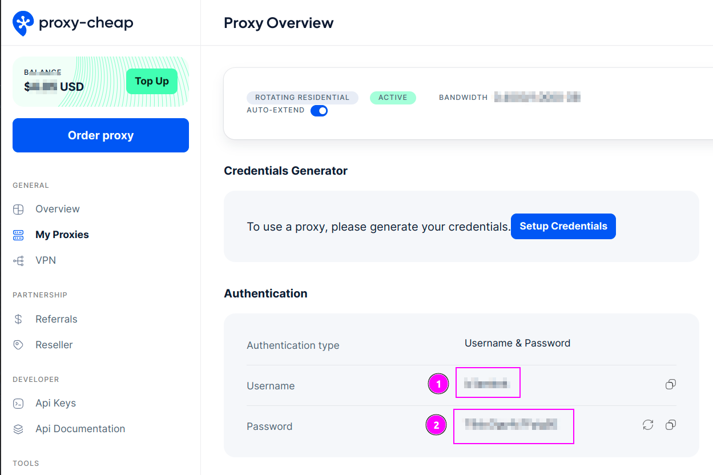
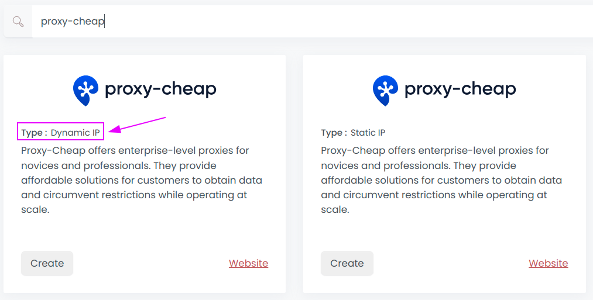
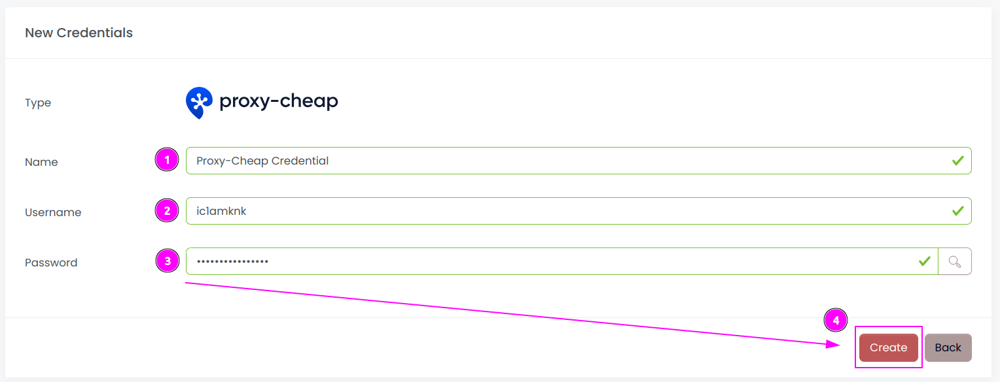

# Proxy-Cheap Connector

{width=230 nozoom}

[Proxy-Cheap](https://app.proxy-cheap.com/r/lt6xyT) offers enterprise-level proxies for novices and professionals. They provide affordable solutions for customers to obtain data and circumvent restrictions while operating at scale. Theirs solutions serve customers from data scraping to market research and other industries. 

Scrapoxy features 2 Proxy-Cheap connectors:

- connector for **server proxies**: encompassing Mobile Proxies, Static Residential Proxies and Datacenter Proxies.
- connector for **residential proxies**: specifically Rotating Residential Proxies.

::: info
Mobile proxies need a whitelisted IP address. This configuration is available in the [Dashboard](https://app.proxy-cheap.com).
:::

## Server Proxies

Server Proxies are static endpoints featuring a dedicated IP address. 

### Prerequisites

An active Proxy-Cheap subscription is required on Mobile Proxies, Static Residential Proxies or Datacenter Proxies.

### Proxy-Cheap Dashboard

Connect to [Dashboard](https://app.proxy-cheap.com).

#### Get the API Key

1. On the top left menu, click on `Api Keys`;
2. Click on `Generate new API Key`;
3. Remember the `API Key`;
4. Remember the `API Secret`.

### Scrapoxy

Open Scrapoxy User Interface and select `Marketplace`:

#### Step 1: Create a new credential

Select `Proxy-Cheap` with type `Static IP` to create a new credential (use search if necessary).

---

Complete the form with the following information:
1. **Name**: The name of the credential;
2. **Key**: The key of the API;
3. **Secret**: The secret of the API.

And click on `Create`.

#### Step 2: Create a new connector

Create a new connector and select `Proxy-Cheap` as provider:

Complete the form with the following information:
1. **Credential**: The previous credential;
2. **Name**: The name of the connector;
3. **# Proxies**: The number of instances to create;
4. **Type**: Select the type to use (Datacenter, Static Residential or Mobile), or `All` to use all products.

And click on `Create`.

#### Step 3: Start the connector

1. Start the project;
2. Start the connector.

#### Other: Stop the connector

1. Stop the connector;
2. Wait for proxies to be removed.

## Residential Proxies

Residential Proxies are accessed via a unique endpoint, and the link is maintained through a sticky session mechanism.

### Prerequisites

An active Proxy-Cheap subscription is required on Residential Proxies.

### Proxy-Cheap Dashboard

Connect to [Dashboard](https://app.proxy-cheap.com).

#### Get the proxy credentials

1. On the left menu, select `My Proxies`;
2. Click on the line tagged as `ROTATING RESIDENTIAL`.

---

1. Remember the `Username`;
2. Remember the `Password`.

### Scrapoxy

Open Scrapoxy User Interface and select `Marketplace`:

#### Step 1: Create a new credential

Select `Proxy-Cheap` with type `Dynamic IP` to create a new credential (use search if necessary).

---

Complete the form with the following information:
1. **Name**: The name of the credential;
2. **Username**: The username of the proxy;
3. **Password**: The password of the proxy.

And click on `Create`.

#### Step 2: Create a new connector

Create a new connector and select `Proxy-Cheap` as provider:

Complete the form with the following information:
1. **Credential**: The previous credential;
2. **Name**: The name of the connector;
3. **# Proxies**: The number of instances to create;
4. **Country**: Select the country to use, or `All` to use all countries;

And click on `Create`.

#### Step 3: Start the connector

1. Start the project;
2. Start the connector.

#### Other: Stop the connector

1. Stop the connector;
2. Wait for proxies to be removed.
