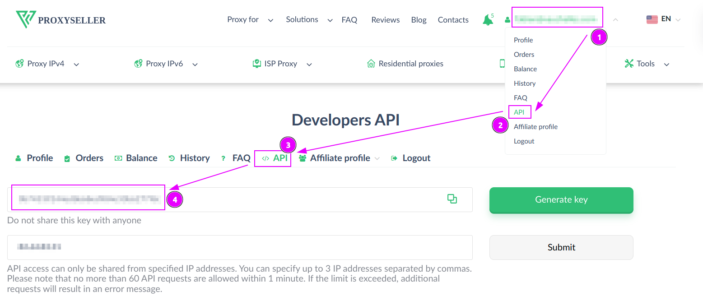
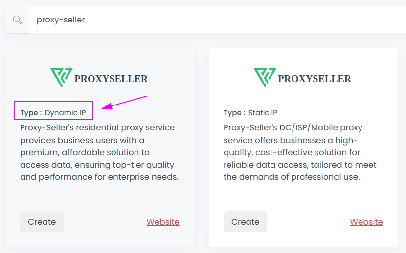
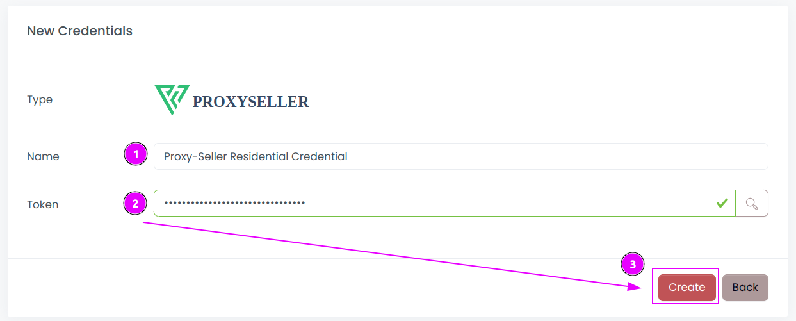
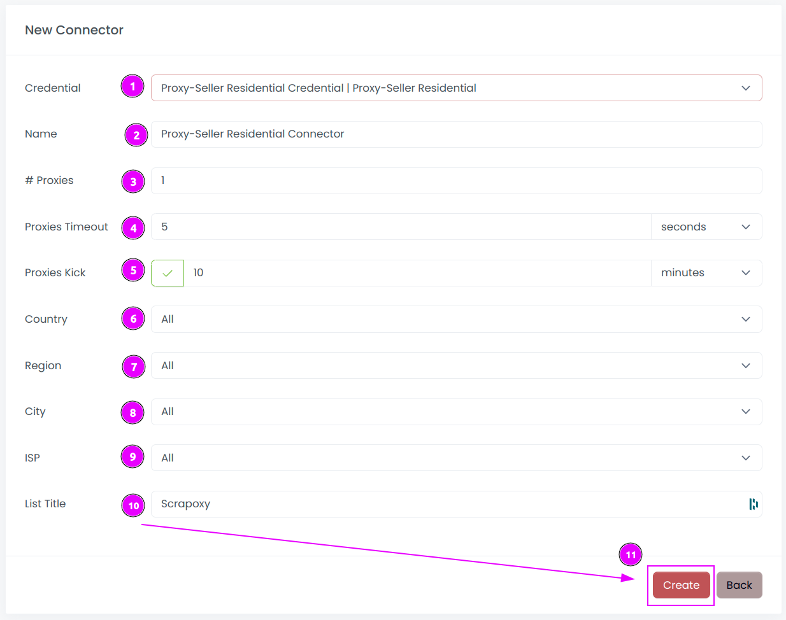
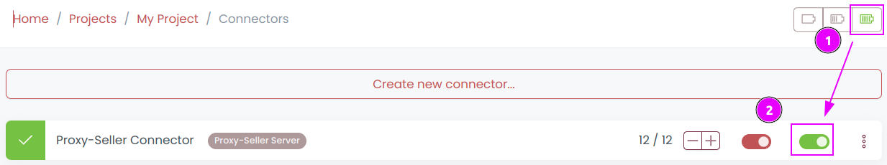
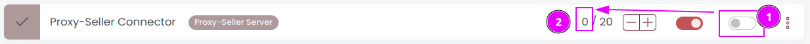

# Proxy-Seller Connector

{width=260 nozoom}

[Proxy-Seller](https://proxy-seller.com/?partner=GR930FP5IOO78P) offers residential proxy service provides business users with a premium, affordable solution to access data, ensuring top-tier quality and performance for enterprise needs. 

This connector is for Rotating Residential Proxies.

## Prerequisites

An active Proxy-Seller subscription is required on Residential Proxies.

## Proxy-Seller Dashboard

Connect to [Dashboard](https://proxy-seller.com/personal/api).

### Get the API credentials

1. On the top right menu, click on your account;
2. Select `API` menu;
3. Check that your are on the `API` tab;
4. Remember the `Token`.

## Scrapoxy

Open Scrapoxy User Interface and select `Marketplace`:

### Step 1: Create a new credential

Select `Proxy-Select` with type `Dynamic IP` to create a new credential (use search if necessary).

---

Complete the form with the following information:
1. **Name**: The name of the credential;
2. **Token**: The token of the API;

And click on `Create`.

### Step 2: Create a new connector

Create a new connector and select `Proxy-Seller` as provider:

Complete the form with the following information:
1. **Credential**: The previous credential;
2. **Name**: The name of the connector;
3. **# Proxies**: The number of instances to create.
4. **Proxies Timeout**: Maximum duration for connecting to a proxy before considering it as offline;
5. **Proxies Kick**: If enabled, maximum duration for a proxy to be offline before being removed from the pool;
6. **Country**: Select the country to use, or `All` to use all countries;
7. **Region**: Select the region to use in this country, or `All` to use all regions;
8. **City**: Select the city to use in this region, or `All` to use all cities;
9. **ISP**: Select the ISP to use in this region, or `All` to use all ISPs;
10. **List Title**: Keep `Scrapoxy` to use the default list;

And click on `Create`.

### Step 3: Start the connector

1. Start the project;
2. Start the connector.

### Other: Stop the connector

1. Stop the connector;
2. Wait for proxies to be removed.
