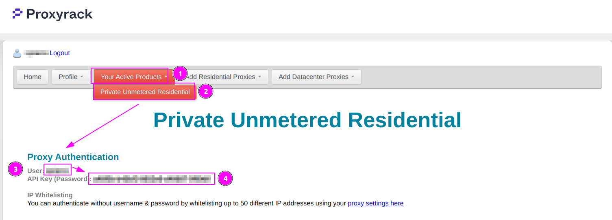
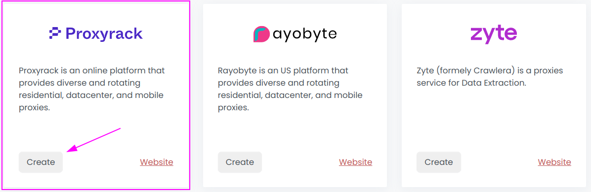
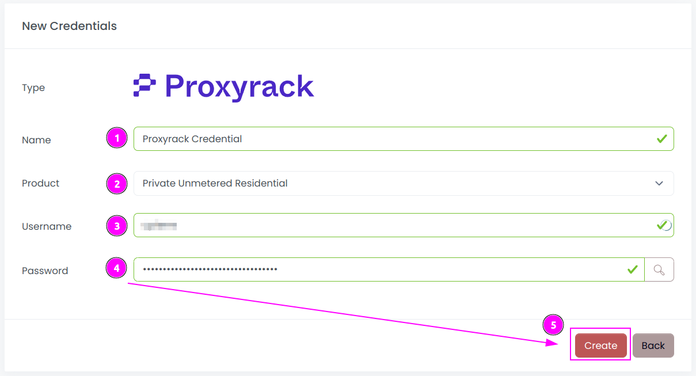
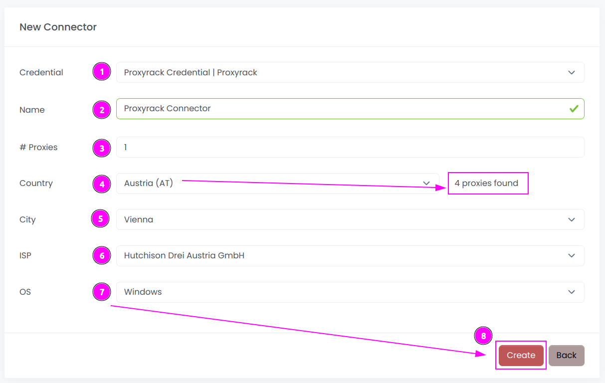
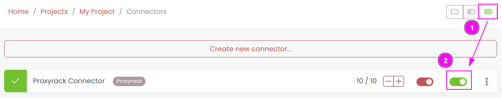
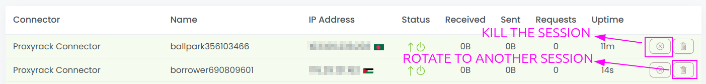
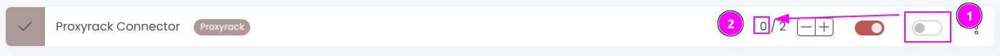

# Proxyrack Connector

{width=250 nozoom}

[Proxyrack](https://www.proxyrack.com) is an online platform that provides diverse and rotating residential, datacenter, and mobile proxies.

## Prerequisites

An active Proxyrack subscription is required.

::: warning
Scrapoxy supports only `Private Unmetered Residential` proxies.
:::

## Proxyrack Admin

Connect to [Admin](https://member.proxyrack.com/access/member).

### Get the credentials

1. On the menu, click on `Your Active Products`;
2. Select `Private Unmetered Residential`;
3. Remember `Username`;
4. Remember `API Key (Password)`.

## Scrapoxy

Open Scrapoxy User Interface and select `Credentials`:

### Step 1: Create a new credential

Create a new credential and select `IPRoyal` as provider.

---

Complete the form with the following information:
1. **Name**: The name of the credential;
2. **Product**: Choose `Private Unmetered Residential`;
3. **Username**: The username of the API;
4. **Password**: The key of the API.

And click on `Create`.

### Step 2: Create a new connector

Create a new connector and select `IPRoyal` as provider:

Complete the form with the following information:
1. **Credential**: The previous credential;
2. **Name**: The name of the connector;
3. **# Proxies**: The number of instances to create;
4. **Country**: Select the country to use, or `All` to use all countries. Scrapoxy will retrieve the available proxies count for this country;
5. **City**: Select the city to use, or `All` to use all cities;
6. **ISP**: Select the Internet Service Provider to use, or `All` to use all ISPs;
7. **OS**: Select the Operating System to use, or `All` to use all OSs.

And click on `Create`.

::: info
You can ask to Proxyrack to refine proxies by country, city, ISP or OS. 
If you do not have access to this feature, you can leave the default value `All`.
:::

### Step 3: Start the connector

1. Start the project;
2. Start the connector.

### Step 4: Interact with sessions

Within this connector, you can perform 2 actions on the proxies:
1. **Trash button**: Initiates a session rotation. The session is temporarily removed and will be reused later.
2. **Cross button**: Kill the session. The session definitively removed. But there is a limit number of removal per hour.

### Other: Stop the connector

1. Stop the connector;
2. Wait for proxies to be removed.
