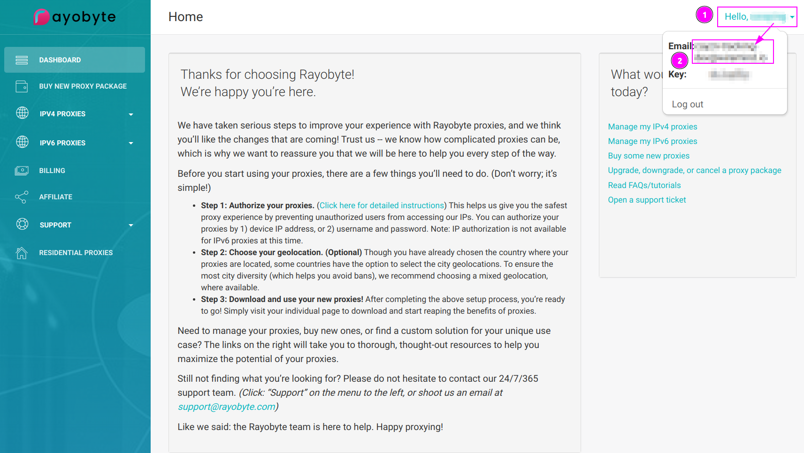
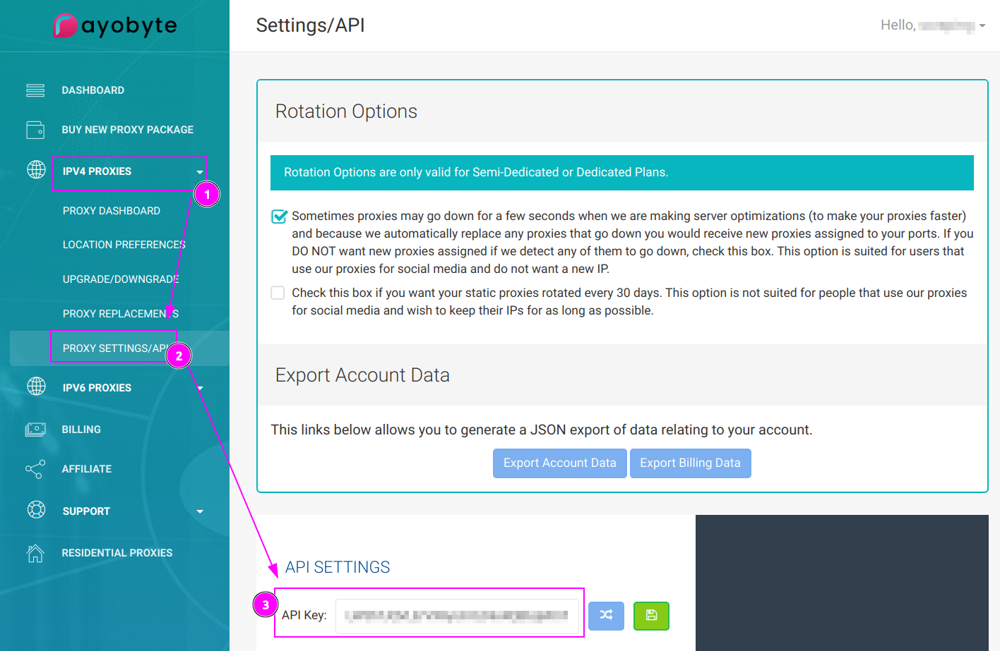
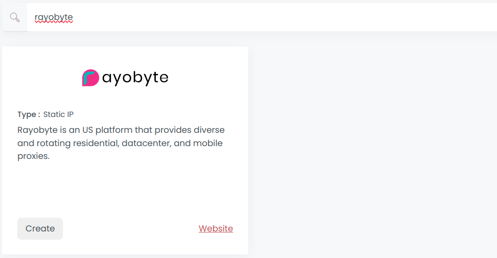
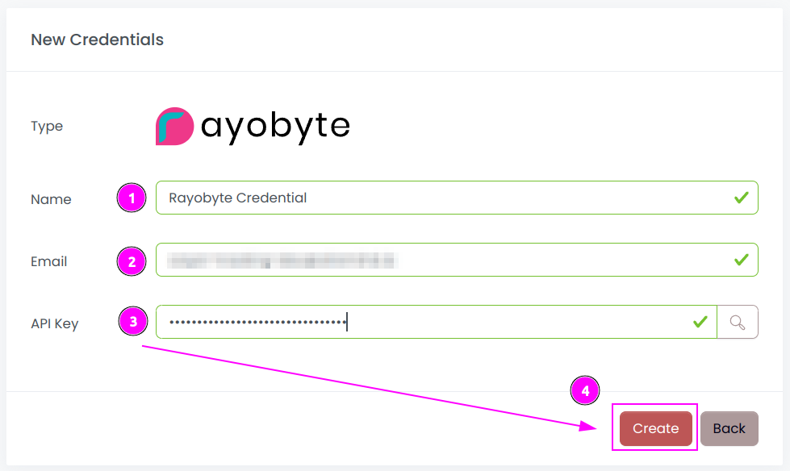
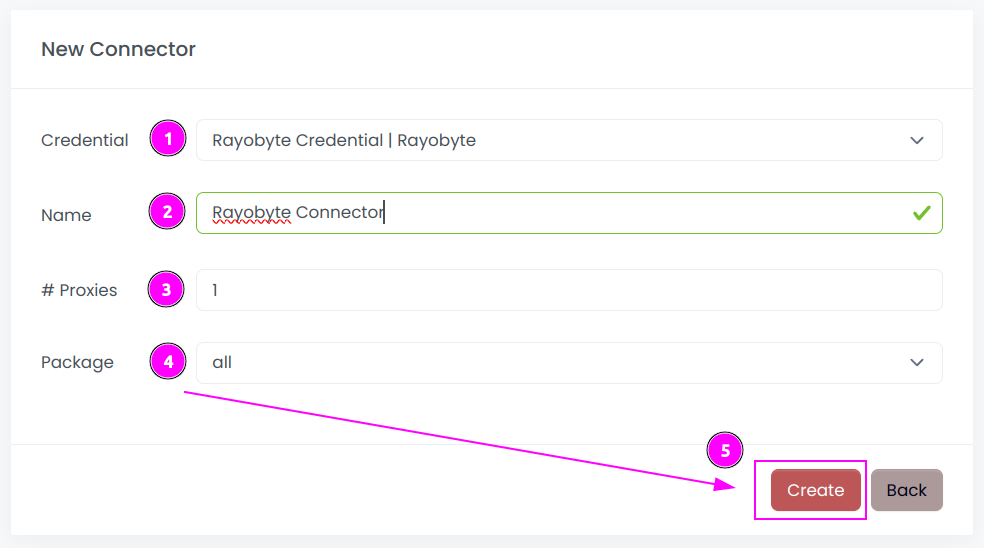
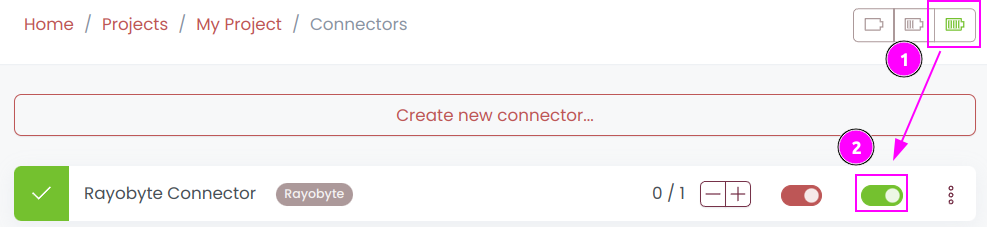
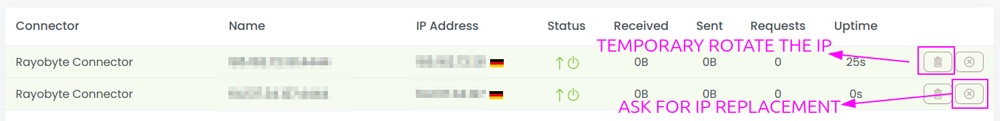
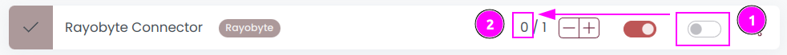

# Rayobyte Connector

{width=230 nozoom}

[Rayobyte](https://rayobyte.com) is an US platform that provides diverse and rotating residential, datacenter, and mobile proxies.

## Prerequisites

An active Rayobyte subscription is required.

## Rayobyte Dashboard

Connect to [Dashboard](https://rayobyte.com/proxy/dashboard).

### Get the credentials

1. Click on your name on the top right;
2. Remember the `Email`.

---

1. Click on `IPV4 PROXIES`;
2. Select `PROXY SETTINGS/API`;
3. Remember the `API Key`.

## Scrapoxy

Open Scrapoxy User Interface and select `Marketplace`:

### Step 1: Create a new credential

Select `Rayobyte` as provider to create a new credential (use search if necessary).

---

Complete the form with the following information:
1. **Name**: The name of the credential;
2. **Email**: The email of the account;
3. **API Key**: The key of the API.

And click on `Create`.

### Step 2: Create a new connector

Create a new connector and select `Rayobyte` as provider:

Complete the form with the following information:
1. **Credential**: The previous credential;
2. **Name**: The name of the connector;
3. **# Proxies**: The number of instances to create;
4. **Package**: Select the package that you bought, or `All` to use all packages.

And click on `Create`.

### Step 3: Start the connector

1. Start the project;
2. Start the connector.

### Step 4: Interact with proxies

Within this connector, you can perform 2 actions on the proxies:
1. **Trash button**: Initiates a proxy rotation. The session is temporarily removed and will be reused later.
2. **Cross button**: Requests a replacement from Rayobyte to permanently replace the IP. It's important to note that there is a limited count of monthly replacements available.

### Other: Stop the connector

1. Stop the connector;
2. Wait for proxies to be removed.
