# Scaleway Connector

{width=230, nozoom}

[Scaleway](/l/scaleway)  is a French cloud computing provider that offers on-demand infrastructure solutions. 
In 2023, Scaleway operates 7 data centers in 3 regions across Europe.

Thanks a lot to [Rémy Fontaine](/l/github-remyft) of [Sahar](/l/sahar) for the contribution! 

## Prerequisites

An active subscription to Scaleway is required.

## Scaleway Console

Connect to [Scaleway Console](/l/scaleway-console).

### Get the Secret Key

1. On the top right, click on your name to open the menu;
2. And click on `API Keys`.

---

1. Select the tab `API Keys` (should be already selected);
2. And click on `Generate an API key`.

---

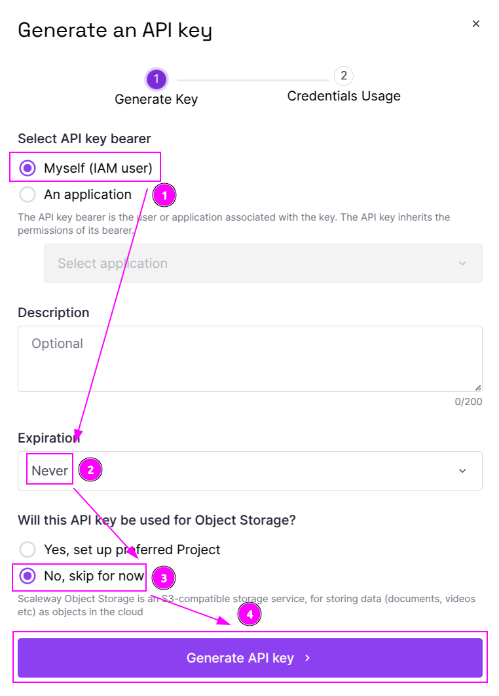

1. Choose `Myself (IAM user)` for the bearer;
2. Select `Never` for expiration;
3. Choose `No, skip for now` for Object Storage;
4. And click on `Generate API key`.

---

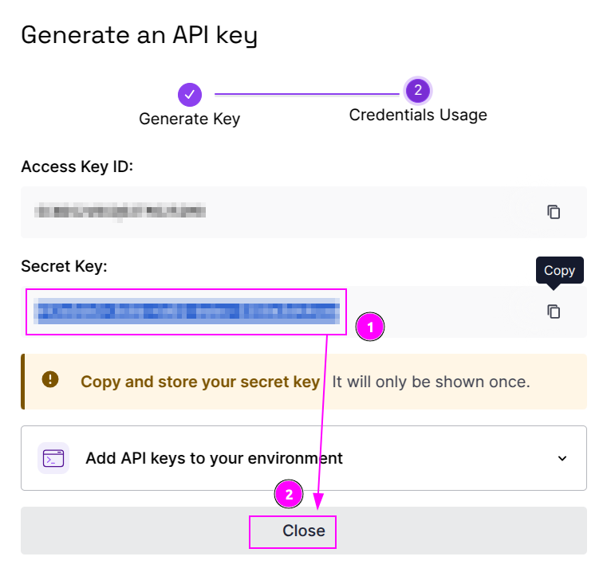

1. Remember the `Secret Key`;
2. And click on `Close` button.

### Get the Project ID

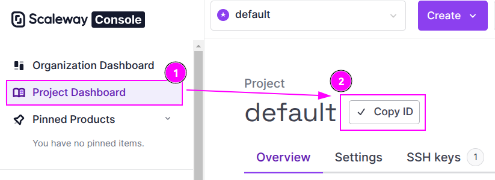

1. On the left sidebar, click on `Project Dashboard`;
2. And click on the `Copy ID` button to remember the `Project ID`.

## Scrapoxy

Open Scrapoxy User Interface and select `Marketplace`:

### Step 1: Create a new credential

Select `Scaleway` to create a new credential (use search if necessary).

---

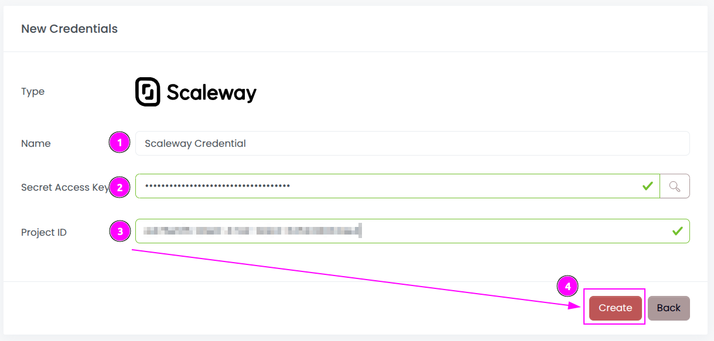

Complete the form by entering the following information:
1. **Name**: Specify the unique name for the credential;
2. **Secret Access Jey**: Enter the remembered `Secret Key`;
3. **Project ID**: Enter the remembered `Project ID`.

And click on `Create`.

### Step 2: Create a new connector

Create a new connector:

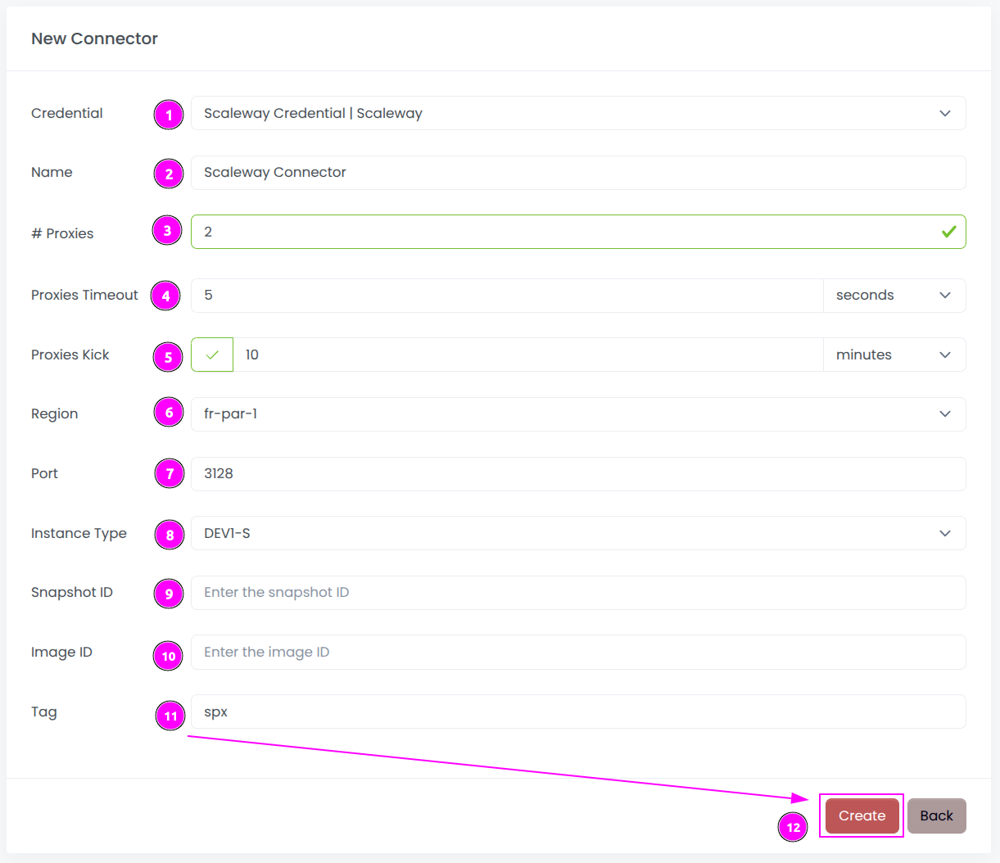

Complete the form with the following information:
1. **Credential**: The previous credential;
2. **Name**: The name of the connector;
3. **# Proxies**: The number of instances to create.
4. **Proxies Timeout**: Maximum duration for connecting to a proxy before considering it as offline;
5. **Proxies Kick**: If enabled, maximum duration for a proxy to be offline before being removed from the pool;
6. **Region**: The region where the instances will be created;
7. **Port**: The port of the proxy (on Scaleway);
8. **Instance Type**: The type of the instance;
9. **Snapshot ID**: The ID of the snapshot in the region (keep it empty);
10. **Image ID**: The ID of the image in the region (keep it empty);
11. **Tag**: The default tag for instance.

And click on `Create`.

Most default values can be retained if suitable for the use case.

### Step 3: Install the connector

On the connector list, click on `Install`.

---

Click on `Install`.

Scrapoxy will start, install and stop the VM to create a custom image.

::: warning
Do not reuse an installation from a prior setup:
Scrapoxy embeds a unique TLS certificate within the instance image to secure communication and communication with the Master will fail.
:::

---

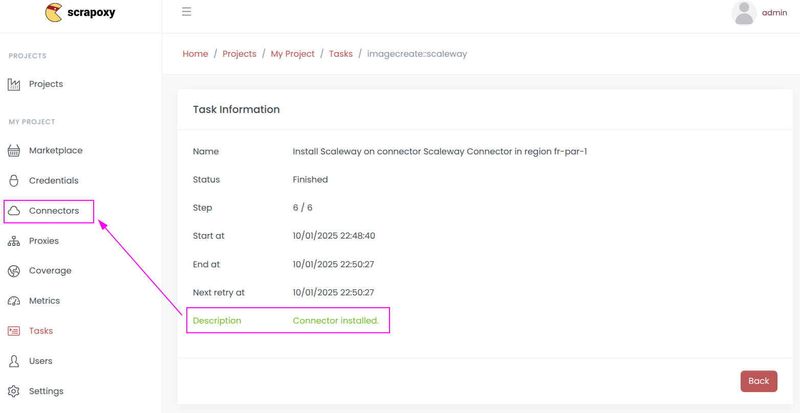

When the installation is finished, click on `Connectors`.

---

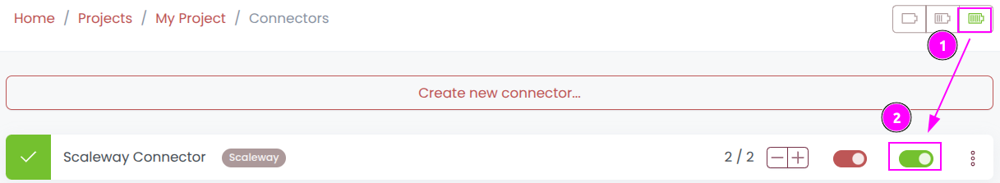

1. Start the project;
2. Start the connector.

### Other: Uninstall the connector

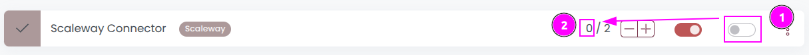

1. Stop the connector;
2. Wait for proxies to be removed.

---

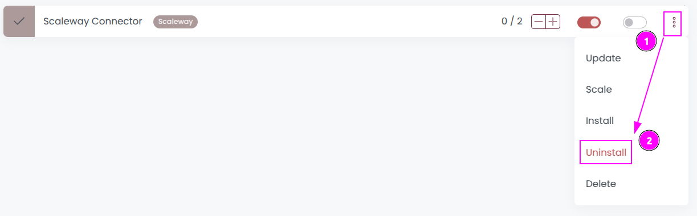

On the connector list, click on `Uninstall`.

---

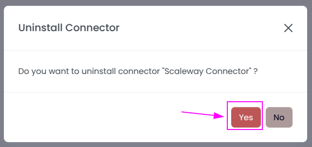

Confirm the uninstallation.

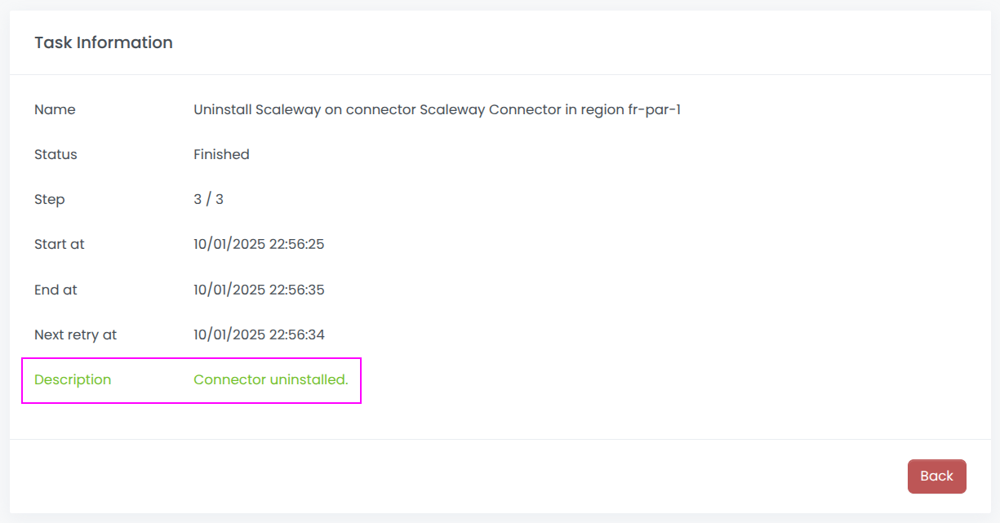

Wait for the uninstallation to finish: Scrapoxy will delete the custom image.
