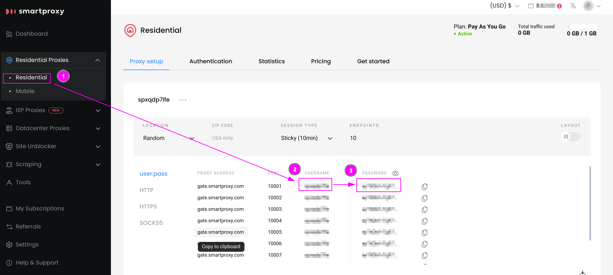
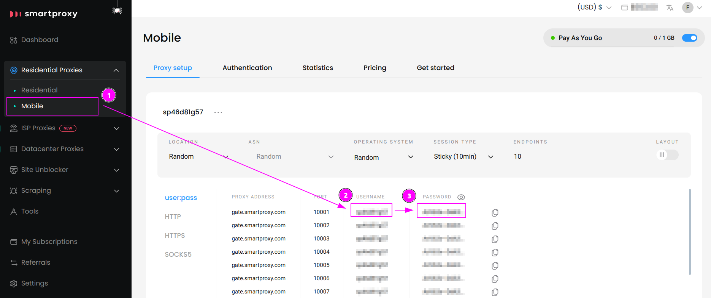
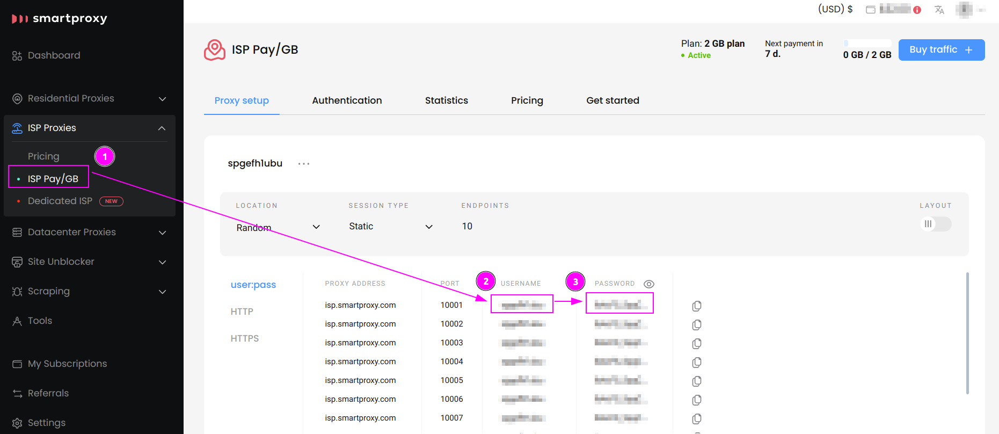
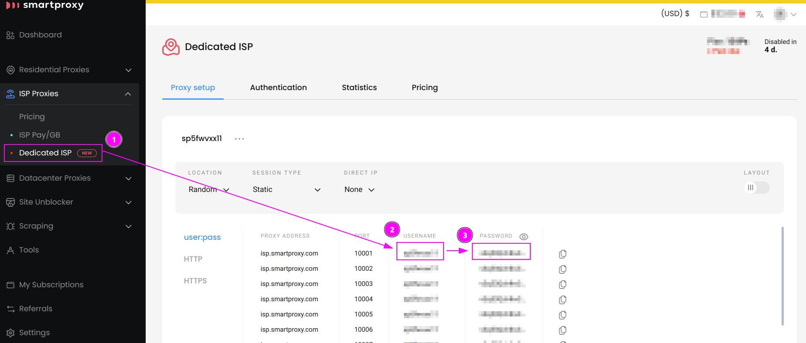
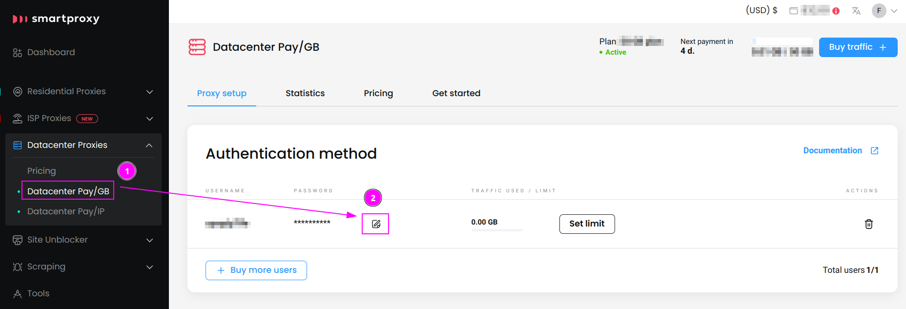
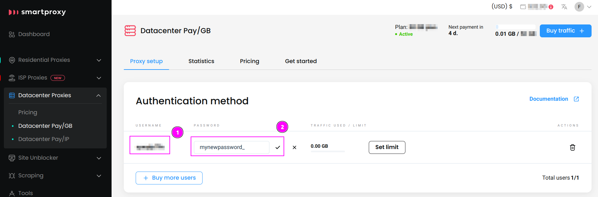
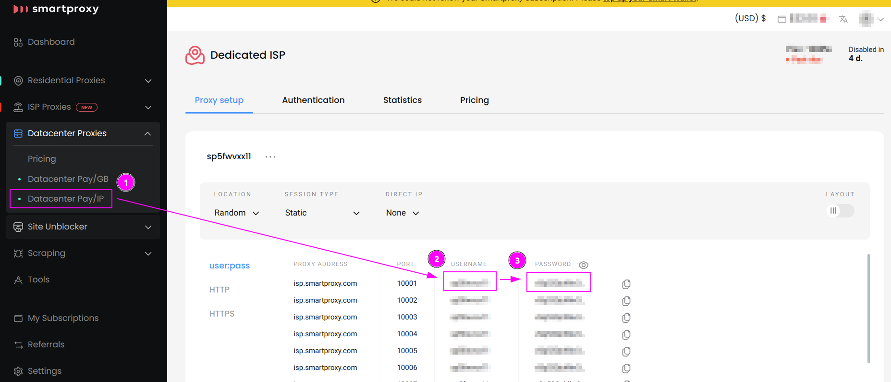
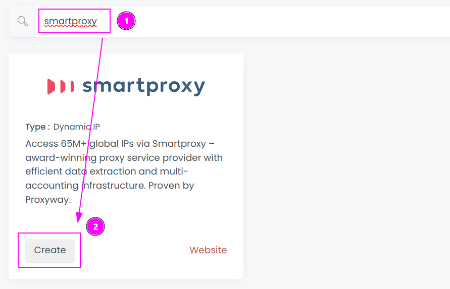

# Smartproxy Connector

{width=280 nozoom}

[Smartproxy](https://smartproxy.pxf.io/Qy5mVo) is the award-winning proxy service provider with efficient data extraction and multi-accounting infrastructure.
They provides access to 65M+ global IPs.

::: info
This connector supports Residential proxies, ISP proxies and Datacenter proxies
with plans to integrate Mobile proxies in the future.
:::

## Prerequisites

An active Smartproxy subscription is required.

## Smartproxy Dashboard

Connect to [Dashboard](https://dashboard.smartproxy.com).

You need to create a new credential for each type of product.

### Residential Proxies

1. On the left menu, select `Residential Proxies` > `Residential`;
2. Remember the username;
3. Remember the password.

### Mobile Proxies

1. On the left menu, select `Residential Proxies` > `Mobile`;
2. Remember the username;
3. Remember the password.

### ISP Proxies - Pay/GB

1. On the left menu, select `ISP Proxies` > `ISP Pay/GB`;
2. Remember the username;
3. Remember the password.

### ISP Proxies - Dedicated ISP

1. On the left menu, select `ISP Proxies` > `Dedicated ISP`;
2. Remember the username;
3. Remember the password.

### Datacenter Proxies - Pay/GB

::: info
For Datacenter Pay/GB proxies, you need to reset the password if you can't remember it.
:::

1. On the left menu, select `Datacenter Proxies` > `Datacenter Pay/GB`;
2. Click on the `Edit` button.

---

1. Remember the username;
2. Change the password, remember and save it.

### Datacenter Proxies - Pay/IP

1. On the left menu, select `Datacenter Proxies` > `Datacenter Pay/IP`;
2. Remember the username;
3. Remember the password.

## Scrapoxy

Open Scrapoxy User Interface and select `Marketplace`:

### Step 1: Create a new credential

Select `Smartproxy` to create a new credential (use search if necessary).

---

Complete the form with the following information:
1. **Name**: The name of the credential;
2. **Product**: The type of product;
3. **Username**: The username;
4. **Password**: The password.

And click on `Create`.

::: info
If you switch to a different product type, remember to copy and paste the new username and password.
:::

### Step 2: Create a new connector

Create a new connector and select `Smartproxy` as provider:

Complete the form with the following information:
1. **Credential**: The previous credential;
2. **Name**: The name of the connector;
3. **# Proxies**: The number of instances to create;
4. **Proxies Timeout**: Maximum duration for connecting to a proxy before considering it as offline;
5. **Proxies Kick**: If enabled, maximum duration for a proxy to be offline before being removed from the pool;
6. **Country**: Select the country to use, or `All` to use all countries.

And click on `Create`.

### Step 3: Start the connector

1. Start the project;
2. Start the connector.

### Other: Stop the connector

1. Stop the connector;
2. Wait for proxies to be removed.
