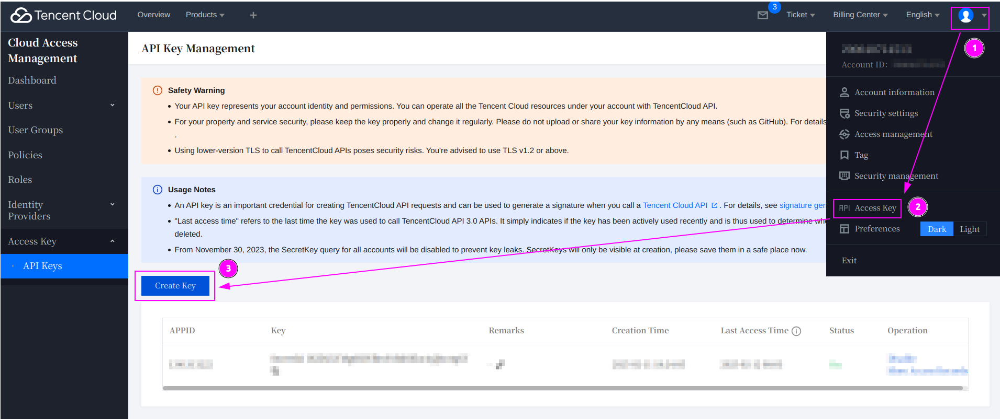
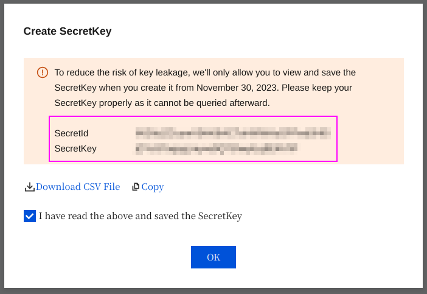
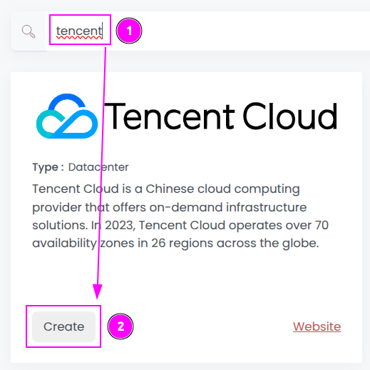
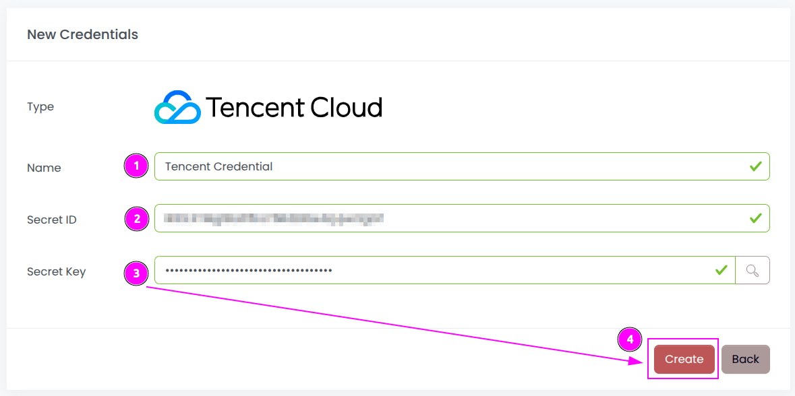
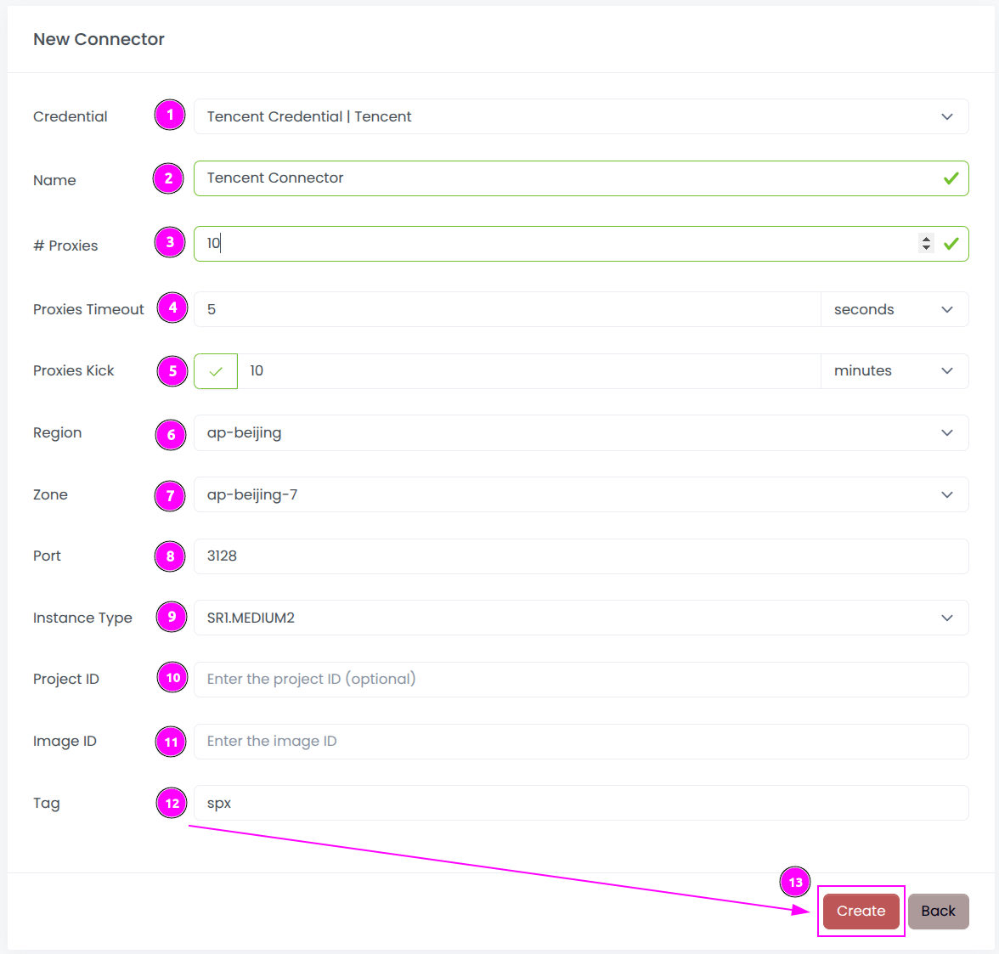
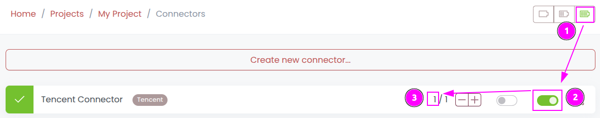
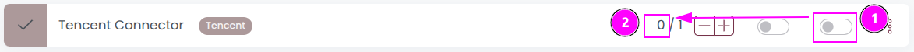

# Tencent Cloud Connector

{width=230, nozoom}

[Tencent Cloud](/l/tencent) is a Chinese cloud computing provider that offers on-demand infrastructure solutions. 
In 2023, Tencent Cloud operates over 70 availability zones in 26 regions across the globe.

Thanks a lot to [Rémy Fontaine](/l/github-remyft) of [Sahar](/l/sahar) for the contribution!

## Prerequisites

An active subscription to Tencent Cloud is required.

When accessing regions other than Hong Kong, Tencent Cloud will require you to **complete verification**, 
either through personal ID verification or by submitting company registration details.

## Tencent Console

Connect to [Tencent Console](/l/tencent-console).

### Get the Secret ID and Key

1. On the top right, click on your name to open the menu;
2. Click on `Access Key`;
3. And click on `Create Key`.

---

Remember the `SecretId` and the `SecretKey`.

## Scrapoxy

Open Scrapoxy User Interface and select `Marketplace`:

### Step 1: Create a new credential

Select `Tencent` to create a new credential (use search if necessary).

---

Complete the form by entering the following information:
1. **Name**: Specify the unique name for the credential;
2. **Secret ID**: Enter the remembered `Secret ID`;
3. **Secret Key**: Enter the remembered `Secret Key`.

And click on `Create`.

### Step 2: Create a new connector

Create a new connector:

Complete the form with the following information:
1. **Credential**: The previous credential;
2. **Name**: The name of the connector;
3. **# Proxies**: The number of instances to create.
4. **Proxies Timeout**: Maximum duration for connecting to a proxy before considering it as offline;
5. **Proxies Kick**: If enabled, maximum duration for a proxy to be offline before being removed from the pool;
6. **Region**: The region where the instances will be created;
7. **Zone**: The zone inside the region;
8. **Port**: The port of the proxy (on Tencent);
9. **Instance Type**: The type of the instance;
10. **Project ID**: The Project ID or leave it empty to use the default project;
11. **Image ID**: The ID of the image in the region (keep it empty);
12. **Tag**: The default tag for instance.

And click on `Create`.

Most default values can be retained if suitable for the use case.

### Step 3: Start the connector

1. Start the project;
2. Start the connector.

### Step 4: Stop the connector (optional)

1. Stop the connector;
2. Wait for proxies to be removed.
