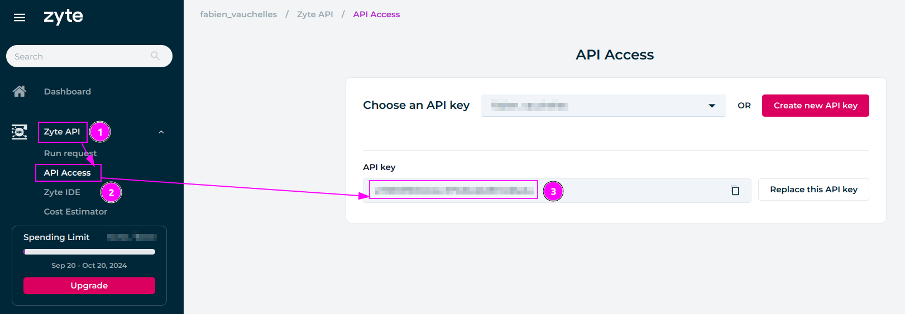
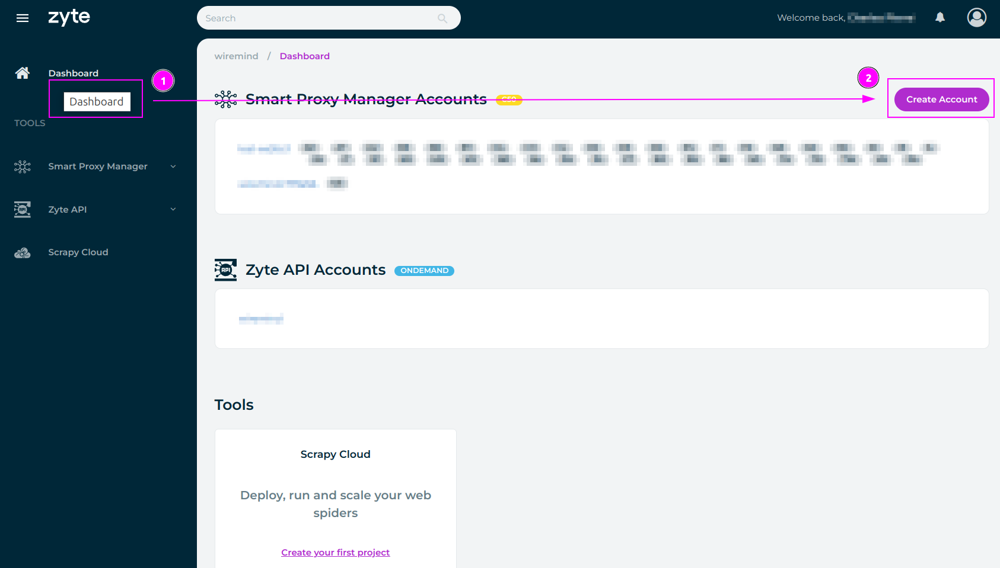
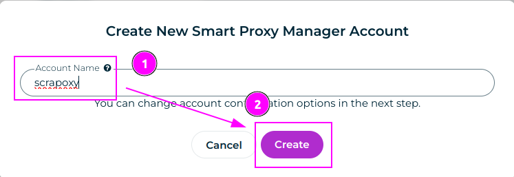
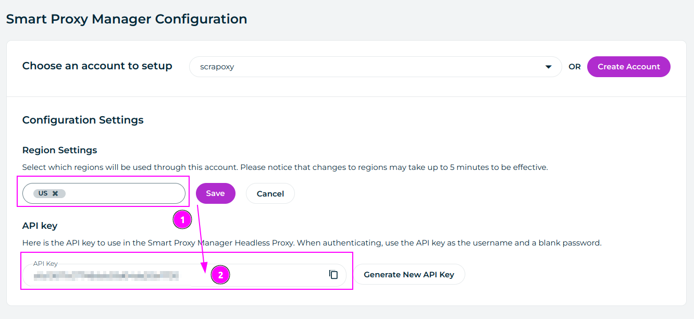
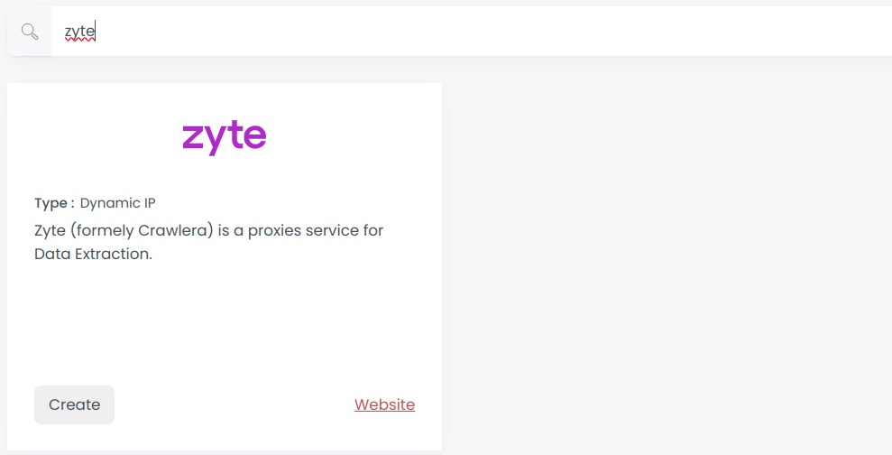
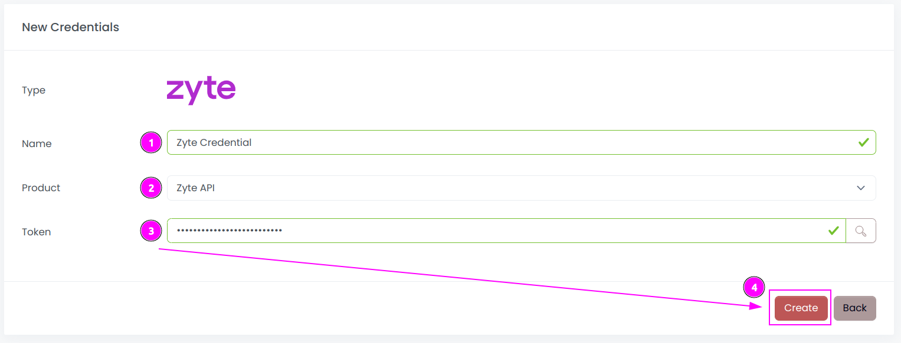
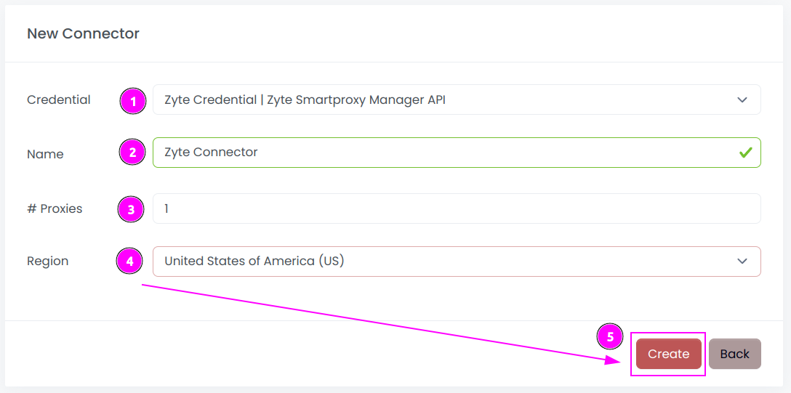
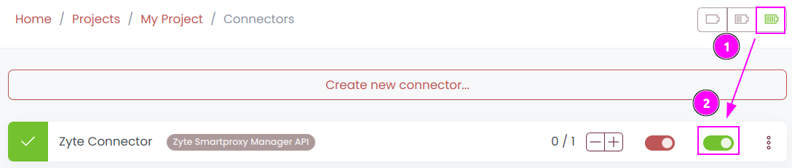
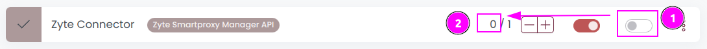

# Zyte Connector

{width=150 nozoom}

[Zyte](/l/zyte) (formely Crawlera) is a proxies service for Data Extraction.

Scrapoxy supports both [Zyte API (Proxy Mode)](/l/zyte-api)
and [Smart Proxy Manager](/l/zyte-spm).

## Prerequisites

An active Zyte subscription is required.

## Zyte API

::: info
When using the Zyte API, you need to enable sticky sessions with an HTTP header or cookie because the cookie jar is linked to the Zyte session and its outbound IP. 
If you try to send the cookie through a different proxy, the Zyte API will remove it.
A simpler solution is to keep all session requests on the same proxy in Scrapoxy.
:::

Connect to the Zyte [App](/l/zyte-app):

1. Go to the `Zyte API` section;
2. Select the `API Access` tab;
3. Remember the `API key`.

## Smart Proxy Manager

Connect to the Zyte [App](/l/zyte-app):

1. Go to the `Dashboard` section;
2. And click on the `Create Account` button.

---

1. Enter `scrapoxy` as `Account Name`;
2. Click on the `Create` button.

---

1. Select the region you want to use and click on `Save`;
2. Remember the `API Key`.

## Scrapoxy

Open Scrapoxy User Interface and select `Marketplace`:

### Step 1: Create a new credential

Select `Zyte` to create a new credential (use search if necessary).

---

Complete the form with the following information:
1. **Name**: The name of the credential;
2. **Product**: The product to use (Zyte API or Smart Proxy Manager);
3. **Token**: The token of the API.

And click on `Create`.

### Step 2: Create a new connector

Create a new connector and select `Zyte` as provider:

Complete the form with the following information:
1. **Credential**: The previous credential;
2. **Name**: The name of the connector;
3. **# Proxies**: The number of instances to create;
4. **Proxies Timeout**: Maximum duration for connecting to a proxy before considering it as offline;
5. **Proxies Kick**: If enabled, maximum duration for a proxy to be offline before being removed from the pool;
6. **Region**: Select the country to use;
7. **API URL**: Set the URL (default is `api.zyte.com:8011` for the Zyte API and `proxy.crawlera.com:8011` for the Smart Proxy Manager).

And click on `Create`.

### Step 3: Start the connector

1. Start the project;
2. Start the connector.

### Other: Stop the connector

1. Stop the connector;
2. Wait for proxies to be removed.
