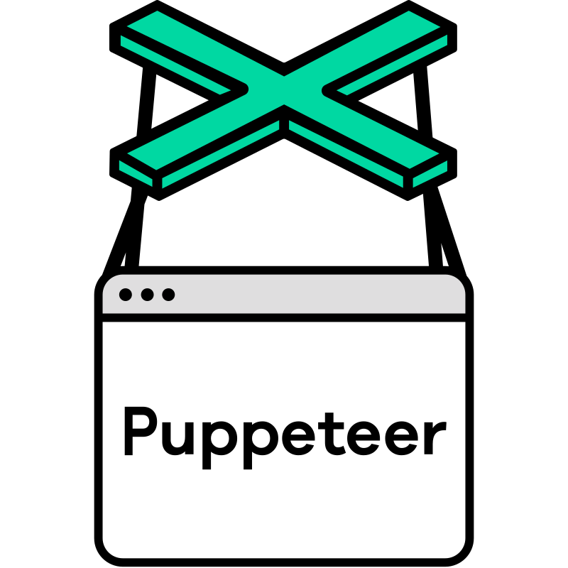
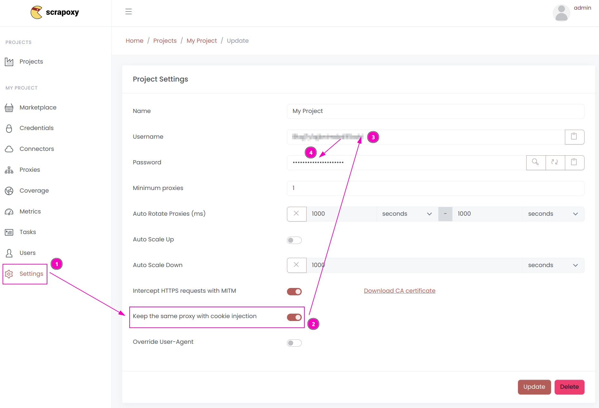
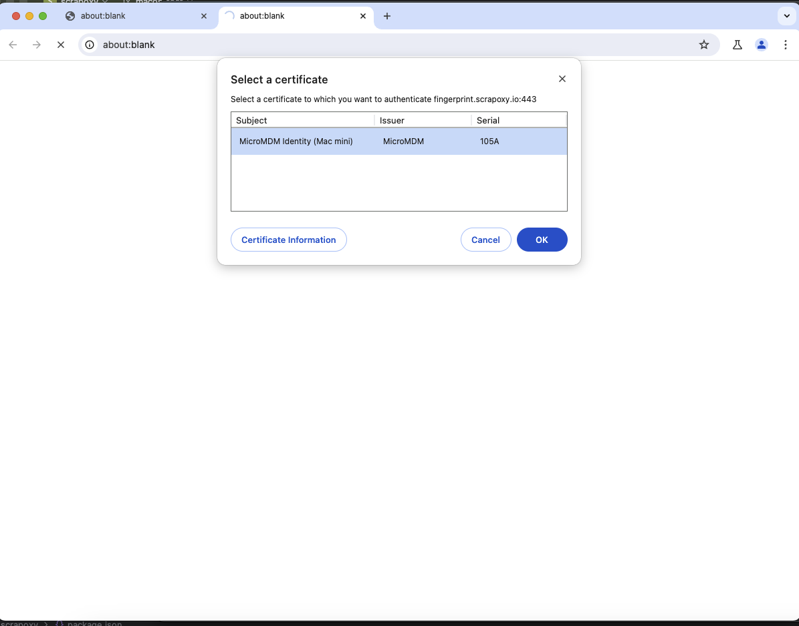

# Puppeteer Integration

{width=120 nozoom}

[Puppeteer](https://pptr.dev) is a webscraping framework for Node.JS,
which provides a high-level API to control Chrome or Chromium over the DevTools Protocol.


## Step 1: Install the library

```shell
npm install puppeteer
```


## Step 2: Retrieve project credentials



1. Open Scrapoxy User interface, and go to the project `Settings`;
2. Enable `Keep the same proxy with cookie injection`;
3. Remember the project's `Username`;
4. Remember the project's `Password`.


## Step 3: Create and run the script

Create a file name `puppeteer.js` with the following content:

```javascript
import puppeteer from 'puppeteer';

(async () => {
    const browser = await puppeteer.launch({
        headless: 'new',
        ignoreHTTPSErrors: true,
        args: [
            '--proxy-server=localhost:8888',
        ]
    });

    async function newPage() {
        const page = await browser.newPage();
        await page.authenticate({
            username: 'USERNAME',
            password: 'PASSWORD',
        });
        return page;
    }

    const page = await newPage();

    await page.goto('https://fingerprint.scrapoxy.io');

    const content = await page.content();
    console.log(content);

    await browser.close();
})()
    .catch(console.error);
```

Replace `USERNAME` and `PASSWORD` by the credentials you copied earlier.

Puppeteer requires adding proxy credential for every new page.

::: info
All requests made in the same session will use the same proxy instance.
:::

Run the script:

```shell
node puppeteer.js
```


## MacOS issue: Select a certificate

On MacOS, Chrome prompts for a certificate when using MITM:



Unfortunately, you cannot bypass this message using Puppeteer options.
The only [solution](https://github.com/puppeteer/puppeteer/issues/1319#issuecomment-1834387149) is to intercept the request 
and use a library like axios to make the request instead.

First, install `axios`:

```shell
npm install axios
```

Then, update the script:

```javascript
import puppeteer from 'puppeteer';
import axios from "axios";

(async () => {
    const browser = await puppeteer.launch({
        headless: 'new',
        ignoreHTTPSErrors: true,
    });

    async function newPage() {
        const page = await browser.newPage();
        await page.setRequestInterception(true);

        page.on('request', (iReq) => {
            const options = {
                url: iReq.url(),
                method: iReq.method(),
                headers: iReq.headers(),
                data: iReq.postData(),
                proxy: {
                    protocol: 'http',
                    host: 'localhost',
                    port: 8888,
                    auth: {
                        username: 'USERNAME',
                        password: 'PASSWORD',
                    }
                }
            };
            axios.request(options)
                .then((res) => {
                    iReq.respond({
                        status: res.status,
                        contentType: res.headers['content-type'],
                        headers: res.headers,
                        body: res.data,
                    });
                })
                .catch(() => {
                    iReq.abort('connectionrefused')
                });
        });

        return page;
    }

    const page = await newPage();

    await page.goto('https://fingerprint.scrapoxy.io');

    const content = await page.content();
    console.log(content);

    await browser.close();
})()
    .catch(console.error);
```

Replace `USERNAME` and `PASSWORD` by the credentials you copied earlier.
