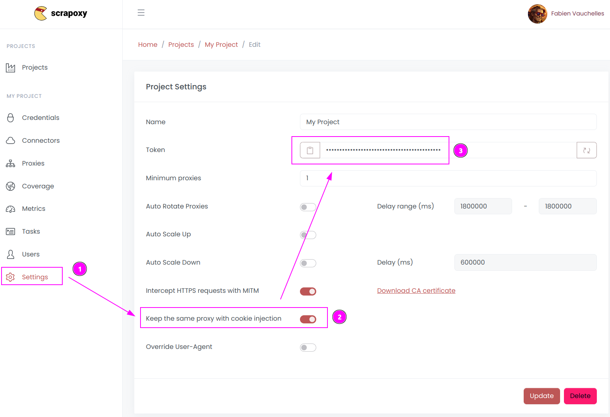

# Puppeteer Integration

{width=120 nozoom}

[Puppeteer](https://pptr.dev) is a webscraping framework for Node.JS,
which provides a high-level API to control Chrome or Chromium over the DevTools Protocol.


### Step 1: Install the library

```shell
npm install puppeteer
```


### Step 2: Retrieve project token



1. Open Scrapoxy User interface, and go to the project `Settings`;
2. Enable `Keep the same proxy with cookie injection`;
3. Remember the project token (format is `USERNAME:PASSWORD`).


### Step 3: Create and run the script

Create a file name `puppeteer.js` with the following content:

```javascript
import puppeteer from 'puppeteer';

(async () => {
    const browser = await puppeteer.launch({
        headless: 'new',
        ignoreHTTPSErrors: true,
        args: [
            '--proxy-server=localhost:8888',
        ]
    });

    async function newPage() {
        const page = await browser.newPage();
        await page.authenticate({
            username: 'USERNAME',
            password: 'PASSWORD',
        });
        return page;
    }

    const page = await newPage();

    await page.goto('https://fingerprint.scrapoxy.io');

    const content = await page.content();
    console.log(content);

    await browser.close();
})()
    .catch(console.error);
```

Replace `USERNAME` and `PASSWORD` by the credentials you copied earlier.

Puppeteer requires adding proxy credential for every new page.

::: info
All requests made in the same session will use the same proxy instance.
:::

Run the script:

```shell
node puppeteer.js
```
