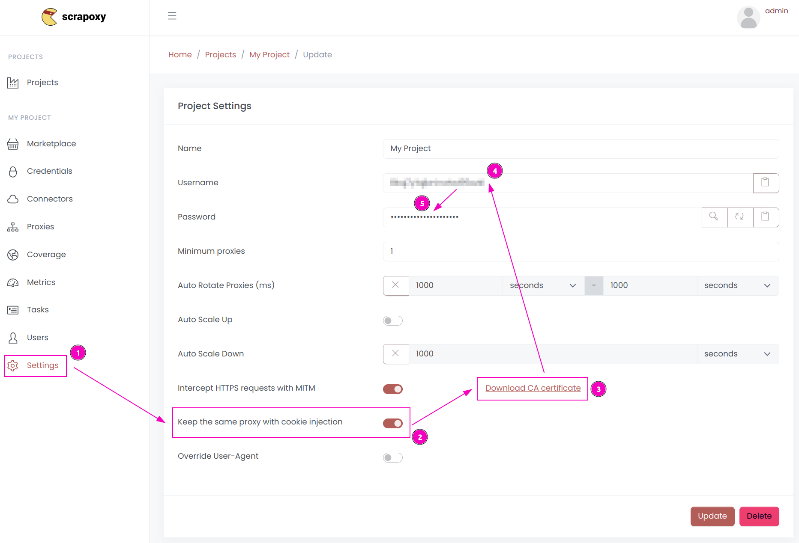

# Python Integration 

{width=230 nozoom}

## Requests

This tutorial uses the famous Python HTTP library [Requests](http://docs.python-requests.org/en/master/).


### Step 1: Install the library

```shell
pip install requests
```


### Step 2: Retrieve CA certificate and project token


1. Open Scrapoxy User interface, and go to the project `Settings`;
2. Click on `Download CA certificate` and save the file;
3. Remember the project token.

::: info
It is assumed that file is saved in `/tmp/scrapoxy-ca.crt`.
:::


### Step 3: Create and run the script

Create a file name `requests.py` with the following content:

```python
import requests

ca = "/tmp/scrapoxy-ca.crt"
proxy = "http://<project_username>:<project_password>@localhost:8888"

r = requests.get(
    "https://fingerprint.scrapoxy.io",
    proxies={"http": proxy, "https": proxy},
    verify=ca
)

print("proxy instance:", r.headers["x-scrapoxy-proxyname"])

print(r.json())
```

Replace `<project_username>` and `<project_password>` by the credentials you copied earlier.

Scrapoxy includes a `x-scrapoxy-proxyname` header in each response,
indicating the name of the proxy instance assigned for the request.

Run the script:

```shell
python requests.py
```


### Step 4: Sticky session (optional)

To reuse the same proxy instance for all requests, add the following line:

```python
import requests

ca = "/tmp/scrapoxy-ca.crt"
proxy = "http://<project_username>:<project_password>@localhost:8888"
headers={
    'X-Scrapoxy-Proxyname': '<proxyname>'
}

r = requests.get(
    "https://fingerprint.scrapoxy.io",
    headers=headers,
    proxies={"http": proxy, "https": proxy},
    verify=ca
)

print("proxy instance:", r.headers["x-scrapoxy-proxyname"])
```

Replace `<proxyname>` by the proxy instance name you want to use.


## HRequests

This tutorial uses the powerful Python HTTP library [HRequests](https://daijro.gitbook.io/hrequests).


### Step 1: Install the library

```shell
pip install hrequests[all]
```


### Step 2: Retrieve CA certificate and project token



1. Open Scrapoxy User interface, and go to the project `Settings`;
2. Enable `Keep the same proxy with cookie injection`;
3. Click on `Download CA certificate` and save the file;
4. Remember the project token.

::: info
It is assumed that file is saved in `/tmp/scrapoxy-ca.crt`.
:::


### Step 3: Create and run the script

Create a file name `hrequests.py` with the following content:

```python
import hrequests

ca = "/tmp/scrapoxy-ca.crt"
proxy = "http://<project_username>:<project_password>@localhost:8888"

session = hrequests.Session()

r = session.get(
    "https://fingerprint.scrapoxy.io",
    proxies={"http": proxy, "https": proxy},
    verify=ca
)

session.close()

print("proxy instance:", r.headers["x-scrapoxy-proxyname"])

print(r.json())
```

::: info
All requests made in the same session will use the same proxy instance.
:::

Run the script:

```shell
python hrequests.py
```
