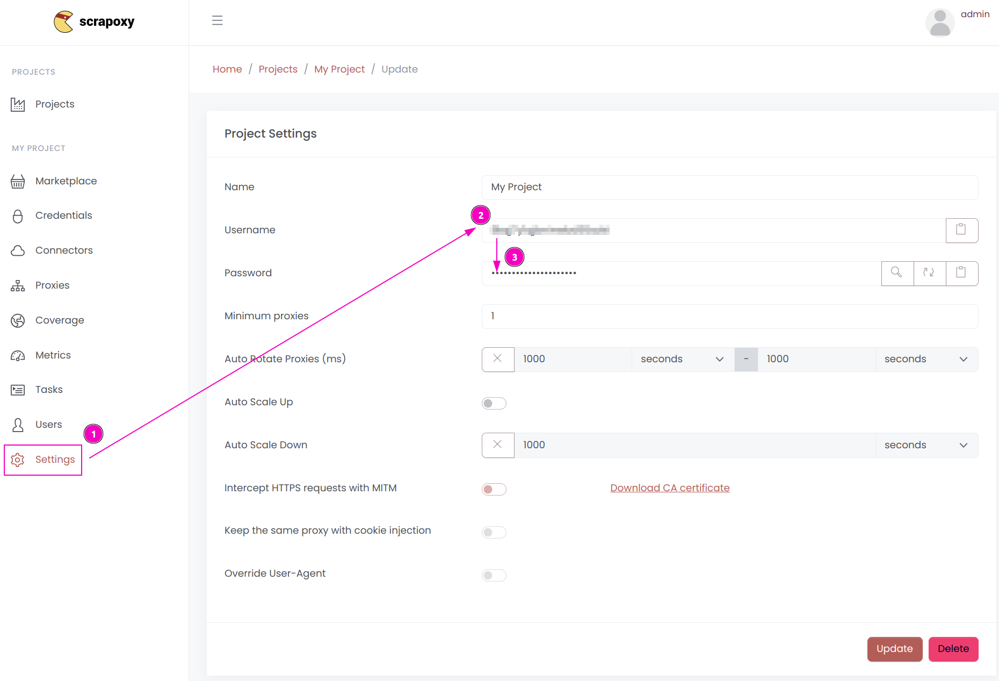

# Kameleo Integration

{width=230 nozoom}

This tutorial uses [Kameleo](https://kameleo.io/web-scraping?utm_source=scrapoxy&utm_medium=github&utm_campaign=scrapoxy_integration_guide), an anti-detect browser designed for web-scraping.

Kameleo provides a powerful antidetect browser for better data collection on websites with anti-bot detection systems such as Cloudflare, DataDome, and PerimeterX. It combines headless browsers, proxies, and top-tier automation framework support for smooth web scraping. Change fingerprint parameters to ensure your activities blend seamlessly into regular web traffic, minimizing bot detection risks.


## Step 1: Install the framework

```shell
pip install kameleo.local-api-client scrapoxy
```


### Step 2: Retrieve project credentials



1. Open Scrapoxy User interface, and go to the project `Settings`;
2. Remember the project's `Username`;
3. Remember the project's `Password`.

<sub>When integrating Scrapoxy with Kameleo, you can't use MITM mode. Otherwise the TLS fingperint would break and anti-detection mode would be damaged. Without the MITM mode sticky session is not possible. However our recommendation is to use one browser session with one IP address.</sub>

## Step 3: Download and install Kameleo.CLI

**[Download and install Kameleo](https://kameleo.io/downloads?utm_source=scrapoxy&utm_medium=github&utm_campaign=scrapoxy_integration_guide)** .


## Step 4: Start Kameleo.CLI

**Windows:**

```shell
cd C:\Users\<YOUR_USERNAME>\AppData\Local\Programs\Kameleo
Kameleo.CLI.exe email=<YOUR_EMAIL> password=<YOUR_PASSWORD>
```

**MacOS:**

```shell
cd /Applications/Kameleo.app/Contents/Resources/CLI/
./Kameleo.CLI email=<YOUR_EMAIL> password=<YOUR_PASSWORD>
```

<sub>Kameleo consists of multiple components running on your computer and in the cloud. The core logic is implemented in the Kameleo CLI component, located on your device. This component is responsible for every action you do in the application. For example, it starts the preconfigured browsers and saves their actual state into virtual browser profile files. Once you start this component, a REST API is available on the local interface (by default, it is on http://localhost:5050). You can check the available endpoints and models on [SwaggerHub](https://app.swaggerhub.com/apis/kameleo-team/kameleo-local-api/) or by opening the [http://localhost:5050/swagger](http://localhost:5050/swagger) URL.</sub>


## Step 5: Connect to Kameleo.CLI


```python
from kameleo.local_api_client import KameleoLocalApiClient
from kameleo.local_api_client.builder_for_create_profile import BuilderForCreateProfile
from kameleo.local_api_client.models import WebglMetaSpoofingOptions

kameleo_port = 5050
client = KameleoLocalApiClient(
  endpoint=f'http://localhost:{kameleo_port}',
  retry_total=0
)
```


## Step 6: Search fresh & real fingerprints


<sub>Base profiles are real-world browser fingerprint configurations that are used for instantiating virtual browser profiles. This way the browser profile will have a consistent footprint after the spoofing mechanism is applied as most data are derived from a real browser. The rest of the data are generated automatically upon creation. You can filter in hundreds of thousands of base profiles to have profiles with the required language, operating system, and browser.</sub>

```python
base_profiles = client.search_base_profiles(
  device_type='desktop',
  browser_product='chrome',
  os_family='windows',
  language='en-us'
)
```


## Step 7: Configure browser fingerprint & Set Up Scrapoxy


```python
create_profile_request = BuilderForCreateProfile \
  .for_base_profile(base_profiles[0].id) \
  .set_name('kameleo scrapoxy integration') \
  .set_recommended_defaults() \
  .set_proxy('socks5', Server(host='localhost', port=8888, id='USERNAME', secret='PASSWORD')) \
  .set_start_page("https://kameleo.io") \
  .build()

profile = client.create_profile(body=create_profile_request)
```


<sub>Recommended default settings should work on most anti-bot systems. If you prefer, you can test different browsers, [canvas](https://help.kameleo.io/hc/en-us/articles/7021925786397-Intelligent-Canvas-Spoofing-Our-research-on-canvas-fingerprinting), webgl, audio spoofing, etc. 


## Step 8: Start browser profile


<sub>Kameleo is shipped with 2 different custom-built browsers to ensure you can bypass anti-bot systems during web scraping. Chrome, Edge and Safari are emulated by [Chroma](https://help.kameleo.io/hc/en-us/articles/13301851271836-Chroma). Firefox is emulated on [Junglefox](https://help.kameleo.io/hc/en-us/articles/13301908333852-Junglefox).</sub>


```python
client.start_profile(profile.id)
```


## Step 9: Automate the browser


<sub>You can choose 3 popular automation frameworks ([Selenium](https://www.selenium.dev/), [Puppeteer](https://pptr.dev/), or [Playwright](https://playwright.dev/)) to automate the browser. Thanks to Kameleo anti-bot systems won't recognise the presence of an automation framework.


### Selenium


```shell
pip install selenium
```

```python
from selenium import webdriver

options = webdriver.ChromeOptions()
options.add_experimental_option("kameleo:profileId", profile.id)
driver = webdriver.Remote(
  command_executor=f'http://localhost:{kameleo_port}/webdriver',
  options=options
)

await webdriver.get('https://cloudflare.com');
```


### Puppeteer


```shell
pip install pyppeteer
```

```python
import pyppeteer

browser_ws_endpoint = f'ws://localhost:{kameleo_port}/puppeteer/{profile.id}'
browser = await pyppeteer.launcher.connect(
  browserWSEndpoint=browser_ws_endpoint,
  defaultViewport=False)
page = await browser.newPage()


await page.goto('https://cloudflare.com')
```


### Playwright


```shell
pip install playwright
```

```python
from playwright.sync_api import sync_playwright

browser_ws_endpoint = f'ws://localhost:{kameleo_port}/playwright/{profile.id}'
with sync_playwright() as playwright:
  browser = playwright.chromium.connect_over_cdp(endpoint_url=browser_ws_endpoint)
  context = browser.contexts[0]
  page = context.new_page()
  page.goto('https://cloudflare.com')
```


## Step 10: Stop, save and delete the profile


<sub>Make sure to stop the browser. The virtual browser profile is then stored in you local workspace. Optionally you can export it to a .kameleo file, so you can load it later on another server as well. Or simply you can delete the profile from Kameleo's workspace once you don't need it anymore. This way, you can keep your resource usage low.</sub>

```python
client.stop_profile(profile.id)
path = f'{os.path.dirname(os.path.realpath(__file__))}\\test.kameleo'
result = client.export_profile(profile.id, body=SaveProfileRequest(path=path)) # optional
client.delete_profile(profile.id); # optional
```


## Optional Settings 1: Headless browser support


<sub>To save computer resources it is possible to run browsers in headless mode while you do browser automation. To launch in the headless mode you will need to pass additional settings when you start the virtual browser profile. You can do it by calling the `POST /profiles/{guid}/start` endpoint or simply call the [StartProfileWithOptions](https://app.swaggerhub.com/apis/kameleo-team/kameleo-local-api/#/Profile/StartProfileWithOptions) method in our packages.</sub>

```python
from kameleo.local_api_client.models.web_driver_settings_py3 import WebDriverSettings

client.start_profile_with_options(profile.id, WebDriverSettings(
    arguments=["--headless"]
))
```


## Optional Settings 2: Emulate mobile user agents


```python
base_profile_list = client.search_base_profiles(
  device_type='mobile',
  os_family='ios',
  browser_product='safari',
  language='en-us'
)

create_profile_request = BuilderForCreateProfile \
  .for_base_profile(base_profile_list[0].id) \
  .set_recommended_defaults() \
  .set_launcher('chromium') \
  .build()
profile = client.create_profile(body=create_profile_request)

client.start_profile_with_options(profile.id, body={
  'additionalOptions': [
    {
      'key': 'disableTouchEmulation',
      'value': True,
    },
  ],
})
```


## Optional Settings 3: Manage cookies


```python
cookie_list = client.list_cookies(profile.id)

cookie = cookie_list[0]
new_cookie = CookieRequest(domain=cookie.domain, name=cookie.name, path=cookie.path, value=cookie.value,
    host_only=cookie.host_only, http_only=cookie.http_only, secure=cookie.secure,
    same_site=cookie.same_site, expiration_date=cookie.expiration_date)
cookie_array = [new_cookie]
client.add_cookies(profile.id, body=cookie_array)

client.delete_cookies(profile.id)
```

## Full documentation
- [Terminology](https://help.kameleo.io/hc/en-us/articles/4420420859793-Terminology)
- [Getting Started guide](https://help.kameleo.io/hc/en-us/articles/4418166326417-Getting-started-with-Kameleo-Automation)
- [Examples on Kameleo's GitHub](https://github.com/kameleo-io/local-api-examples)
