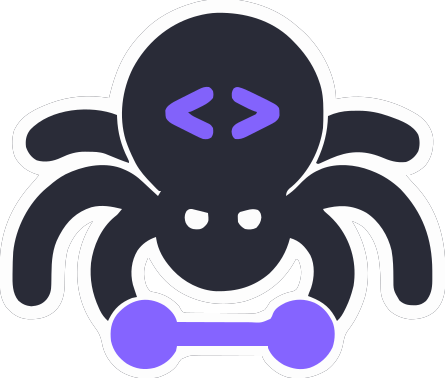

# ScrapeGraphAI Integration 

{width=180 nozoom}

This tutorial introduces [ScrapeGraphAI](https://scrapegraphai.com), a robust scraping framework.

ScrapeGraphAI leverages advanced LLM models to efficiently parse and extract data from web pages,
eliminating the need for intricate XPath or CSS selectors and the maintenance they require.


## Step 1: Install the framework

Follow the instructions [here](https://scrapegraph-ai.readthedocs.io/en/latest/getting_started/installation.html) for detailed steps.

In summary, run the following command:

```shell
pip install scrapegraphai
```

Then, install Playwright with dependencies:

```shell
playwright install --with-deps
```


## Step 2: Install Mistra model from Ollama

Follow the instructions [here](https://ollama.com/download) for detailled steps.

In summary, run the following command:

```shell
curl -fsSL https://ollama.com/install.sh | sh
```

And install the Mistra model:

```shell
ollama pull mistra
```


## Step 3: Retrieve project credentials


1. Open Scrapoxy User interface, and go to the project `Settings`;
2. Enable `Keep the same proxy with cookie injection`;
3. Remember the project's `Username`;
4. Remember the project's `Password`.


## Step 4: Create a spider

Write the following spider:

```python
from scrapegraphai.graphs import SmartScraperGraph

graph_config = {
    "verbose": True,
    "headless": False,
    "llm": {
        "model": "ollama/mistral",
        "temperature": 1,
        "format": "json",  # Ollama needs the format to be specified explicitly
        "model_tokens": 2000, #  depending on the model set context length
        "base_url": "http://localhost:11434",  # set ollama URL of the local host (YOU CAN CHANGE IT, if you have a different endpoint
    },
    "embeddings": {
        "model": "ollama/nomic-embed-text",
        "temperature": 0,
        "base_url": "http://localhost:11434",  # set ollama URL
    },
    "loader_kwargs": {
        "proxy": {
            "server": "http://127.0.0.1:8888",
            "username": "USERNAME",
            "password": "PASSWORD",
        }
    }
}

# ************************************************
# Create the SmartScraperGraph instance and run it
# ************************************************

smart_scraper_graph = SmartScraperGraph(
    prompt="List me all the projects with their description.",
    # also accepts a string with the already downloaded HTML code
    source="https://perinim.github.io/projects",
    config=graph_config
)

result = smart_scraper_graph.run()
print(result)
```

Replace `USERNAME` and `PASSWORD` by the credentials you copied earlier.

In this example, we set `headless=False` to display Playwright
and `verbose=True` to show the logs.
