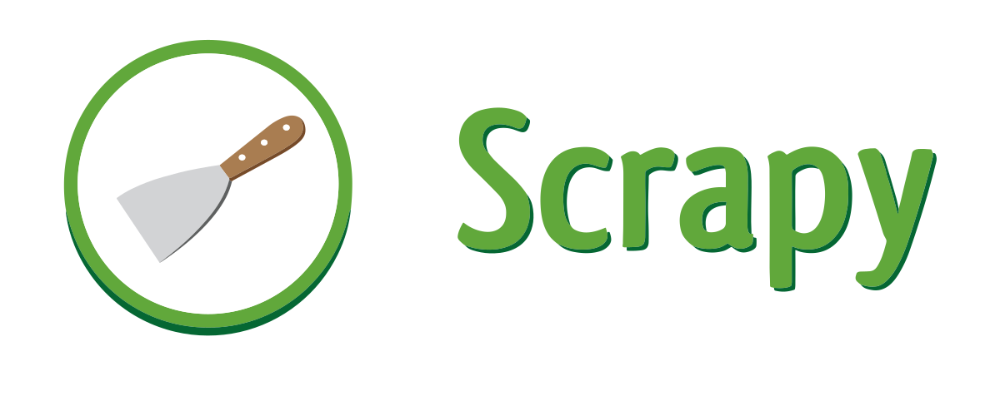
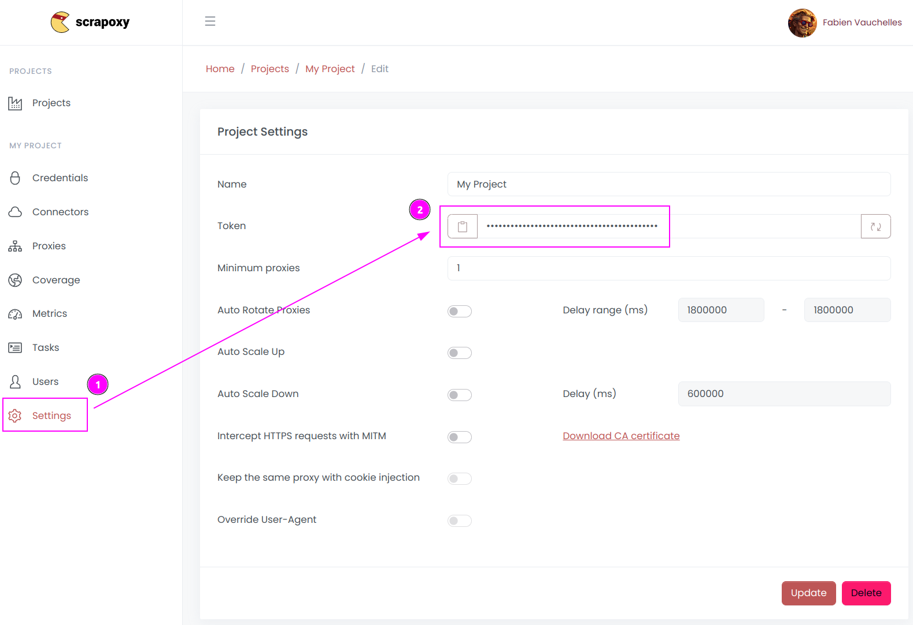

# Scrapy Integration

{width=230 nozoom}

This tutorial uses the famous Python web scraping framework [Scrapy](https://scrapy.org/). 


## Step 1: Install the framework

```shell
pip install scrapy scrapoxy
```


### Step 2: Retrieve project token



1. Open Scrapoxy User interface, and go to the project `Settings`;
2. Remember the project token (format is `USERNAME:PASSWORD`).


## Step 3: Create a new project

Create a new Scrapy project:

```shell
scrapy startproject myproject
cd myproject
```

And add a new spider:

```shell
scrapy genspider myspider mydomain.com
```


## Step 4: Add Scrapoxy usage

Edit `myproject/settings.py` and modify the following lines:

```python
DOWNLOADER_MIDDLEWARES = {
    'scrapoxy.ProxyDownloaderMiddleware': 100,
}

SCRAPOXY_MASTER = "http://localhost:8888"
SCRAPOXY_API = "http://localhost:8890/api"
SCRAPOXY_USERNAME = "USERNAME"
SCRAPOXY_PASSWORD = "PASSWORD"
```

Replace `USERNAME` and `PASSWORD` by the credentials you copied earlier.


## Step 5: Remove blacklisted instances (optional)

Scrapy uses Scrapoxy's API to kill blacklisted instance.

Edit `myproject/settings.py` and add the following lines:

```python
DOWNLOADER_MIDDLEWARES = {
    'scrapoxy.ProxyDownloaderMiddleware': 100,
    'scrapoxy.BlacklistDownloaderMiddleware': 101,
}

SCRAPOXY_BLACKLIST_HTTP_STATUS_CODES = [400, 429, 503]
SCRAPOXY_SLEEP_MIN = 60
SCRAPOXY_SLEEP_MAX = 180
```

::: tip
Add the HTTP status codes you want to blacklist in `SCRAPOXY_BLACKLIST_HTTP_STATUS_CODES`.
:::

Scrapy will pause for a duration ranging between `SCRAPOXY_SLEEP_MIN` and `SCRAPOXY_SLEEP_MAX` seconds
when no proxy instance is available.


## Step 6: Auto-scale the scraping session (optional)

Scrapy can start instances at the beginning of a session 
and terminate them when the session finishes.

Edit `myproject/settings.py` and add the following lines:

```python
SPIDER_MIDDLEWARES = {
   "scrapoxy.ScaleSpiderMiddleware": 100,
}

SCRAPOXY_WAIT_FOR_SCALE = 120
```

Scrapy will wait for a duration of `SCRAPOXY_WAIT_FOR_SCALE` seconds before initiating the scraping session,
allowing time for the instances to be ready.


## Step 7: Sticky session (optional)

Scrapy can use the same proxy instance for a set of chained requests.

Edit `myproject/settings.py` and add the following lines:

```python
SPIDER_MIDDLEWARES = {
   "scrapoxy.StickySpiderMiddleware": 101,
}
```


## Step 8: Integrate scrapy-impersonate (optional)

The library [scrapy-impersonate](https://github.com/jxlil/scrapy-impersonate) is a Scrapy download handler. 
This project integrates [curl_cffi](https://github.com/yifeikong/curl_cffi) to perform HTTP requests, 
so it can impersonate browsers' TLS signatures or JA3 fingerprints.

To use it, first install the package:

```shell
pip install scrapy-impersonate
```

And add the following lines to `settings.py`:

```python
TWISTED_REACTOR = "twisted.internet.asyncioreactor.AsyncioSelectorReactor"

DOWNLOAD_HANDLERS = {
    "http": "scrapy_impersonate.ImpersonateDownloadHandler",
    "https": "scrapy_impersonate.ImpersonateDownloadHandler",
}
```

In your scraper, include additional metadata with the request,
specifically setting the `verify` option to `False` within the impersonate_args.
This will bypass SSL certificate verification.

```python
class ExampleSpider(Spider):
    name = "example"
    allowed_domains = ["browserleaks.com"]

    def start_requests(self):
        yield Request(
            url="https://tls.browserleaks.com/json",
            dont_filter=True,
            meta={
                "impersonate": "chrome110",
                "impersonate_args": {
                    "verify": False,
                },
            },
            callback=self.parse
        )
```

In this example, the request will emulate a Chrome 110 browser,
but you have the flexibility to choose from [many other useragents](https://github.com/jxlil/scrapy-impersonate?tab=readme-ov-file#supported-browsers).
