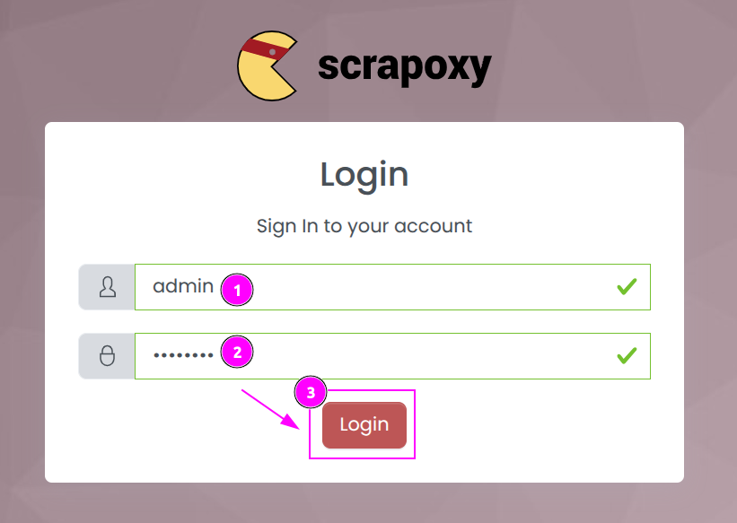
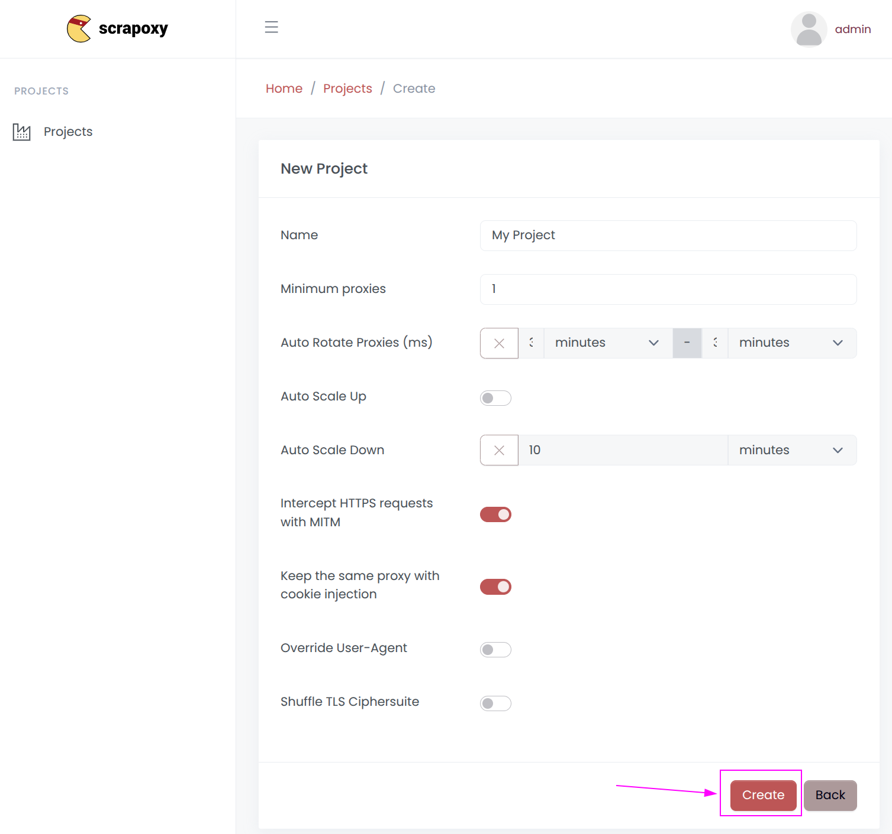
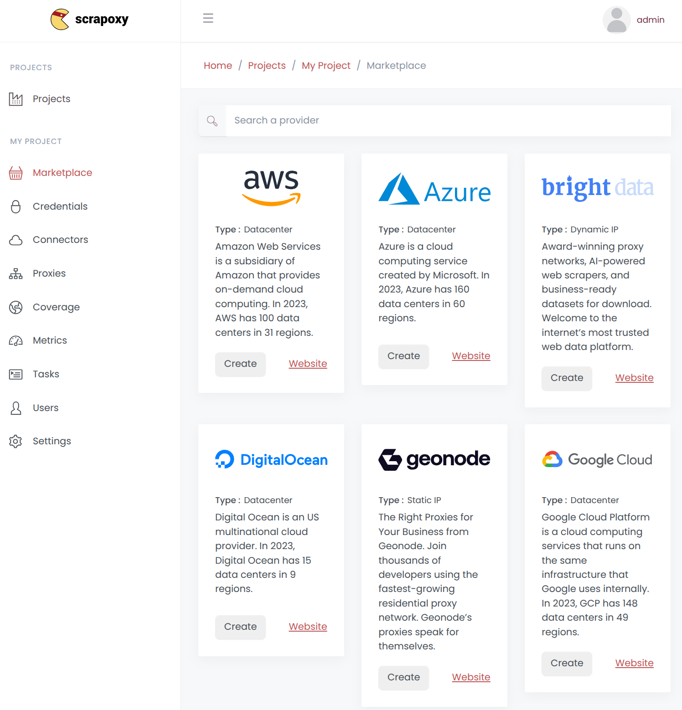
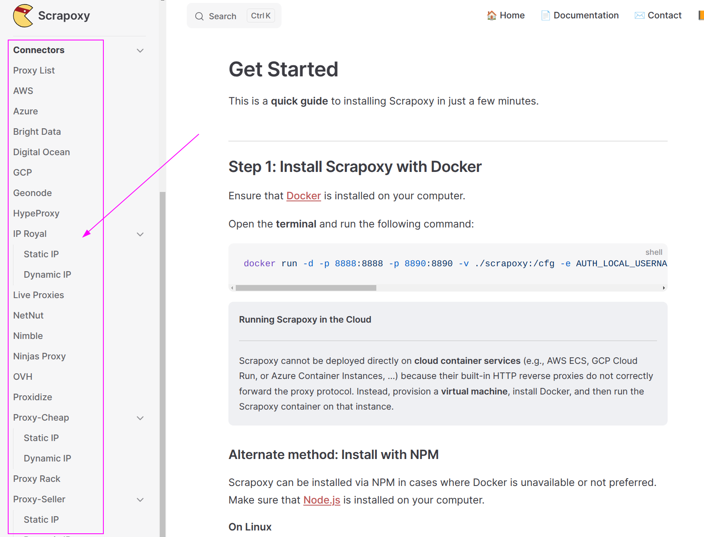
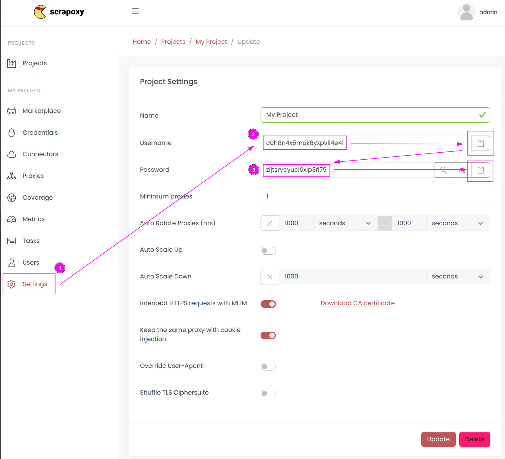
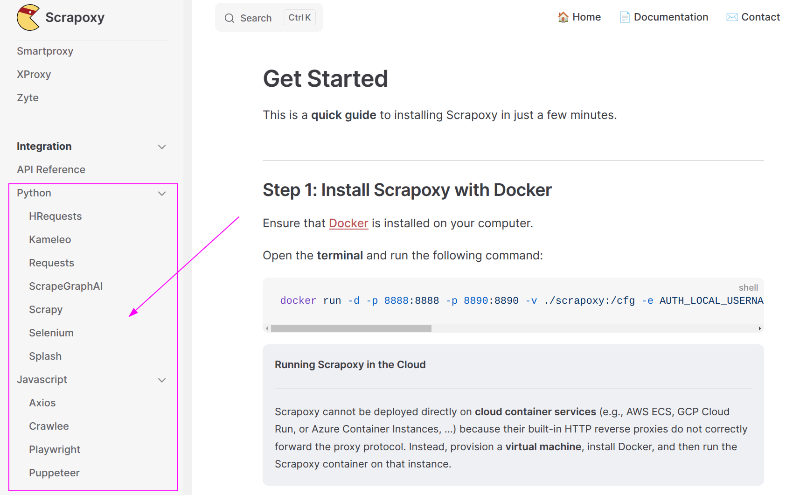

# Get Started

This is a **quick guide** to installing Scrapoxy in just a few minutes.


## Step 1: Install Scrapoxy with Docker

Ensure that [Docker](/l/docker) is installed on your computer.

Open the **terminal** and run the following command:

```shell
docker run -d -p 8888:8888 -p 8890:8890 -v ./scrapoxy:/cfg -e AUTH_LOCAL_USERNAME=admin -e AUTH_LOCAL_PASSWORD=password -e BACKEND_JWT_SECRET=secret1 -e FRONTEND_JWT_SECRET=secret2 -e STORAGE_FILE_FILENAME=/cfg/scrapoxy.json scrapoxy/scrapoxy
```


::: info Running Scrapoxy in the Cloud
****

Scrapoxy cannot be deployed directly on **cloud container services** 
(e.g., AWS ECS, GCP Cloud Run, or Azure Container Instances, ...) 
because their built-in HTTP reverse proxies do not correctly forward the proxy protocol.
Instead, provision a **virtual machine**, install Docker, and then run the Scrapoxy container on that instance.
:::


### Alternate method: Install with NPM

Scrapoxy can be installed via NPM in cases where Docker is unavailable or not preferred.
Make sure that [Node.js](/l/nodejs) is installed on your computer.


#### On Linux

Open the **terminal** and run the following command:

```shell
AUTH_LOCAL_USERNAME=admin AUTH_LOCAL_PASSWORD=password BACKEND_JWT_SECRET=secret1 FRONTEND_JWT_SECRET=secret2 npx --yes scrapoxy
```


#### On Windows

Open the **Command Prompt** and run the following command:

```shell
set AUTH_LOCAL_USERNAME=admin
set AUTH_LOCAL_PASSWORD=password
set BACKEND_JWT_SECRET=secret1
set FRONTEND_JWT_SECRET=secret2
npx --yes scrapoxy
```


## Step 2: Connect to Scrapoxy and create the first project

Connect to http://localhost:8890:



1. Enter `admin` as the username.
2. Enter `password` as the password.
3. Click **Login**.

---

The first project is automatically created:



Click on `Create`.


## Step 3: Add a first connector

After creating the project, Scrapoxy will ask to add a connector.

Connectors are available for cloud providers, proxy services, hardware, and more:



Select the connector and click `Create`. 

---

Detailed configuration instructions are provided in Scrapoxy's [documentation](https://scrapoxy.io/intro/scrapoxy).
Follow the appropriate guide and return to this page once the connector is ready.




## Step 4: Make your first request with Curl

First, retrieve the proxy credentials:



1. Click on the `Settings` tab;
2. Click on the `Username` copy button and remember the value (e.g.: c0h8n4x5muk6yxpvli4e4l);
3. Click on the `Password` copy button and remember the value (e.g.: zljtsrycyucl0xip3rl79)

---

Next, make a request with `curl`:

```shell
curl -k -x http://localhost:8888 -U c0h8n4x5muk6yxpvli4e4l:zljtsrycyucl0xip3rl79 http://ipinfo.io
```

::: tip
Scrapoxy uses proxy credentials to route requests to the correct project.
This allows Scrapoxy to manage multiple projects simultaneously, all accessible through the same proxy port (8888).
:::

For additional integrations, refer to the [documentation](https://scrapoxy.io/intro/scrapoxy):



Scrapoxy supports many popular tools and frameworks, including:
[Puppeteer](../integration/js/puppeteer/guide.md), 
[Playwright](../integration/js/playwright/guide.md), 
[Scrapy](../integration/python/scrapy/guide.md),
etc.
