# User Interface

This page details each section within the Scrapoxy User Interface.

## Login

User interface is accessible at: [http://localhost:8890](http://localhost:8890).

---

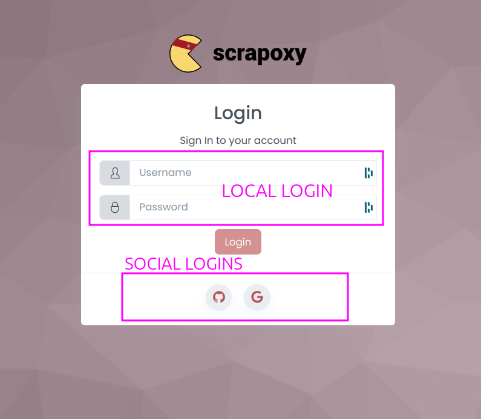

When you open Scrapoxy User interface, Scrapoxy prompts you to log in.

Scrapoxy offers various login methods depending on your configuration:
- **Local User/Password**: Allows only one user.
- **Social Logins**: Supports authentication through platforms like Google, Github, etc.

## Layout

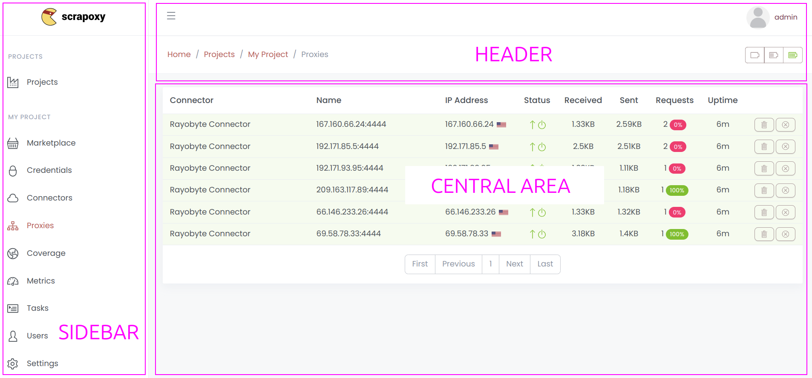

The administration interface includes the following components:

- **Left Menu**: Facilitates navigation between different project sections.
- **Header**: Displays the name of the connected user and provides a menu for accessing user settings and logging out.
- **Central Area**: Reserved for displaying pages and relevant content.

## Project

### Project Settings

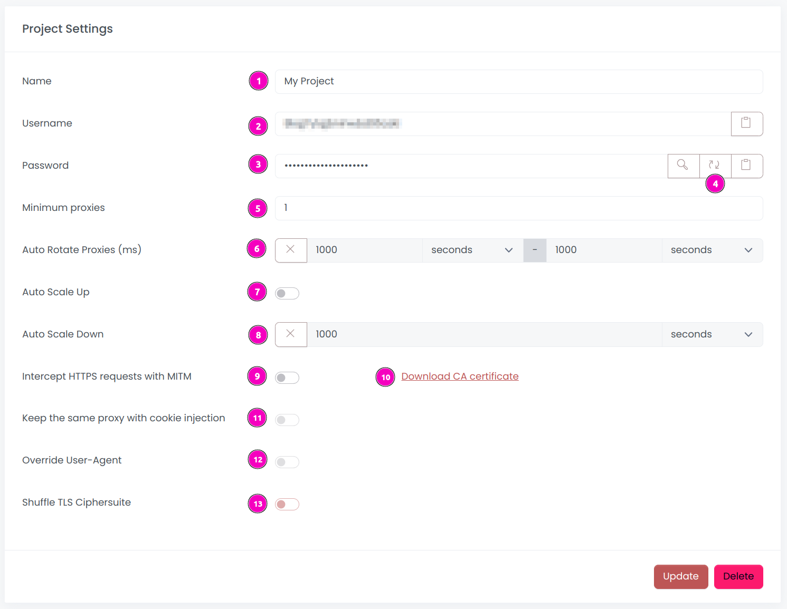

During the initial connection, Scrapoxy will guide you through the creation of a new project with the following settings:
1. **Name**: Unique identifier for the project;
2. **Username**: Authentication username used for proxy authentication in requests (click on the `clipboard` icon to copy the username);
3. **Password**: Authentication password used for proxy authentication in requests (click on the `clipboard` icon to copy the password);
4. **Renew token**: Click on this button to renew username and password;
5. **Minimum proxies**: The minimum number of proxies online when the project status is CALM;
6. **Auto Rotate Proxies**: If enabled, proxies are automatically rotated at random intervals within the specified **Delay range**; 
7. **Auto Scale Up**: When enabled, the project status switches to `HOT` upon receiving a request, and all proxies are started;
8. **Auto Scale Down**: When enabled, the project status switches to `CALM` if no requests are received after a specified delay, and all proxies are stopped;
9. **Intercept HTTPS requests with MITM**: If enabled, Scrapoxy intercepts and modifies HTTPS requests and responses. 
10. **Certificate**: Install this CA certificate to avoid security warnings in Browsers or Scrapers;
11. **Keep the same proxy with cookie injection**: If enabled, Scrapoxy injects a cookie to maintain the same proxy for a browser session (sticky cookie);
12. **Override User-Agent**: If enabled, Scrapoxy overrides the User-Agent header with the value assigned to a proxy instance. All requests made with this instance will have the same User-Agent header;
13. **Shuffle TLS Ciphersuite**: If enabled, Scrapoxy assigns a random TLS cipher suite to each proxy instance, helping to prevent [TLS fingerprinting](https://youtu.be/0S5SRT-WIUo?t=497);

After saving these settings, Scrapoxy will prompt you to create the first credential for the project.

---

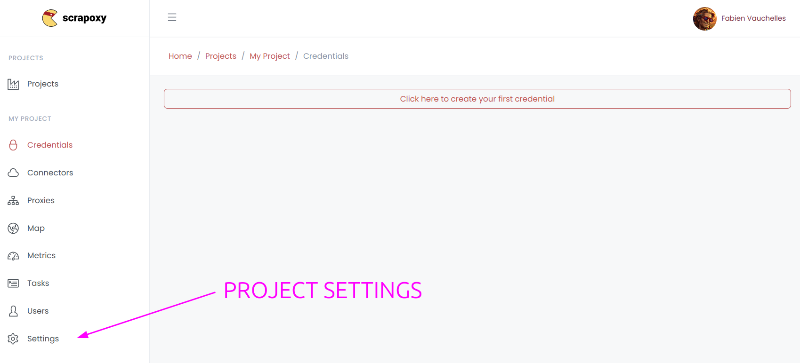

Settings can also be accessed through the left menu.

### List of projects

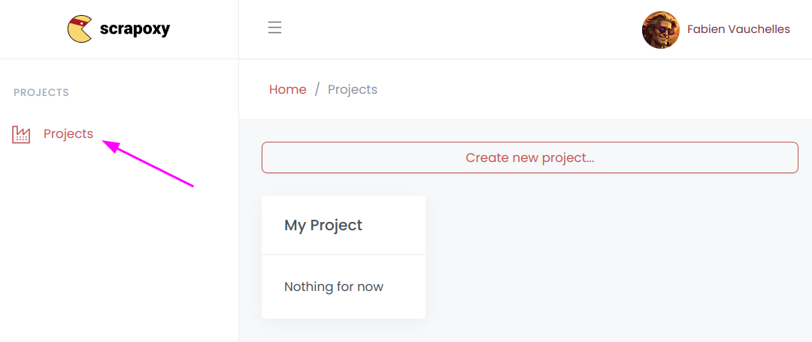

If you come back to the `Projects` section, Scrapoxy will display a list of all accessible projects.

## Marketplace

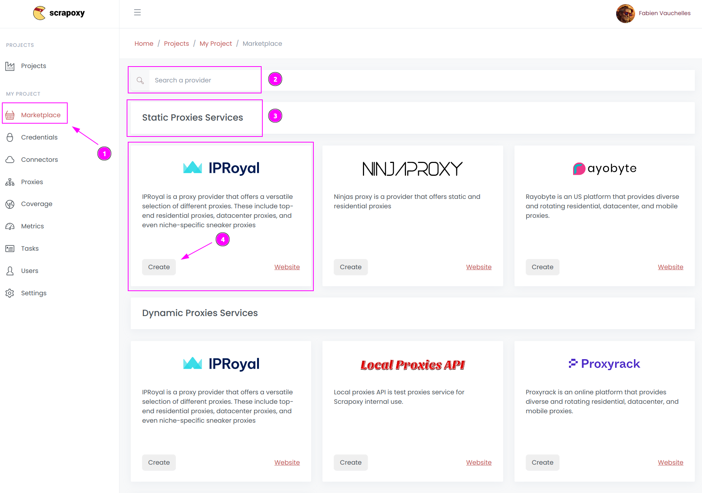

Upon the first connection:
1. Scrapoxy will redirect you to the `Marketplace` section;
2. Search for a provider by name or type;
3. Providers are categorized by type (e.g., datacenter provider, proxies services, etc.);
4. Click on `Create` to commence the configuration the chosen provider.

## Credentials

### Credential creation

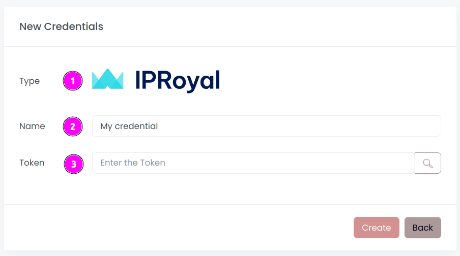

The settings for the connector's credential include:
1. **Type**: The provider of the credential;
2. **Name**: A unique name for the credential within the project;
3. **Options**: Configuration options for the credential, dependent on the type of provider.

::: info
When you save the settings, Scrapoxy performs a validation test to ensure that the entered credentials are valid.
:::

### List of credentials

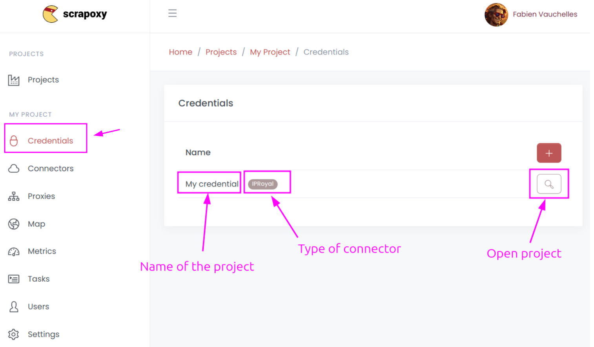

After saving, Scrapoxy will display the list of credentials.

### Credential update

If you open a credential, Scrapoxy displays the settings:

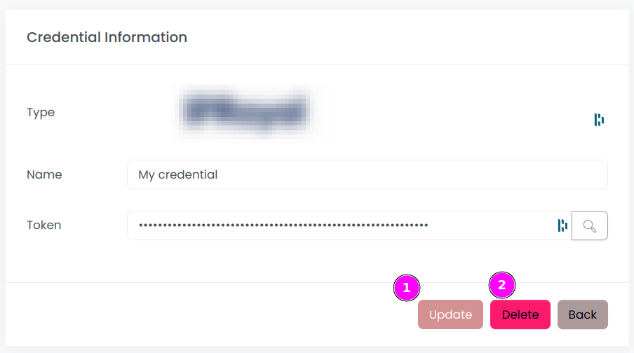

You have the following options when managing a credential:
1. **Update**: Modify the credential with new settings;
2. **Delete**: Remove the credential, provided there are no connectors currently using it.

## Connectors

### Connector creation

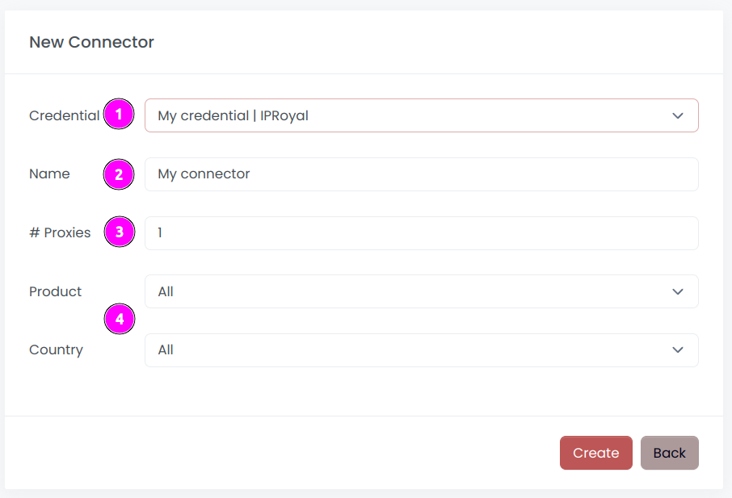

Upon the first connection, Scrapoxy will guide you through the creation of a new connector with the following settings:
1. **Credential**: Selection from the list of available credentials from the previous section;
2. **Name**: Unique identifier for the connector within the project;
3. **# of proxies**: Maximum number of proxies that the connector can provide and that you intend to use;
4. **Proxies Timeout**: Maximum duration for connecting to a proxy before considering it as offline;
5. **Proxies Kick**: If enabled, maximum duration for a proxy to be offline before being removed from the pool;

When you save the settings, Scrapoxy performs a validation test to ensure that the entered configuration is valid.

::: info
Proxies Kick must be greater than Proxies Timeout.
:::

### List of connectors

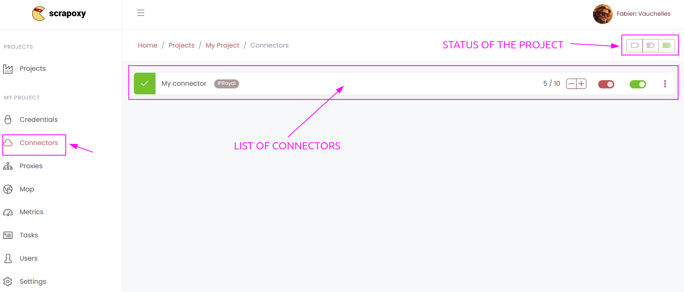

After saving, Scrapoxy will display the list of connectors.

### Connector update

If you open the connector, Scrapoxy will present the associated settings:

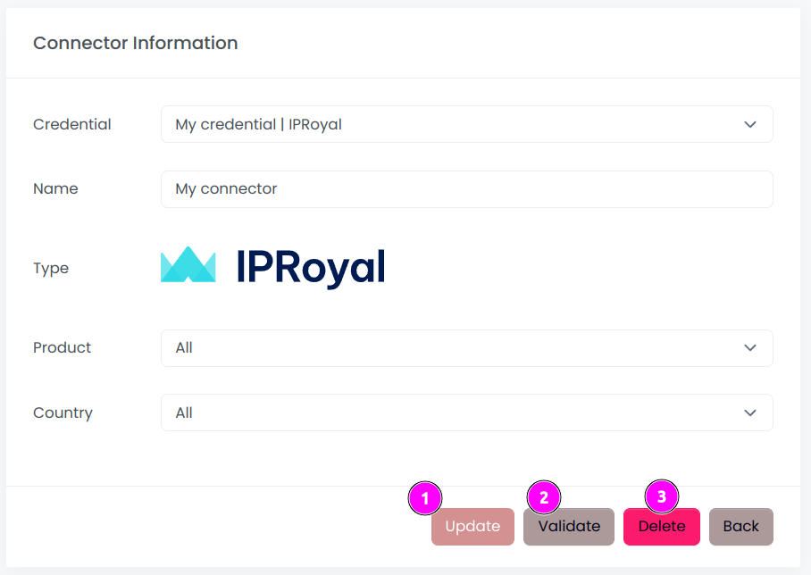

Upon opening the connector, Scrapoxy provides the following options:
1. **Update**: Modify the connector with new settings;
2. **Validate**: Confirm the validity of the connector configuration. Particularly useful for datacenter providers, as Scrapoxy checks for the existence of the template image;
3. **Delete**: Remove the connector only if the project's status is OFF.

::: info
The type cannot be modified.
:::

### Project status

The project can have the following statuses:

| Status | Description                                                                                                                                                                    |
|--------|--------------------------------------------------------------------------------------------------------------------------------------------------------------------------------|
| OFF | The project is stopped. All proxies are halted and removed.                                                                                                                    |
| CALM | The project is in a sleep state. It maintains the minimum required proxies according to the project's settings and awaits the initial request (if `Auto Scale Up` is enabled). |
| HOT | The project is active. All proxies are started and await connections.                                                                                                          |

Scrapoxy requires a minimum number of proxies to maintain a stable connection;
otherwise, all requests will fail.
This remaining connection is essential for detecting whether Scrapoxy is receiving any activity.
If traffic is detected and `Auto Scale Up` is enabled, 
Scrapoxy will change the project's status from `CALM` to `HOT.` 

If you prefer not to keep at least one proxy active, 
please disable `Auto Scale Up` and use the [API](/integration/api-reference#change-project-s-status) to manually change the project's status.

### Connector details

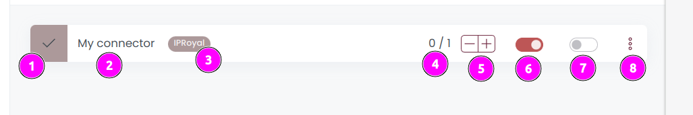

A connector has:
1. **Status**: Indicates the current status of the connector (refer to the descriptions below);
2. **Name**: The unique identifier assigned to the connector;
3. **Type**: The classification of the connector, consistent with the credential type;
4. **Proxies count**: Displays the number of online proxies and the maximum allowed proxies for this connector;
5. **Proxies control**: Offers the option to increase or decrease the maximum number of proxies for this connector;
6. **Default**: If enabled, designates this connector as the exclusive one used when the project status is `CALM`. Only one connector can be set as the default for a project;
7. **Active**: If enabled, initiate the proxies associated with this connector;
8. **Options**: Provides a shortcut for scaling, updating, installing, or uninstalling the connector.

### Connector status

The connector can have the following statuses:

| Icon                                 | Status                                                        | Description                                             |
|--------------------------------------|---------------------------------------------------------------|---------------------------------------------------------|
| 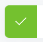       | ON                                                            | The connector is online.                                |
| 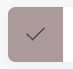     | OFF                                                           | The connector is offline.                               |
| 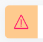 | ERROR | The connector has an error. Details are in the tooltip. |

## Proxies

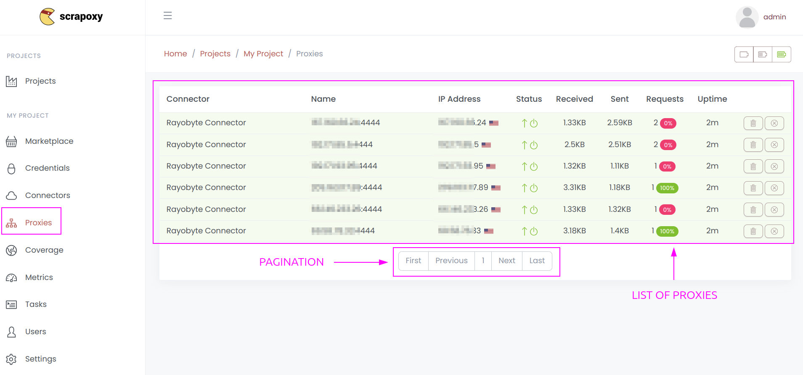

If you open the `Proxies` section, Scrapoxy will present a list of proxies.

This compilation includes proxies from all connectors, with pagination to enhance performance.

### Proxy details

A proxy is characterized by the following attributes:
1. **Connector**: The name of the associated connector;
2. **Name**: The identifier assigned to the proxy;
3. **IP Address**: The IP address of the proxy along with geo-localization information;
4. **Status**: Indicates the current status of the proxy (refer to the descriptions below);
5. **Received**: The amount of bytes received by the proxy;
6. **Sent**: The amount of bytes sent by the proxy;
7. **Requests**: The number of requests made by the proxy and the success rate;
8. **Uptime**: The uptime of the proxy, representing the duration between its creation and the current moment;
9. **Delete**: Manually remove the proxy from the pool.

The **Success Rate** is calculated as follows: 

`Valid Requests / (Valid + Invalid Requests) * 100`

Notes:

This metric is applicable only when the Project settings `Intercept HTTPS requests with MITM` is enabled.
The total number of requests may vary from the sum of valid and invalid requests due to its dependence on whether the setting is enabled.

Requests with HTTP status code below 400 are considered valid, other invalids.

### Proxy status

The proxy has 2 sets of statuses:
- **Instance Status**: This reflects the overall operational status of the proxy;
- **Connection Status**: This denotes the status of the connection associated with the proxy.

#### Instance status

| Icon                                   | Status   | Description             |
|----------------------------------------|----------|-------------------------|
|  | STARTING | The proxy is starting.  |
|    | STARTED  | The proxy is started.   |
|  | STOPPING | The proxy is stopping.  |
|    | STOPPED  | The proxy is stopped.   |
| 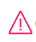       | ERROR    | The proxy has an issue. |

#### Connection status

| Icon                                    | Status  | Description                  |
|-----------------------------------------|---------|------------------------------|
|  | ONLINE  | The connection is online.    |
|       | OFFLINE | The connection is offline.   |
|           | ERROR   | The connection has an issue. |

::: info
Scrapoxy will route traffic only when the proxy status is `STARTED` and connection is `ONLINE`.
:::

## Coverage

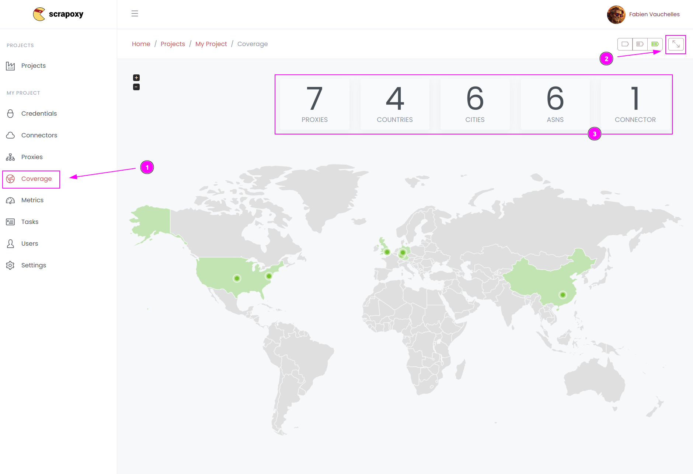

1. When you access the `Coverage` section, Scrapoxy presents a world map showcasing the locations of all proxies. This visualization aids in comprehending the geographic distribution of your proxies;
2. Scrapoxy furnishes metrics such as active proxies, countries, or cities;
3. Click on the full-screen icon to expand the map for a more detailed view.

Checking the origin of your proxies is valuable for optimizing your scraping performance.

::: info
The map displays only proxies that have been used **at least once**, allowing Scrapoxy to fingerprint them.
:::

---

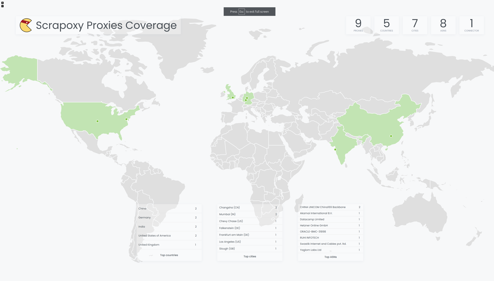

The fullscreen mode is tailored to optimize map display on a TV.
Additionally, it provides a ranking of top countries, cities, and ASNs (Autonomous System Numbers).

## Metrics

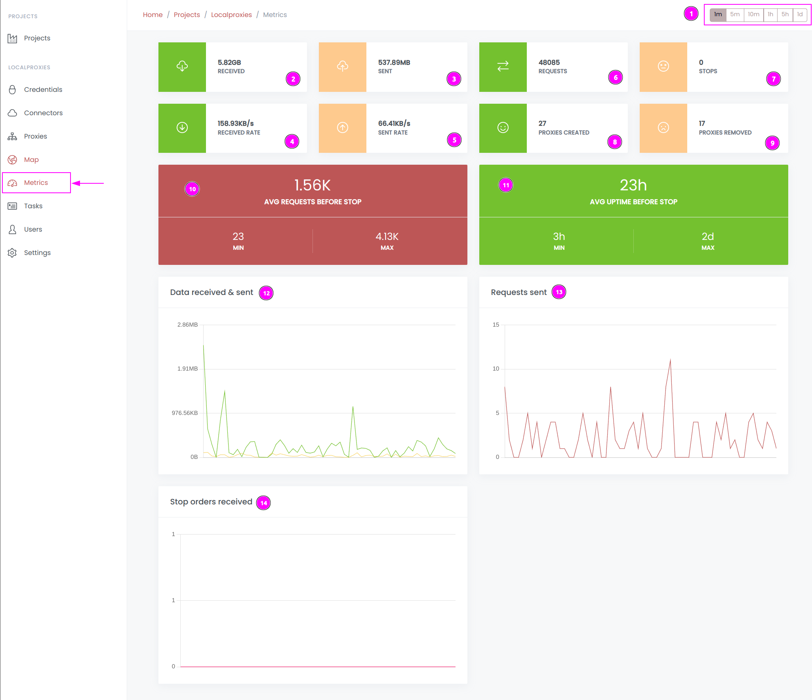

In the `Metrics` section, Scrapoxy provides a set of metrics for monitoring your project.
These metrics include:

1. **Range**: Adjusts the window of the metrics (e.g., 1 minute, 5 minutes);
2. **Received**: Total amount of bytes received by all proxies;
3. **Sent**: Total amount of bytes sent by all proxies;
4. **Requests**: Total number of requests made by all proxies;
5. **Stops**: Total number of "delete" delete orders;
6. **Received rate**: Current rate of data received by all proxies;
7. **Sent rate**: Current rate of data sent by all proxies;
8. **Valid requests**: Number of valid requests made by all proxies (if MITM is enabled);
9. **Invalid requests**: Number of invalid requests made by all proxies (if MITM is enabled);
10. **Proxies Created**: Total number of proxies created;
11. **Proxies Removed**: Total number of proxies deleted;
12. **Avg Requests Before Stop**: Average number of requests made by proxy before removal from the pool;
13. **Avg Uptime Before Stop**: Average uptime for a proxy before removal from the pool;
14. **Data received & sent**: Amount of data received and sent by all proxies over time;
15. **Requests sent**: Number of requests made by all proxies over time;
16. **Stop orders received**: Number of "stop" orders received over time.

::: info
Only the last 3 charts use the window setting.
:::

::: tip
- Line charts are valuable for monitoring project usage.
- By analyzing "stop" orders, you can determine how much time a proxy is utilized before removal from the pool.
:::

## Tasks

### List of tasks

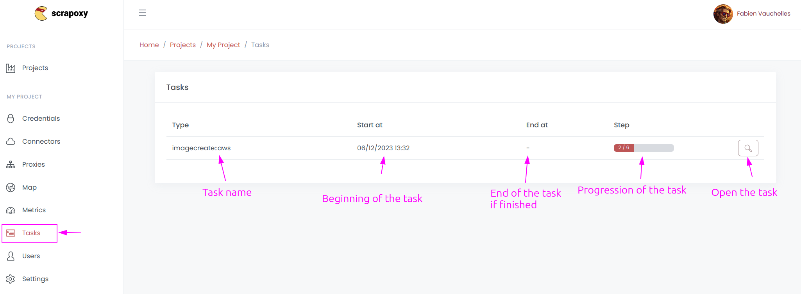

If you open the `Tasks` section, Scrapoxy displays a list of executed tasks.

### Task details

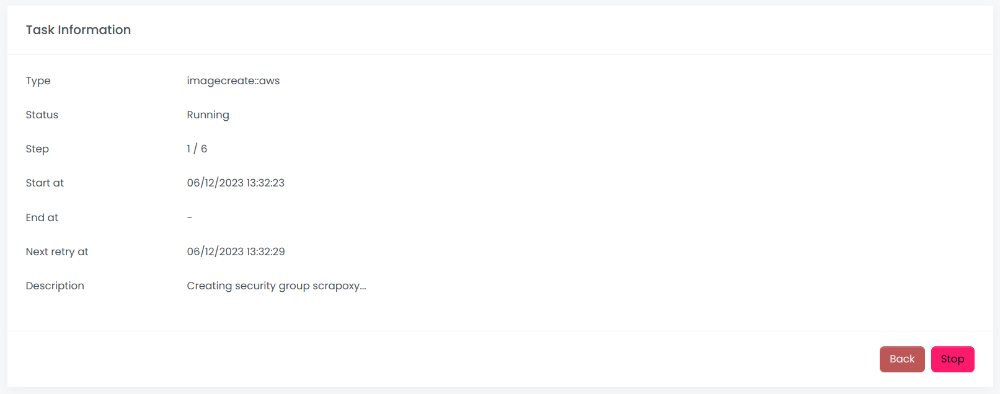

If you open a task, Scrapoxy presents detailed information about the task.

## Users

### List of users

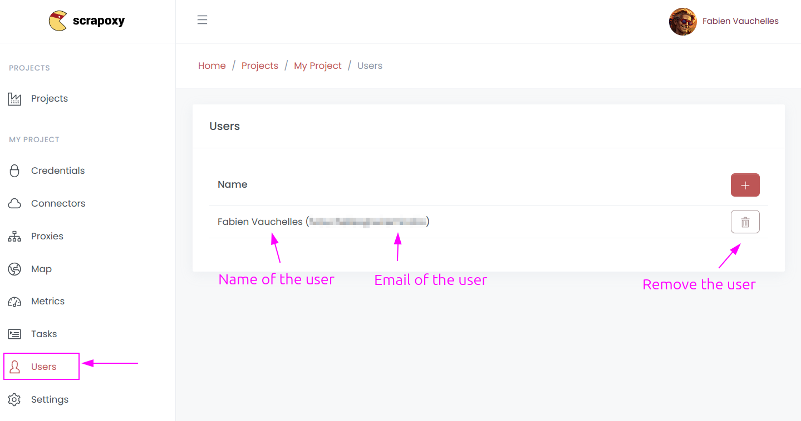

If you open the `Users` section, Scrapoxy displays the list of users authorized to access the project.

::: warning
1. You can only add users who have previously been authenticated by Scrapoxy.
2. It is impossible to remove yourself from the project.
:::
