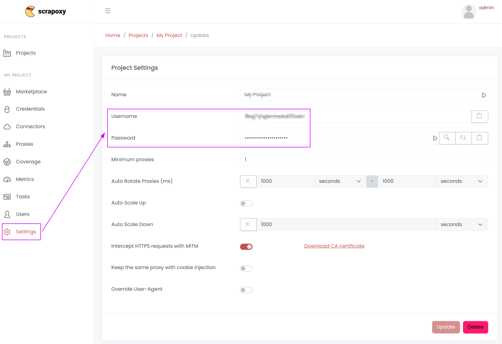
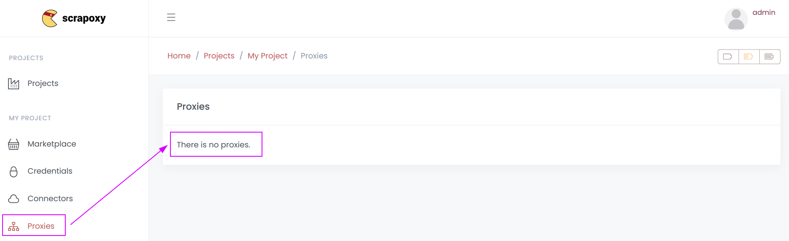
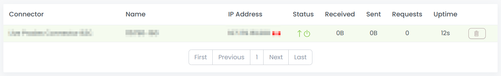

# Errors

Scrapoxy can show different errors, each with:

* an HTTP status code
* an ID
* a description

Here are the errors you might see:

## 407 HTTP Status

All these errors are related to authentication with Scrapoxy.

### ID: 'no_token'

This error occurs when there is no authentication token in the header request.
To fix this, add the `Proxy-Authorization` header with the token formatted as `Basic BASE64(USERNAME:PASSWORD)`.

Use the username and password found in the `Project Settings` tab:

### ID: 'no_project'

This error occurs if the token exists but does not match any project (invalid token).

Please verify the username and password in the `Project Settings` tab:

## 557 HTTP Status

All these errors are related to the Scrapoxy behavior.

### ID: 'no_proxy'

Authentication is successful, but no proxies are currently online:

Please ensure you have at least one proxy online (green status) in the `Proxies` tab:

