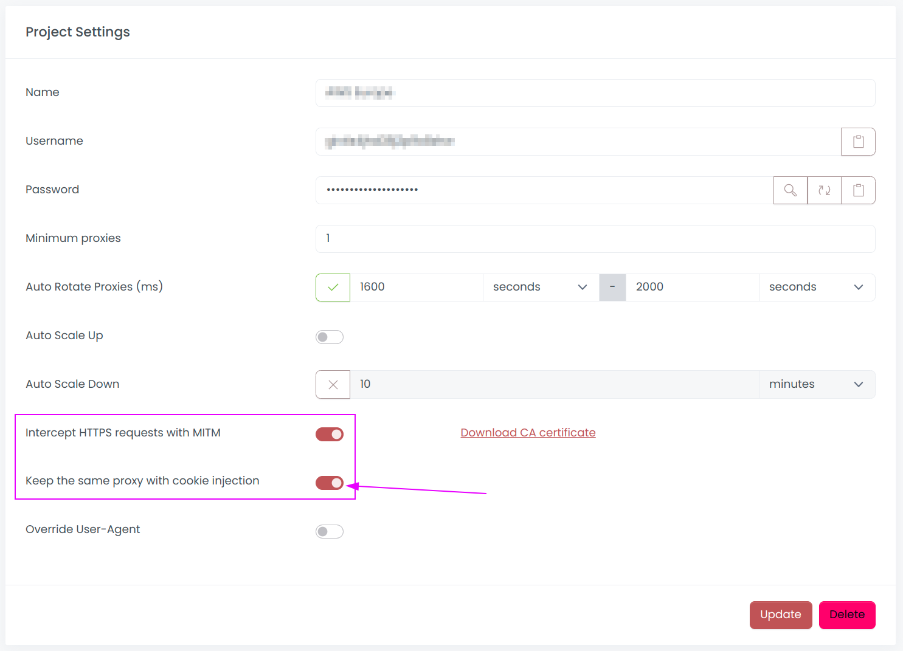

# Sticky Sessions

Scrapoxy supports 2 modes for maintaining sticky sessions: through **headers** or **cookies**.

## Sticky Header

When Scrapoxy receives a response, it includes the `X-Scrapoxy-Proxyname` header.
This header contains the ID of the proxy used to initiate the request.

To use sticky sessions, ensure that your requests include the `X-Scrapoxy-Proxyname` header.
Scrapoxy will then route the request to the same proxy that initiated the session.

This functionality is implemented by Scrapy's middleware [StickySpiderMiddleware](../integration/python/scrapy/guide#step-7-sticky-session-optional).

::: warning
Scrapoxy automatically filters this header in requests, eliminating the need for manual intervention.
:::

## Sticky Cookie

To enable sticky sessions with cookies, navigate to project settings 
and activate the option `Keep the same proxy with cookie injection`:

Scrapoxy will append a cookie to all responses, ensuring that later requests from the browser are routed to the same proxy.

::: info
Cookie injection is particularly crucial when using a headless browser (Playwright or Puppeteer) alongside a residential network to prevent IP rotation between requests.
::::
